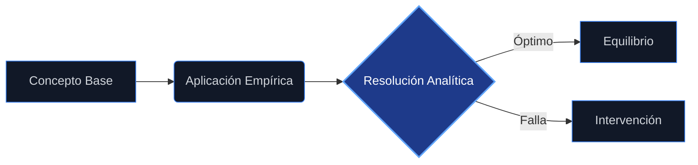

<!-- HERO -->
<header class="mb-24">
    

        

        Economics Master Series
    

    <h1 class="text-5xl md:text-7xl font-black text-white tracking-tighter leading-none mb-8">
        A10
    </h1>
    

        Zero-Noise UX
        v9.0 · Dark Mode
    

</header>

    📈
    <h2 class="text-2xl md:text-4xl font-black tracking-tight leading-tight bg-gradient-to-r from-indigo-300 to-violet-400 bg-clip-text text-transparent">Guía de Estudio: Microeconomía</h2>

<section class="mb-16 last:mb-0">
<!-- section: 10.1. -->

    📈
    

        <h2 class="text-xl md:text-3xl font-black tracking-tight bg-gradient-to-r from-indigo-300 to-violet-400 bg-clip-text text-transparent">Microeconomía: Bienestar y tipología de fallos de mercado</h2>
        

    

<!-- section: 10.1.1. -->

    📈
    <h3 class="text-xl font-bold text-indigo-300 tracking-tight">Microeconomía</h3>

La microeconomía es la ciencia social que estudia la asignación de recursos escasos para satisfacer necesidades múltiples y de importancia diversa , . Se centra en el comportamiento de agentes individuales, como consumidores y empresas, y en cómo sus interacciones en los mercados determinan los precios y las cantidades de bienes y servicios.

<!-- section: 10.1.2. -->

    📖
    <h3 class="text-xl font-bold text-indigo-300 tracking-tight">Principios de la micro economía y conceptos</h3>

El análisis económico parte de supuestos fundamentales: los recursos son limitados frente a deseos ilimitados, lo que genera escasez y obliga a la elección , . Un concepto clave es el <strong>costo de oportunidad</strong>, que representa el valor de la mejor alternativa sacrificada al tomar una decisión , . Los individuos actúan racionalmente buscando maximizar sus beneficios o utilidad .

<!-- section: 10.1.3. -->

    ⚙️
    <h3 class="text-xl font-bold text-indigo-300 tracking-tight">La producción</h3>

La producción es la relación física que describe cómo los factores (insumos como capital y trabajo) se transforman en productos . Se analiza mediante la <strong>función de producción</strong>, que muestra la cantidad máxima de producto obtenible con una combinación dada de factores. Conceptos clave incluyen el producto total, el producto marginal (variación del producto al alterar un factor) y el producto medio .

<!-- section: 10.1.4. -->

    📌
    <h3 class="text-xl font-bold text-indigo-300 tracking-tight">Soberanía del consumidor</h3>

Este principio implica que las preferencias y decisiones de los consumidores guían la producción y asignación de recursos. El consumidor busca maximizar su satisfacción (utilidad) sujeto a su restricción presupuestaria, eligiendo la cesta de bienes que más prefiere dentro de sus posibilidades , .

<!-- section: 10.1.5. -->

    📌
    <h3 class="text-xl font-bold text-indigo-300 tracking-tight">Agentes económicos</h3>

Los principales agentes son los <strong>hogares</strong> (consumidores y dueños de factores) y las <strong>empresas</strong> (productores). Los hogares maximizan utilidad y las empresas maximizan beneficios , . El gobierno también actúa como agente, interviniendo para corregir fallos o redistribuir recursos .

<!-- section: 10.1.6. -->

    🌱
    <h3 class="text-xl font-bold text-indigo-300 tracking-tight">Bienestar y tipología de fallos</h3>

La economía del bienestar evalúa la eficiencia de la asignación de recursos. Un mercado competitivo ideal alcanza un óptimo de Pareto (nadie puede mejorar sin que otro empeore) . Sin embargo, existen situaciones donde el mercado falla en asignar eficientemente los recursos .

<!-- section: 10.1.7. -->

    🌱
    <h3 class="text-xl font-bold text-indigo-300 tracking-tight">Concepto del bienestar</h3>

El bienestar se mide a través del <strong>excedente del consumidor</strong> (diferencia entre lo que está dispuesto a pagar y lo que paga) y el <strong>excedente del productor</strong> (diferencia entre el precio de mercado y el costo de producción) , . La suma de ambos representa el bienestar total o excedente social.

<!-- section: 10.1.8. -->

    📌
    <h3 class="text-xl font-bold text-indigo-300 tracking-tight">Valor actual neto</h3>

El Valor Actual Neto (VAN) o valor descontado es una herramienta para evaluar decisiones intertemporales, trayendo a valor presente flujos de beneficios y costos futuros mediante una tasa de descuento o interés , . Es fundamental para decisiones de inversión y evaluación de proyectos .

<!-- section: 10.1.9. -->

    📈
    <h3 class="text-xl font-bold text-indigo-300 tracking-tight">Tipología de fallos, limitaciones en el mercado</h3>

Los fallos de mercado ocurren cuando no se alcanza la eficiencia. Los tipos principales incluyen: <em>   <strong>Poder de mercado</strong>: Monopolios u oligopolios que fijan precios superiores al costo marginal . </em>   <strong>Externalidades</strong>: Efectos sobre terceros no reflejados en los precios . <em>   <strong>Bienes públicos</strong>: Bienes no rivales y no excluyentes . </em>   <strong>Información asimétrica</strong>: Desigualdad de información entre agentes .

    

    

        <h5 class="text-indigo-400 text-[9px] md:text-[10px] uppercase tracking-[0.4em] font-black mb-6 flex items-center gap-3">
            
            Puntos Clave
        </h5>
        <ul class="space-y-4">
<li class="flex items-start gap-3 text-slate-200 text-sm leading-relaxed">✦La microeconomía es la ciencia social que estudia la asignación de recursos escasos para satisfacer necesidades múltiples y de importancia diversa ,.</li>
<li class="flex items-start gap-3 text-slate-200 text-sm leading-relaxed">✦El análisis económico parte de supuestos fundamentales: los recursos son limitados frente a deseos ilimitados, lo que genera escasez y obliga a la elección ,.</li>
<li class="flex items-start gap-3 text-slate-200 text-sm leading-relaxed">✦La producción es la relación física que describe cómo los factores (insumos como capital y trabajo) se transforman en productos.</li>
<li class="flex items-start gap-3 text-slate-200 text-sm leading-relaxed">✦Este principio implica que las preferencias y decisiones de los consumidores guían la producción y asignación de recursos.</li>
        </ul>
    

</section>

<section class="mb-16 last:mb-0">
<!-- section: 10.2. -->

    📌
    

        <h2 class="text-xl md:text-3xl font-black tracking-tight bg-gradient-to-r from-cyan-300 to-blue-400 bg-clip-text text-transparent">Intervención pública. Externalidades y bienes públicos</h2>
        

    

<!-- section: 10.2.1. -->

    📌
    <h3 class="text-xl font-bold text-cyan-300 tracking-tight">Intervención pública</h3>

La intervención del gobierno se justifica para corregir fallos de mercado y restablecer la eficiencia . Esto puede realizarse mediante impuestos, subsidios, regulaciones o provisión directa de bienes. También se interviene por razones de equidad y distribución del ingreso .

<!-- section: 10.2.2. -->

    📌
    <h3 class="text-xl font-bold text-cyan-300 tracking-tight">La existencia de bienes públicos</h3>

Los bienes públicos puros son aquellos que son <strong>no rivales</strong> (el consumo de uno no reduce el de otro) y <strong>no excluyentes</strong> (no se puede impedir su uso a quien no pague) . Debido a estas características, el mercado privado tiende a subproducirlos, justificando su provisión por el sector público .

    

    

        <h5 class="text-cyan-400 text-[9px] md:text-[10px] uppercase tracking-[0.4em] font-black mb-6 flex items-center gap-3">
            
            Puntos Clave
        </h5>
        <ul class="space-y-4">
<li class="flex items-start gap-3 text-slate-200 text-sm leading-relaxed">✦La intervención del gobierno se justifica para corregir fallos de mercado y restablecer la eficiencia.</li>
<li class="flex items-start gap-3 text-slate-200 text-sm leading-relaxed">✦Los bienes públicos puros son aquellos que son no rivales (el consumo de uno no reduce el de otro) y no excluyentes (no se puede impedir su uso a quien no pague).</li>
        </ul>
    

</section>

<section class="mb-16 last:mb-0">
<!-- section: 10.4. -->

    🔬
    

        <h2 class="text-xl md:text-3xl font-black tracking-tight bg-gradient-to-r from-emerald-300 to-teal-400 bg-clip-text text-transparent">Teoría de Juegos</h2>
        

    

<!-- section: 10.4.1. -->

    📌
    <h3 class="text-xl font-bold text-emerald-300 tracking-tight">Representación en forma extensiva</h3>

La forma extensiva representa un juego como un árbol, detallando el orden de los movimientos, los conjuntos de información, las acciones posibles en cada nodo y los pagos finales , . Es especialmente útil para juegos dinámicos o secuenciales.

<!-- section: 10.4.2. -->

    🎯
    <h3 class="text-xl font-bold text-emerald-300 tracking-tight">De la forma extensiva a la forma normal: la estrategia</h3>

Un juego en forma extensiva puede convertirse a forma normal (matriz de pagos) definiendo las estrategias completas. Una estrategia es un plan completo de acción que especifica qué hará el jugador en cada situación posible .

<!-- section: 10.4.3. -->

    📌
    <h3 class="text-xl font-bold text-emerald-300 tracking-tight">Introducción hacia atrás y equilibrio de Nash perfecto en sub-juegos</h3>

El equilibrio de Nash perfecto en subjuegos se obtiene mediante inducción hacia atrás. Se resuelven primero los sub-juegos finales y se retrocede hacia el inicio, garantizando que las estrategias sean óptimas en cada etapa del juego, eliminando amenazas no creíbles , .

<!-- section: 10.4.4. -->

    📌
    <h3 class="text-xl font-bold text-emerald-300 tracking-tight">Racionalidad secuencial y equilibrio de Nash</h3>

La racionalidad secuencial implica que los jugadores optimizan sus decisiones en cada punto de decisión, anticipando las respuestas racionales de los demás . El equilibrio de Nash es un conjunto de estrategias donde ningún jugador tiene incentivos para desviarse unilateralmente , .

<!-- section: 10.4.5. -->

    📌
    <h3 class="text-xl font-bold text-emerald-300 tracking-tight">Procedimiento de introducción hacia atrás</h3>

    
Este procedimiento (o inducción hacia atrás) consiste en comenzar por los nodos finales del árbol de juego, determinando la acción óptima del último jugador, y luego usar esa información para resolver la decisión del penúltimo jugador, y así sucesivamente hasta el nodo inicial .

    
Fundamento Conceptual

<!-- section: 10.4.6. -->

    💻
    <h3 class="text-xl font-bold text-emerald-300 tracking-tight">Sub-juegos con información perfecta</h3>

Un sub-juego comienza en un nodo de decisión y contiene todos sus nodos sucesores. En juegos con información perfecta, los jugadores conocen toda la historia previa del juego en cada nodo, lo que facilita la solución mediante inducción hacia atrás .

<!-- section: 10.4.7. -->

    🔢
    <h3 class="text-xl font-bold text-emerald-300 tracking-tight">El modelo de duopolio de Stackelberg</h3>

Es un modelo de oligopolio secuencial donde una firma (líder) fija su nivel de producción primero, y la otra firma (seguidora) decide su producción después de observar la decisión del líder , .

<!-- section: 10.4.8. -->

    📖
    <h3 class="text-xl font-bold text-emerald-300 tracking-tight">Concepto</h3>

En el modelo de Stackelberg, la firma líder tiene una ventaja estratégica ("ventaja del primer movimiento") porque puede anticipar la reacción de la seguidora y ajustar su producción para maximizar sus propios beneficios, obteniendo generalmente una mayor cuota de mercado y beneficios que en el modelo simultáneo de Cournot , .

<!-- section: 10.4.9. -->

    📌
    <h3 class="text-xl font-bold text-emerald-300 tracking-tight">Aplicaciones</h3>

Este modelo se aplica en industrias donde una empresa tiene dominio o capacidad de comprometerse antes que sus rivales, como la introducción de nuevos productos o decisiones de capacidad instalada , .

    

    

        <h5 class="text-emerald-400 text-[9px] md:text-[10px] uppercase tracking-[0.4em] font-black mb-6 flex items-center gap-3">
            
            Puntos Clave
        </h5>
        <ul class="space-y-4">
<li class="flex items-start gap-3 text-slate-200 text-sm leading-relaxed">✦La forma extensiva representa un juego como un árbol, detallando el orden de los movimientos, los conjuntos de información, las acciones posibles en cada nodo y los pagos finales ,.</li>
<li class="flex items-start gap-3 text-slate-200 text-sm leading-relaxed">✦Un juego en forma extensiva puede convertirse a forma normal (matriz de pagos) definiendo las estrategias completas.</li>
<li class="flex items-start gap-3 text-slate-200 text-sm leading-relaxed">✦El equilibrio de Nash perfecto en subjuegos se obtiene mediante inducción hacia atrás.</li>
<li class="flex items-start gap-3 text-slate-200 text-sm leading-relaxed">✦La racionalidad secuencial implica que los jugadores optimizan sus decisiones en cada punto de decisión, anticipando las respuestas racionales de los demás.</li>
        </ul>
    

</section>

<section class="mb-16 last:mb-0">
<!-- section: 10.5. -->

    🔢
    

        <h2 class="text-xl md:text-3xl font-black tracking-tight bg-gradient-to-r from-amber-300 to-orange-400 bg-clip-text text-transparent">Características y modelos del oligopolio</h2>
        

    

<!-- section: 10.5.1. -->

    📌
    <h3 class="text-xl font-bold text-amber-300 tracking-tight">Características de un oligopolio</h3>

Un oligopolio se caracteriza por tener pocas empresas que producen la mayor parte de la producción del mercado, barreras a la entrada y, fundamentalmente, <strong>interdependencia estratégica</strong> entre las firmas .

<!-- section: 10.5.2. -->

    📌
    <h3 class="text-xl font-bold text-amber-300 tracking-tight">Conceptualización</h3>

Es una estructura de mercado intermedia entre la competencia perfecta y el monopolio, donde pocas firmas compiten entre sí y no es posible la libre entrada de nuevas empresas .

<!-- section: 10.5.3. -->

    📌
    <h3 class="text-xl font-bold text-amber-300 tracking-tight">Diferencias con el monopolio</h3>

A diferencia del monopolio (un solo vendedor), en el oligopolio hay más de una empresa, por lo que cada una debe considerar las acciones de sus rivales . El poder de mercado es compartido y limitado por la competencia estratégica.

<!-- section: 10.5.4. -->

    🏢
    <h3 class="text-xl font-bold text-amber-300 tracking-tight">Interdependencia empresarial</h3>

Debido al pequeño número de empresas, las decisiones de una firma (precio, cantidad, publicidad) afectan directamente los beneficios de las otras, y viceversa. Las empresas deben actuar estratégicamente, anticipando las reacciones de sus competidores , .

<!-- section: 10.5.5. -->

    🔢
    <h3 class="text-xl font-bold text-amber-300 tracking-tight">Modelos del oligopolio</h3>

Existen varios modelos para explicar el comportamiento oligopólico, dependiendo de si las empresas compiten en cantidades (Cournot, Stackelberg) o en precios (Bertrand), y si actúan de forma simultánea o secuencial , .

<!-- section: 10.5.6. -->

    📌
    <h3 class="text-xl font-bold text-amber-300 tracking-tight">Diferenciado</h3>

En el oligopolio diferenciado, las empresas venden productos que son sustitutos cercanos pero no perfectos (ej. automóviles, cereales), compitiendo a través de marcas, calidad y publicidad , .

<!-- section: 10.5.7. -->

    📌
    <h3 class="text-xl font-bold text-amber-300 tracking-tight">Concentrado</h3>

    
Se refiere a industrias donde un pequeño número de empresas concentra una gran cuota de mercado. La alta concentración facilita la colusión o la coordinación tácita .

    
Fundamento Conceptual

<!-- section: 10.5.8. -->

    📌
    <h3 class="text-xl font-bold text-amber-300 tracking-tight">Duopolios</h3>

Es el caso más simple de oligopolio con solo dos empresas. Sirve como base para modelos teóricos como Cournot y Bertrand .

<!-- section: 10.5.9. -->

    📈
    <h3 class="text-xl font-bold text-amber-300 tracking-tight">Barreras de ingreso al mercado</h3>

Factores que impiden o dificultan la entrada de nuevas firmas, como economías de escala, patentes, acceso a recursos clave o estrategias de disuasión por parte de las firmas establecidas , .

<!-- section: 10.5.10. -->

    📌
    <h3 class="text-xl font-bold text-amber-300 tracking-tight">Prácticas oligopólicas</h3>

Incluyen la colusión (acuerdos para fijar precios o cuotas), liderazgo de precios (una firma fija el precio y otras la siguen) y guerras de precios , . Los cárteles son la forma más explícita de colusión .

<!-- section: 10.5.11. -->

    📌
    <h3 class="text-xl font-bold text-amber-300 tracking-tight">Causas y consecuencias</h3>

Las causas incluyen economías de escala y barreras tecnológicas. Las consecuencias pueden ser precios más altos y menor producción que en competencia perfecta, generando pérdidas de eficiencia, aunque también pueden fomentar la innovación .

    

    

        <h5 class="text-amber-400 text-[9px] md:text-[10px] uppercase tracking-[0.4em] font-black mb-6 flex items-center gap-3">
            
            Puntos Clave
        </h5>
        <ul class="space-y-4">
<li class="flex items-start gap-3 text-slate-200 text-sm leading-relaxed">✦Un oligopolio se caracteriza por tener pocas empresas que producen la mayor parte de la producción del mercado, barreras a la entrada y, fundamentalmente, interdependencia estratégica entre las firmas.</li>
<li class="flex items-start gap-3 text-slate-200 text-sm leading-relaxed">✦Es una estructura de mercado intermedia entre la competencia perfecta y el monopolio, donde pocas firmas compiten entre sí y no es posible la libre entrada de nuevas empresas.</li>
<li class="flex items-start gap-3 text-slate-200 text-sm leading-relaxed">✦A diferencia del monopolio (un solo vendedor), en el oligopolio hay más de una empresa, por lo que cada una debe considerar las acciones de sus rivales.</li>
<li class="flex items-start gap-3 text-slate-200 text-sm leading-relaxed">✦Debido al pequeño número de empresas, las decisiones de una firma (precio, cantidad, publicidad) afectan directamente los beneficios de las otras, y viceversa.</li>
        </ul>
    

</section>

<section class="mb-16 last:mb-0">
<!-- section: 10.6. -->

    📌
    

        <h2 class="text-xl md:text-3xl font-black tracking-tight bg-gradient-to-r from-rose-300 to-pink-400 bg-clip-text text-transparent">El sector público y los oligopolios</h2>
        

    

<!-- section: 10.6.1. -->

    🔢
    <h3 class="text-xl font-bold text-rose-300 tracking-tight">Diferentes modelos</h3>

El análisis del sector público en oligopolios considera cómo la regulación o la presencia de empresas públicas afecta la competencia. Los modelos clásicos (Cournot, Stackelberg) se adaptan para incluir objetivos de bienestar social .

<!-- section: 10.6.2. -->

    🔢
    <h3 class="text-xl font-bold text-rose-300 tracking-tight">Modelo de Cournot</h3>

En este modelo, las empresas deciden simultáneamente la cantidad a producir. Cada firma toma la producción de la otra como dada. El equilibrio resultante (Nash-Cournot) implica un precio y beneficios intermedios entre competencia perfecta y monopolio .

<!-- section: 10.6.3. -->

    🔢
    <h3 class="text-xl font-bold text-rose-300 tracking-tight">Modelo de Stackelberg</h3>

Como se mencionó, es un modelo de liderazgo en cantidades. Si una empresa pública actúa como líder (ej. para maximizar bienestar), puede influir en el resultado del mercado induciendo a las privadas a producir más o menos .

<!-- section: 10.6.4. -->

    📌
    <h3 class="text-xl font-bold text-rose-300 tracking-tight">El sector público</h3>

El sector público puede intervenir en oligopolios mediante empresas estatales, regulación antimonopolio o políticas de competencia para corregir el poder de mercado y acercar los resultados al óptimo social , .

<!-- section: 10.6.5. -->

    📌
    <h3 class="text-xl font-bold text-rose-300 tracking-tight">Sectores públicos e innovación</h3>

Las barreras tecnológicas y la innovación son relevantes en oligopolios. El sector público puede fomentar la innovación mediante patentes o I+D, pero también debe vigilar que esto no cree monopolios permanentes injustificados .

<!-- section: 10.6.6. -->

    📌
    <h3 class="text-xl font-bold text-rose-300 tracking-tight">Fallos en el sector</h3>

    
Se refiere a fallos de mercado típicos de estructuras concentradas (precios altos, ineficiencia) o fallos del propio sector público al intervenir (ineficiencias burocráticas, captura del regulador) .

    
Fundamento Conceptual

<!-- section: 10.6.7. -->

    📌
    <h3 class="text-xl font-bold text-rose-300 tracking-tight">Oligopolios mundiales</h3>

Existen oligopolios a nivel global, como el mercado del petróleo o materias primas. Los <strong>cárteles</strong> internacionales como la OPEP son ejemplos claros, donde países coordinan producción para influir en precios mundiales , .

    

    

        <h5 class="text-rose-400 text-[9px] md:text-[10px] uppercase tracking-[0.4em] font-black mb-6 flex items-center gap-3">
            
            Puntos Clave
        </h5>
        <ul class="space-y-4">
<li class="flex items-start gap-3 text-slate-200 text-sm leading-relaxed">✦El análisis del sector público en oligopolios considera cómo la regulación o la presencia de empresas públicas afecta la competencia.</li>
<li class="flex items-start gap-3 text-slate-200 text-sm leading-relaxed">✦En este modelo, las empresas deciden simultáneamente la cantidad a producir.</li>
<li class="flex items-start gap-3 text-slate-200 text-sm leading-relaxed">✦Como se mencionó, es un modelo de liderazgo en cantidades.</li>
<li class="flex items-start gap-3 text-slate-200 text-sm leading-relaxed">✦El sector público puede intervenir en oligopolios mediante empresas estatales, regulación antimonopolio o políticas de competencia para corregir el poder de mercado y acercar los resultados al óptimo social ,.</li>
        </ul>
    

</section>

<section class="mb-16 last:mb-0">
<!-- section: 10.7. -->

    📈
    

        <h2 class="text-xl md:text-3xl font-black tracking-tight bg-gradient-to-r from-fuchsia-300 to-purple-400 bg-clip-text text-transparent">La competencia monopolística</h2>
        

    

<!-- section: 10.7.1. -->

    📖
    <h3 class="text-xl font-bold text-fuchsia-300 tracking-tight">Concepto de monopolio</h3>

Estructura donde una única firma suple todo el mercado, teniendo poder para influir en el precio . Sirve como extremo de comparación para la competencia monopolística.

<!-- section: 10.7.2. -->

    📌
    <h3 class="text-xl font-bold text-fuchsia-300 tracking-tight">Contexto</h3>

La competencia monopolística surge en mercados donde hay muchas empresas y libre entrada, pero cada una vende un producto diferenciado .

<!-- section: 10.7.3. -->

    📖
    <h3 class="text-xl font-bold text-fuchsia-300 tracking-tight">Conceptos y definiciones</h3>

Es un mercado con libre entrada y salida, donde cada firma produce una versión de un producto diferenciado, enfrentando una curva de demanda con pendiente negativa .

<!-- section: 10.7.4. -->

    📈
    <h3 class="text-xl font-bold text-fuchsia-300 tracking-tight">Características del mercado</h3>

1) Muchos compradores y vendedores. 2) Producto diferenciado (sustitutos cercanos). 3) Libre entrada y salida de firmas. 4) Información perfecta o imperfecta sobre calidades , .

<!-- section: 10.7.5. -->

    📈
    <h3 class="text-xl font-bold text-fuchsia-300 tracking-tight">Ejemplos de mercado</h3>

Mercados de marcas, restaurantes, ropa, donde cada vendedor tiene un "monopolio" sobre su propia marca o estilo pero compite con otros .

<!-- section: 10.7.6. -->

    📈
    <h3 class="text-xl font-bold text-fuchsia-300 tracking-tight">La competencia imperfecta</h3>

Categoría general que incluye monopolio, oligopolio y competencia monopolística, donde las firmas tienen algún grado de control sobre el precio , .

    

    

        <h5 class="text-fuchsia-400 text-[9px] md:text-[10px] uppercase tracking-[0.4em] font-black mb-6 flex items-center gap-3">
            
            Puntos Clave
        </h5>
        <ul class="space-y-4">
<li class="flex items-start gap-3 text-slate-200 text-sm leading-relaxed">✦Estructura donde una única firma suple todo el mercado, teniendo poder para influir en el precio.</li>
<li class="flex items-start gap-3 text-slate-200 text-sm leading-relaxed">✦La competencia monopolística surge en mercados donde hay muchas empresas y libre entrada, pero cada una vende un producto diferenciado.</li>
<li class="flex items-start gap-3 text-slate-200 text-sm leading-relaxed">✦Es un mercado con libre entrada y salida, donde cada firma produce una versión de un producto diferenciado, enfrentando una curva de demanda con pendiente negativa.</li>
<li class="flex items-start gap-3 text-slate-200 text-sm leading-relaxed">✦1) Muchos compradores y vendedores.</li>
        </ul>
    

</section>

<section class="mb-16 last:mb-0">
<!-- section: 10.8. -->

    📈
    

        <h2 class="text-xl md:text-3xl font-black tracking-tight bg-gradient-to-r from-sky-300 to-blue-400 bg-clip-text text-transparent">Diferenciación, equilibrio y comparación entre competencia perfecta y monopolística</h2>
        

    

<!-- section: 10.8.1. -->

    📌
    <h3 class="text-xl font-bold text-sky-300 tracking-tight">Diferenciación</h3>

La diferenciación del producto (real o percibida) otorga a la firma cierto poder de mercado, permitiéndole fijar precios por encima del costo marginal .

<!-- section: 10.8.2. -->

    📖
    <h3 class="text-xl font-bold text-sky-300 tracking-tight">Conceptos</h3>

Incluye la diferenciación horizontal (variedad) y vertical (calidad). La lealtad a la marca reduce la elasticidad de la demanda .

<!-- section: 10.8.3. -->

    📌
    <h3 class="text-xl font-bold text-sky-300 tracking-tight">Características</h3>

En el corto plazo, las firmas pueden obtener beneficios positivos. En el largo plazo, la libre entrada erosiona estos beneficios hasta llegar a cero .

<!-- section: 10.8.4. -->

    📌
    <h3 class="text-xl font-bold text-sky-300 tracking-tight">Puntos más destacados</h3>

Un punto clave es el <strong>exceso de capacidad</strong>: en equilibrio de largo plazo, las firmas producen en un nivel inferior a la escala eficiente mínima (donde se minimiza el costo medio) .

<!-- section: 10.8.5. -->

    📌
    <h3 class="text-xl font-bold text-sky-300 tracking-tight">Equilibrio</h3>

En el corto plazo, el equilibrio se da donde IMg = CMg. En el largo plazo, la entrada de firmas desplaza la demanda hasta que es tangente al costo medio, resultando en beneficio cero .

<!-- section: 10.8.6. -->

    📖
    <h3 class="text-xl font-bold text-sky-300 tracking-tight">Concepto</h3>

El equilibrio implica que el precio es igual al costo medio (beneficio nulo) pero mayor al costo marginal (ineficiencia asignativa) .

<!-- section: 10.8.7. -->

    📌
    <h3 class="text-xl font-bold text-sky-300 tracking-tight">Coste marginal</h3>

El precio de equilibrio es superior al costo marginal, lo que genera una pérdida de peso muerto similar a la del monopolio, aunque menor debido a la competencia .

<!-- section: 10.8.8. -->

    📣
    <h3 class="text-xl font-bold text-sky-300 tracking-tight">Productores</h3>

Hay muchos productores, actuando independientemente sin considerar la reacción de los rivales (a diferencia del oligopolio) .

<!-- section: 10.8.9. -->

    📌
    <h3 class="text-xl font-bold text-sky-300 tracking-tight">Comparación</h3>

En competencia perfecta, P=CMg y se produce en el mínimo del costo medio. En competencia monopolística, P>CMg y se produce con exceso de capacidad (a la izquierda del mínimo del CMe), ofreciendo variedad a cambio de una menor eficiencia productiva .

    

    

        <h5 class="text-sky-400 text-[9px] md:text-[10px] uppercase tracking-[0.4em] font-black mb-6 flex items-center gap-3">
            
            Puntos Clave
        </h5>
        <ul class="space-y-4">
<li class="flex items-start gap-3 text-slate-200 text-sm leading-relaxed">✦La diferenciación del producto (real o percibida) otorga a la firma cierto poder de mercado, permitiéndole fijar precios por encima del costo marginal.</li>
<li class="flex items-start gap-3 text-slate-200 text-sm leading-relaxed">✦Incluye la diferenciación horizontal (variedad) y vertical (calidad).</li>
<li class="flex items-start gap-3 text-slate-200 text-sm leading-relaxed">✦En el corto plazo, las firmas pueden obtener beneficios positivos.</li>
<li class="flex items-start gap-3 text-slate-200 text-sm leading-relaxed">✦Un punto clave es el exceso de capacidad: en equilibrio de largo plazo, las firmas producen en un nivel inferior a la escala eficiente mínima (donde se minimiza el costo medio).</li>
        </ul>
    

</section>

<section class="mb-16 last:mb-0">
<!-- section: 10.9. -->

    🔬
    

        <h2 class="text-xl md:text-3xl font-black tracking-tight bg-gradient-to-r from-lime-300 to-green-400 bg-clip-text text-transparent">Teoría del consumidor</h2>
        

    

<!-- section: 10.9.1. -->

    📌
    <h3 class="text-xl font-bold text-lime-300 tracking-tight">Preferencias</h3>

Las preferencias ordenan las cestas de bienes. Deben ser <strong>completas</strong> (se pueden comparar todos los pares), <strong>transitivas</strong> (coherencia) y reflexivas , , .

<!-- section: 10.9.2. -->

    🔬
    <h3 class="text-xl font-bold text-lime-300 tracking-tight">Teoría del consumidor</h3>

Describe cómo los consumidores asignan su ingreso para maximizar su utilidad (satisfacción) dadas las restricciones de precios e ingreso , .

<!-- section: 10.9.3. -->

    📌
    <h3 class="text-xl font-bold text-lime-300 tracking-tight">Cesta de bienes</h3>

Una cesta de bienes es un conjunto de cantidades de uno o más bienes de consumo, representada como un vector $(q_1, ..., q_n)$ .

<!-- section: 10.9.4. -->

    📌
    <h3 class="text-xl font-bold text-lime-300 tracking-tight">Preferencias y restricciones</h3>

El consumidor busca la cesta más preferida que pueda pagar. La <strong>restricción presupuestaria</strong> limita las cestas alcanzables al ingreso disponible: $\sum p_i q_i \leq m$ , , .

<!-- section: 10.9.5. -->

    📌
    <h3 class="text-xl font-bold text-lime-300 tracking-tight">Relación binaria</h3>

Las preferencias se formalizan como una relación binaria $\succeq$ ("al menos tan bueno como") sobre el conjunto de consumo , .

<!-- section: 10.9.6. -->

    📌
    <h3 class="text-xl font-bold text-lime-300 tracking-tight">Curva de indiferencia</h3>

Representa el conjunto de cestas de bienes que proporcionan el mismo nivel de utilidad al consumidor. Son convexas al origen y no se cruzan , , .

<!-- section: 10.9.7. -->

    📖
    <h3 class="text-xl font-bold text-lime-300 tracking-tight">Concepto y definiciones</h3>

La <strong>Tasa Marginal de Sustitución (TMS)</strong> mide la cantidad de un bien que el consumidor está dispuesto a renunciar por una unidad adicional de otro, manteniendo la utilidad constante , .

<!-- section: 10.9.8. -->

    📌
    <h3 class="text-xl font-bold text-lime-300 tracking-tight">Mapas de curvas</h3>

Un mapa de curvas de indiferencia describe completamente las preferencias de un consumidor, mostrando diferentes niveles de utilidad , .

<!-- section: 10.9.9. -->

    📌
    <h3 class="text-xl font-bold text-lime-300 tracking-tight">Función de utilidad</h3>

Es una representación matemática $U(q)$ que asigna un número a cada cesta, tal que las cestas preferidas tienen números más altos , .

<!-- section: 10.9.10. -->

    📖
    <h3 class="text-xl font-bold text-lime-300 tracking-tight">Concepto y definiciones</h3>

Existe el enfoque <strong>ordinal</strong> (solo importa el orden) y el <strong>cardinal</strong> (la magnitud de la utilidad importa, útil en riesgo) .

<!-- section: 10.9.11. -->

    📌
    <h3 class="text-xl font-bold text-lime-300 tracking-tight">Funciones nivel U</h3>

Son los conjuntos de nivel de la función de utilidad, que corresponden geométricamente a las curvas de indiferencia .

<!-- section: 10.9.12. -->

    📖
    <h3 class="text-xl font-bold text-lime-300 tracking-tight">Formulación y tipos de axiomas</h3>

Axiomas clave: Completitud, Transitividad, Insaciabilidad (más es mejor), Continuidad y Convexidad (preferencia por la variedad) , , .

    

    

        <h5 class="text-lime-400 text-[9px] md:text-[10px] uppercase tracking-[0.4em] font-black mb-6 flex items-center gap-3">
            
            Puntos Clave
        </h5>
        <ul class="space-y-4">
<li class="flex items-start gap-3 text-slate-200 text-sm leading-relaxed">✦Las preferencias ordenan las cestas de bienes.</li>
<li class="flex items-start gap-3 text-slate-200 text-sm leading-relaxed">✦Describe cómo los consumidores asignan su ingreso para maximizar su utilidad (satisfacción) dadas las restricciones de precios e ingreso ,.</li>
<li class="flex items-start gap-3 text-slate-200 text-sm leading-relaxed">✦Una cesta de bienes es un conjunto de cantidades de uno o más bienes de consumo, representada como un vector $(q_1,.</li>
<li class="flex items-start gap-3 text-slate-200 text-sm leading-relaxed">✦El consumidor busca la cesta más preferida que pueda pagar.</li>
        </ul>
    

</section>

<section class="mb-16 last:mb-0">
<!-- section: 10.10. -->

    📈
    

        <h2 class="text-xl md:text-3xl font-black tracking-tight bg-gradient-to-r from-indigo-300 to-violet-400 bg-clip-text text-transparent">Curva de demanda individual</h2>
        

    

<!-- section: 10.10.1. -->

    📈
    <h3 class="text-xl font-bold text-indigo-300 tracking-tight">La demanda individual</h3>

Se deriva del problema de maximización de la utilidad al variar el precio de un bien, manteniendo constantes el ingreso y otros precios. Es la cantidad óptima que el consumidor elige para cada precio .

<!-- section: 10.10.2. -->

    📌
    <h3 class="text-xl font-bold text-indigo-300 tracking-tight">Conceptualización</h3>

Es una función que relaciona el precio de un bien con la cantidad demandada por un individuo: $q_i(p_i, p_{-i}, m)$ .

<!-- section: 10.10.3. -->

    📌
    <h3 class="text-xl font-bold text-indigo-300 tracking-tight">Ejemplos</h3>

Si $U = q_1 q_2$, la demanda de $q_1$ es $m/(2p_1)$ .

<!-- section: 10.10.4. -->

    📈
    <h3 class="text-xl font-bold text-indigo-300 tracking-tight">Curva de la demanda</h3>

Gráficamente muestra la relación inversa entre precio y cantidad (Ley de la Demanda). Tiene pendiente negativa para bienes normales .

<!-- section: 10.10.5. -->

    📌
    <h3 class="text-xl font-bold text-indigo-300 tracking-tight">Conceptualización</h3>

Refleja la valoración marginal del bien por parte del consumidor.

<!-- section: 10.10.6. -->

    📈
    <h3 class="text-xl font-bold text-indigo-300 tracking-tight">Determinantes de la demanda</h3>

Precio del bien, ingreso del consumidor, precios de bienes sustitutos y complementarios, y gustos/preferencias .

<!-- section: 10.10.7. -->

    📈
    <h3 class="text-xl font-bold text-indigo-300 tracking-tight">Variaciones en la cantidad de demanda</h3>

Movimiento <em>a lo largo</em> de la curva de demanda causado por un cambio en el precio del propio bien .

<!-- section: 10.10.8. -->

    📈
    <h3 class="text-xl font-bold text-indigo-300 tracking-tight">Variación en la demanda</h3>

Desplazamiento <em>de</em> la curva de demanda causado por cambios en el ingreso, gustos o precios de otros bienes .

    

    

        <h5 class="text-indigo-400 text-[9px] md:text-[10px] uppercase tracking-[0.4em] font-black mb-6 flex items-center gap-3">
            
            Puntos Clave
        </h5>
        <ul class="space-y-4">
<li class="flex items-start gap-3 text-slate-200 text-sm leading-relaxed">✦Se deriva del problema de maximización de la utilidad al variar el precio de un bien, manteniendo constantes el ingreso y otros precios.</li>
<li class="flex items-start gap-3 text-slate-200 text-sm leading-relaxed">✦Es una función que relaciona el precio de un bien con la cantidad demandada por un individuo: $q_i(p_i, p_{-i}, m)$.</li>
<li class="flex items-start gap-3 text-slate-200 text-sm leading-relaxed">✦Si $U = q_1 q_2$, la demanda de $q_1$ es $m/(2p_1)$.</li>
<li class="flex items-start gap-3 text-slate-200 text-sm leading-relaxed">✦Gráficamente muestra la relación inversa entre precio y cantidad (Ley de la Demanda).</li>
        </ul>
    

</section>

<section class="mb-16 last:mb-0">
<!-- section: 10.11. -->

    📌
    

        <h2 class="text-xl md:text-3xl font-black tracking-tight bg-gradient-to-r from-cyan-300 to-blue-400 bg-clip-text text-transparent">Elección intertemporal</h2>
        

    

<!-- section: 10.11.1. -->

    📌
    <h3 class="text-xl font-bold text-cyan-300 tracking-tight">Preferencias intemporales</h3>

Reflejan cómo los individuos valoran el consumo en diferentes momentos del tiempo. A menudo muestran un "sesgo hacia el presente" , .

<!-- section: 10.11.2. -->

    📌
    <h3 class="text-xl font-bold text-cyan-300 tracking-tight">Relación marginal de preferencia temporal</h3>

Mide cuánto consumo futuro se requiere para compensar la renuncia a una unidad de consumo presente.

<!-- section: 10.11.3. -->

    🏦
    <h3 class="text-xl font-bold text-cyan-300 tracking-tight">Decrecimiento</h3>

    
Se refiere al descuento temporal: el valor subjetivo de una recompensa futura disminuye cuanto más alejada está en el tiempo .

    
Fundamento Conceptual

<!-- section: 10.11.4. -->

    📌
    <h3 class="text-xl font-bold text-cyan-300 tracking-tight">Periodo actual e incertidumbre</h3>

Las decisiones intertemporales conllevan incertidumbre sobre el futuro, afectando la valoración del consumo postergado .

<!-- section: 10.11.5. -->

    📖
    <h3 class="text-xl font-bold text-cyan-300 tracking-tight">Tipo de interés y valor descontado</h3>

El tipo de interés es el precio del dinero en el tiempo. El valor descontado trae flujos futuros a valor presente: $VP = VF / (1+r)^t$ , .

<!-- section: 10.11.6. -->

    📖
    <h3 class="text-xl font-bold text-cyan-300 tracking-tight">Tipo de interés R</h3>

Representa el costo de oportunidad del consumo presente o el rendimiento del ahorro .

<!-- section: 10.11.7. -->

    📌
    <h3 class="text-xl font-bold text-cyan-300 tracking-tight">Valor actual</h3>

Es la suma de los valores descontados de un flujo de ingresos o costos futuros. Fundamental para evaluar riqueza y proyectos .

<!-- section: 10.11.8. -->

    📌
    <h3 class="text-xl font-bold text-cyan-300 tracking-tight">Restricción presupuestaria</h3>

En un modelo intertemporal, el valor presente del consumo total debe ser igual al valor presente del ingreso total: $c_1 + c_2/(1+r) = y_1 + y_2/(1+r)$ .

    

    

        <h5 class="text-cyan-400 text-[9px] md:text-[10px] uppercase tracking-[0.4em] font-black mb-6 flex items-center gap-3">
            
            Puntos Clave
        </h5>
        <ul class="space-y-4">
<li class="flex items-start gap-3 text-slate-200 text-sm leading-relaxed">✦Reflejan cómo los individuos valoran el consumo en diferentes momentos del tiempo.</li>
<li class="flex items-start gap-3 text-slate-200 text-sm leading-relaxed">✦Mide cuánto consumo futuro se requiere para compensar la renuncia a una unidad de consumo presente.</li>
<li class="flex items-start gap-3 text-slate-200 text-sm leading-relaxed">✦Se refiere al descuento temporal: el valor subjetivo de una recompensa futura disminuye cuanto más alejada está en el tiempo.</li>
<li class="flex items-start gap-3 text-slate-200 text-sm leading-relaxed">✦Las decisiones intertemporales conllevan incertidumbre sobre el futuro, afectando la valoración del consumo postergado.</li>
        </ul>
    

</section>

<section class="mb-16 last:mb-0">
<!-- section: 10.12. -->

    🌱
    

        <h2 class="text-xl md:text-3xl font-black tracking-tight bg-gradient-to-r from-emerald-300 to-teal-400 bg-clip-text text-transparent">Elección social bajo incertidumbre y riesgo</h2>
        

    

<!-- section: 10.12.1. -->

    📌
    <h3 class="text-xl font-bold text-emerald-300 tracking-tight">Descripción del riesgo</h3>

Situación donde los resultados no son ciertos pero se conocen sus probabilidades .

<!-- section: 10.12.2. -->

    🔬
    <h3 class="text-xl font-bold text-emerald-300 tracking-tight">Análisis de decisiones</h3>

Estudia cómo los agentes eligen entre loterías (distribuciones de probabilidad de resultados) .

<!-- section: 10.12.3. -->

    📌
    <h3 class="text-xl font-bold text-emerald-300 tracking-tight">Valor esperado</h3>

Es el promedio ponderado de los posibles resultados, usando las probabilidades como pesos: $E(X) = \sum p_i x_i$ .

<!-- section: 10.12.4. -->

    📌
    <h3 class="text-xl font-bold text-emerald-300 tracking-tight">Juego justo</h3>

Un juego o apuesta donde el valor esperado de la ganancia es igual al costo de participar (valor esperado neto cero) , .

<!-- section: 10.12.5. -->

    📌
    <h3 class="text-xl font-bold text-emerald-300 tracking-tight">Variabilidad</h3>

Medida de la dispersión de los posibles resultados (riesgo) .

<!-- section: 10.12.6. -->

    📌
    <h3 class="text-xl font-bold text-emerald-300 tracking-tight">Desviaciones</h3>

Diferencias entre los resultados posibles y el valor esperado .

<!-- section: 10.12.7. -->

    📌
    <h3 class="text-xl font-bold text-emerald-300 tracking-tight">Preferencias por el riesgo</h3>

Los individuos pueden ser aversos, neutrales o amantes del riesgo, dependiendo de la forma de su función de utilidad .

<!-- section: 10.12.8. -->

    📌
    <h3 class="text-xl font-bold text-emerald-300 tracking-tight">Utilidad esperada</h3>

Teoría de Von Neumann-Morgenstern: los individuos maximizan la esperanza matemática de su utilidad, no del valor monetario: $EU = \sum p_i U(x_i)$ .

<!-- section: 10.12.9. -->

    📌
    <h3 class="text-xl font-bold text-emerald-300 tracking-tight">Individuos renuentes al riesgo</h3>

Prefieren un valor cierto al valor esperado de una lotería riesgosa. Tienen función de utilidad cóncava ($U'' < 0$) , .

<!-- section: 10.12.10. -->

    📌
    <h3 class="text-xl font-bold text-emerald-300 tracking-tight">Individuos neutrales</h3>

Indiferentes entre un valor cierto y una lotería con el mismo valor esperado. Función de utilidad lineal , .

<!-- section: 10.12.11. -->

    📌
    <h3 class="text-xl font-bold text-emerald-300 tracking-tight">Individuos amantes del riesgo</h3>

Prefieren la lotería riesgosa a su valor esperado cierto. Función de utilidad convexa , .

<!-- section: 10.12.12. -->

    📌
    <h3 class="text-xl font-bold text-emerald-300 tracking-tight">Prima de riesgo y valor cierto</h3>

El <strong>equivalente cierto</strong> es la cantidad segura que da la misma utilidad que la lotería. La <strong>prima de riesgo</strong> es la cantidad que un individuo está dispuesto a pagar para evitar el riesgo ($Valor Esperado - Equivalente Cierto$) .

<!-- section: 10.12.13. -->

    💻
    <h3 class="text-xl font-bold text-emerald-300 tracking-tight">Reducción del riesgo</h3>

Mecanismos como los seguros permiten a los individuos aversos al riesgo transferirlo a cambio de una prima .

<!-- section: 10.12.14. -->

    📌
    <h3 class="text-xl font-bold text-emerald-300 tracking-tight">Diversificación</h3>

Estrategia para reducir el riesgo total distribuyendo recursos entre varios activos no correlacionados perfectamente .

<!-- section: 10.12.15. -->

    📌
    <h3 class="text-xl font-bold text-emerald-300 tracking-tight">La justicia actuarial</h3>

Un seguro es actuarialmente justo si la prima cobrada es igual al valor esperado de la pérdida .

<!-- section: 10.12.16. -->

    📈
    <h3 class="text-xl font-bold text-emerald-300 tracking-tight">Precio de reserva</h3>

En subastas, es el valor máximo que un comprador está dispuesto a pagar (o mínimo que un vendedor acepta) , .

    

    

        <h5 class="text-emerald-400 text-[9px] md:text-[10px] uppercase tracking-[0.4em] font-black mb-6 flex items-center gap-3">
            
            Puntos Clave
        </h5>
        <ul class="space-y-4">
<li class="flex items-start gap-3 text-slate-200 text-sm leading-relaxed">✦Situación donde los resultados no son ciertos pero se conocen sus probabilidades.</li>
<li class="flex items-start gap-3 text-slate-200 text-sm leading-relaxed">✦Estudia cómo los agentes eligen entre loterías (distribuciones de probabilidad de resultados).</li>
<li class="flex items-start gap-3 text-slate-200 text-sm leading-relaxed">✦Es el promedio ponderado de los posibles resultados, usando las probabilidades como pesos: $E(X) = \sum p_i x_i$.</li>
<li class="flex items-start gap-3 text-slate-200 text-sm leading-relaxed">✦Un juego o apuesta donde el valor esperado de la ganancia es igual al costo de participar (valor esperado neto cero) ,.</li>
        </ul>
    

</section>

<section class="mb-16 last:mb-0">
<!-- section: 10.13. -->

    💻
    

        <h2 class="text-xl md:text-3xl font-black tracking-tight bg-gradient-to-r from-amber-300 to-orange-400 bg-clip-text text-transparent">Información asimétrica</h2>
        

    

<!-- section: 10.13.1. -->

    💻
    <h3 class="text-xl font-bold text-amber-300 tracking-tight">Información asimétrica</h3>

Fallo de mercado donde una parte de la transacción tiene más o mejor información que la otra (ej. vendedor vs comprador) , .

<!-- section: 10.13.2. -->

    📌
    <h3 class="text-xl font-bold text-amber-300 tracking-tight">Selección adversa</h3>

Problema pre-contractual donde la asimetría de información lleva a que los productos o agentes de "mala calidad" desplacen a los buenos (ej. mercado de "limones" de Akerlof) , .

<!-- section: 10.13.3. -->

    📌
    <h3 class="text-xl font-bold text-amber-300 tracking-tight">Riesgo moral</h3>

Problema post-contractual donde un agente cambia su comportamiento (asumiendo más riesgos) porque no soporta las consecuencias completas de sus acciones (ej. asegurados siendo menos cuidadosos) .

<!-- section: 10.13.4. -->

    💻
    <h3 class="text-xl font-bold text-amber-300 tracking-tight">Teoría de la información asimétrica</h3>

Estudiada por Akerlof, Spence y Stiglitz, analiza cómo la información imperfecta afecta los mercados y cómo mecanismos como la señalización o el monitoreo pueden mitigar estos problemas .

    📌
    <h2 class="text-2xl md:text-4xl font-black tracking-tight leading-tight bg-gradient-to-r from-amber-300 to-orange-400 bg-clip-text text-transparent">Resumen de 3 Puntos Clave</h2>

    <!-- step:1 -->
    
1

    
<strong>Fundamentos y Agentes</strong>: La microeconomía analiza cómo los agentes (consumidores y productores) toman decisiones racionales bajo escasez para maximizar su bienestar (utilidad o beneficios), interactuando en mercados que pueden ser competitivos o presentar fallos.

    <!-- step:2 -->
    
2

    
<strong>Estructuras de Mercado y Estrategia</strong>: Más allá de la competencia perfecta, existen estructuras como el monopolio, oligopolio y competencia monopolística donde las empresas tienen poder de mercado y, en el caso del oligopolio, actúan con interdependencia estratégica, analizada mediante la Teoría de Juegos.

    <!-- step:3 -->
    
3

    
<strong>Incertidumbre e Información</strong>: Las decisiones económicas reales a menudo ocurren bajo condiciones de incertidumbre y asimetría de información, lo que requiere herramientas como la utilidad esperada y genera fenómenos como la selección adversa y el riesgo moral que distorsionan la eficiencia del mercado.

    

    

        <h5 class="text-amber-400 text-[9px] md:text-[10px] uppercase tracking-[0.4em] font-black mb-6 flex items-center gap-3">
            
            Puntos Clave
        </h5>
        <ul class="space-y-4">
<li class="flex items-start gap-3 text-slate-200 text-sm leading-relaxed">✦Fallo de mercado donde una parte de la transacción tiene más o mejor información que la otra (ej.</li>
<li class="flex items-start gap-3 text-slate-200 text-sm leading-relaxed">✦Problema pre-contractual donde la asimetría de información lleva a que los productos o agentes de "mala calidad" desplacen a los buenos (ej.</li>
<li class="flex items-start gap-3 text-slate-200 text-sm leading-relaxed">✦Problema post-contractual donde un agente cambia su comportamiento (asumiendo más riesgos) porque no soporta las consecuencias completas de sus acciones (ej.</li>
<li class="flex items-start gap-3 text-slate-200 text-sm leading-relaxed">✦Estudiada por Akerlof, Spence y Stiglitz, analiza cómo la información imperfecta afecta los mercados y cómo mecanismos como la señalización o el monitoreo pueden mitigar estos problemas.</li>
        </ul>
    

</section>

<!-- VISUAL_ENRICHMENT -->

    

        [DIAGRAMA]
        <h3 class="text-white font-bold text-xl">Esquema Conceptual Módulo A10</h3>
    

    

        

    

<!-- GLOSARIO -->
<section class="mb-24">
    

        [GL]
        <h2 class="text-white font-black text-2xl uppercase tracking-tighter">Glosario: Módulo A10</h2>
    

    

        

            Estandarización
            
Fijación normativa asintótica de paridad en el sistema.

        

        

            Arbitraje
            
Extracción purificada libre de riesgo en asimetrías efímeras.

        

        

            Liquidez
            
Oxígeno y solvencia transaccional latente.

        

        

            Volatilidad
            
Sismógrafo inestable de retornos intertemporales ruidosos.

        

        

            Capitalización
            
Engrosamiento exponencial y reinversión del interés iterado.

        

        

            Inflación
            
Erosión asfixiante y devaluación del poder de compra base.

        

        

            Mercado Extrabursátil (OTC)
            
Plaza descentralizada y no amurallada de transacciones directas.

        

        

            Riesgo Sistémico
            
Deflagración y contagio dominó letal apocalíptico del mercado.

        

        

            Tasa de Acumulación
            
Rendimiento asintótico marginal del ahorro.

        

        

            Eficiencia Débil
            
Imposibilidad oracular de batir al mercado con memoria pasada.

        

    

</section>

<!-- FOOTER -->
<footer class="mt-28 pt-10 border-t border-white/10">
    

        

            
TE

            

                
Tech Economics Institute

                
Zero-Noise Architecture v9

            

        

        

            <a href="#" class="hover:text-indigo-400 transition-colors">Glosario</a>
            <a href="#" class="hover:text-indigo-400 transition-colors">Recursos</a>
        

    

</footer>

