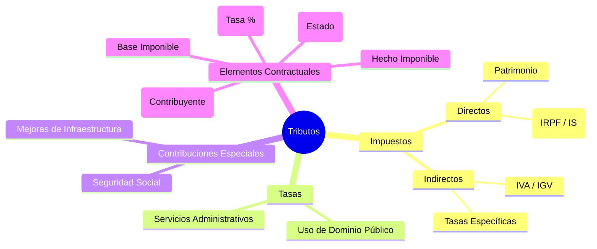

# Guía de Estudio: Asignatura 11. Derecho fiscal

## 11.1. Los ingresos del estado

### 11.1.1. Ingresos patrimoniales
Los ingresos patrimoniales del Estado son aquellos que este percibe como contraprestación por servicios que presta y del uso, aprovechamiento o enajenación de sus bienes de dominio privado [1]. Estos se relacionan con el Derecho fiscal patrimonial, que comprende las normas jurídicas concernientes a los bienes del Estado [1]. Dentro de la clasificación de ingresos, se encuentran los "Productos", definidos en el Código Fiscal de la Federación como las contraprestaciones por los servicios que preste el Estado en sus funciones de derecho privado, así como por el uso, aprovechamiento o enajenación de bienes del dominio privado [2].

### 11.1.2. Ingresos por concepto de precios y tarifas
Estos ingresos corresponden a los obtenidos por la prestación de servicios o la producción de bienes por parte del Estado, actuando de manera similar a un particular. Se vinculan con los "precios públicos" [3]. A diferencia de los impuestos, que son coactivos, estos precios y tarifas responden a una lógica contractual o de servicio, aunque regulada públicamente. También pueden incluirse aquí los ingresos de organismos descentralizados y empresas de participación estatal, que el Código Fiscal de la Federación excluye de la definición de aprovechamientos [4].

### 11.1.3. Ingresos crediticios
Se refieren a los recursos que el Estado obtiene mediante financiamientos, conocidos como empréstitos, tanto de fuentes internas como externas [3]. Estos ingresos generan deuda pública y están regulados por normas específicas como la Ley de la Deuda Pública, formando parte del Derecho del crédito público [1].

### 11.1.4. Ingresos tributarios
Constituyen la parte medular del Derecho Fiscal. Son las prestaciones en dinero o especie que el Estado exige en ejercicio de su poder de imperio [3]. El Código Fiscal de la Federación clasifica las contribuciones (ingresos tributarios) en:
1.  **Impuestos:** Contribuciones establecidas en la ley que deben pagar las personas físicas y morales en la situación jurídica o de hecho prevista [5].
2.  **Aportaciones de seguridad social:** Contribuciones a cargo de personas sustituidas por el Estado en el cumplimiento de obligaciones de seguridad social [6].
3.  **Contribuciones de mejoras:** A cargo de quienes se beneficien de manera directa por obras públicas [6].
4.  **Derechos:** Contribuciones por el uso o aprovechamiento de bienes del dominio público y por recibir servicios que presta el Estado en funciones de derecho público [6].

### 11.1.5. Principios de los tributos
Los principios fundamentales que rigen los tributos se dividen en doctrinales y constitucionales. Adam Smith propuso los principios de justicia (capacidad de pago), certidumbre (certeza en la ley), comodidad (facilidad de pago) y economía (eficiencia recaudadora) [7], [8]. Constitucionalmente (Art. 31, fracc. IV), en México rigen los principios de:
*   **Generalidad:** Todos deben contribuir [9].
*   **Justicia Impositiva:** Reparto justo de cargas [10].
*   **Legalidad Tributaria:** No hay tributo sin ley previa ("Nullum tributum sine lege") [11].
*   **Proporcionalidad y Equidad:** Atender a la capacidad económica y dar trato igual a los iguales [12].
*   **Destino al gasto público:** La recaudación debe satisfacer necesidades colectivas [3].

### 11.1.6. Clasificación y efectos tradicionales de los tributos
Las contribuciones se clasifican tradicionalmente en:
*   **Directos:** Gravan los rendimientos y no son repercutibles (ej. ISR) [13].
*   **Indirectos:** Gravan el consumo y son repercutibles (ej. IVA) [13].
*   **Reales:** Atienden a los bienes o cosas [13].
*   **Personales:** Atienden a las características de las personas [14].
En cuanto a sus efectos, los impuestos pueden tener fines fiscales (recaudación), extrafiscales (sociales o económicos), y efectos morales o políticos [14], [15], [8].

## 11.2. La relación jurídico tributaria

### 11.2.1. La obligación tributaria
La obligación fiscal es el vínculo jurídico en virtud del cual el Estado (acreedor) exige a un deudor (contribuyente) el cumplimiento de una prestación pecuniaria, excepcionalmente en especie [16], [17]. Sus elementos son la causa, el objeto, la relación jurídico-tributaria, el hecho imponible y los sujetos [16].

### 11.2.2. El crédito tributario
El crédito fiscal o tributario es el derecho que tiene el Estado a percibir de los contribuyentes las prestaciones establecidas en la ley. Se compone de la suerte principal (el impuesto) y los accesorios (recargos, multas, gastos de ejecución) [18], [19].

### 11.2.3. Los sujetos de la relación
*   **Sujeto Activo:** El Estado en sus tres niveles de gobierno (Federación, Estados, Municipios y CDMX) con potestad tributaria [20].
*   **Sujeto Pasivo:** El contribuyente o responsable obligado al pago. Se clasifican en sujetos pasivos por deuda propia (directos), por deuda ajena (responsables solidarios) o sustitutos [20], [21].

### 11.2.4. El sujeto del impuesto y el sujeto pagador
Se distingue entre el sujeto que realiza el hecho generador (contribuyente de derecho) y quien realmente soporta la carga económica (contribuyente de hecho), fenómeno común en los impuestos indirectos donde existe traslación [22]. El sujeto pagador puede ser un tercero o un retenedor que entera el impuesto al fisco [23].

### 11.2.5. La responsabilidad, capacidad, residencia y domicilio
*   **Responsabilidad:** Incluye la responsabilidad solidaria (ej. liquidadores, socios) y la responsabilidad por infracción administrativa [24], [25].
*   **Capacidad:** Se refiere a la "capacidad contributiva", que es la potencialidad económica para contribuir a los gastos públicos [26].
*   **Residencia y Domicilio:** Son criterios de vinculación fiscal. La residencia determina el gravamen sobre la renta mundial (en ISR). El domicilio fiscal es el lugar para recibir notificaciones y cumplir obligaciones formales [27], [28], [29].

### 11.2.6. La extinción de la obligación tributaria
Son los medios por los cuales cesa la obligación fiscal. Las formas principales son el pago, la compensación, la condonación, la prescripción y la cancelación [4].

### 11.2.7. El pago
Es la entrega de la cosa o cantidad debida [6]. Existen diversas modalidades: pago liso y llano (sin objeción), bajo protesta (impugnando), provisional (a cuenta del anual), definitivo, extemporáneo (fuera de plazo), y en parcialidades [30], [23].

### 11.2.8. Compensación
Es una forma de extinción donde el contribuyente que tiene cantidades a su favor las resta de las cantidades que debe pagar por adeudos propios o por retención a terceros [31]. Puede ser de oficio o a petición de parte [31].

### 11.2.9. Prescripción y caducidad
*   **Caducidad:** Es la pérdida de las facultades de las autoridades fiscales para comprobar el cumplimiento de disposiciones fiscales, determinar créditos e imponer sanciones. El plazo general es de 5 años [31], [32].
*   **Prescripción:** Es la extinción del crédito fiscal por el transcurso del tiempo; opera para liberar al contribuyente de la obligación de pago. El plazo es de 5 años [33].

### 11.2.10. Condonación y cancelación
*   **Condonación:** Es el perdón de la deuda, total o parcial. El Ejecutivo Federal puede condonar contribuciones en casos extraordinarios. Las multas pueden ser condonadas si se cumplen ciertos requisitos [34], [35].
*   **Cancelación:** Se da cuando el crédito es incobrable o incosteable; cancela el registro contable pero no necesariamente libera de la obligación de pago si el deudor vuelve a tener bienes [35].

## 11.3. El fomento tributario

### 11.3.1. No sujeción y no causación
Se refiere a situaciones donde no nace la obligación fiscal. La no sujeción implica que el hecho no encuadra en la hipótesis normativa. La no causación puede derivar de exenciones o zonas de inmunidad donde, aunque se realice el hecho, la ley impide el nacimiento del cobro [36].

### 11.3.2. Condonación
Como instrumento de fomento, la condonación puede utilizarse para regularizar situaciones fiscales o apoyar en catástrofes, liberando a los contribuyentes de multas y recargos para incentivar el pago del principal [34].

### 11.3.3. Bases jurídicas
Las bases jurídicas del fomento tributario se encuentran en la Constitución, permitiendo al Estado utilizar la política fiscal para incentivar áreas prioritarias, siempre respetando los principios de generalidad y equidad [37].

### 11.3.4. Los estímulos fiscales
Son beneficios económicos concedidos por la ley fiscal (como acreditamientos) para promover ciertas actividades (cine, tecnología, transporte) o regiones. Permiten disminuir la carga tributaria si se cumplen objetivos específicos de política económica [38].

## 11.4. El ilícito tributario

### 11.4.1. La facultad sancionadora
Es el poder represivo de la administración pública hacendaria para castigar el incumplimiento de las normas fiscales [39]. Deriva del *ius puniendi* del Estado.

### 11.4.2. Infracciones y sanciones
*   **Infracción:** Es la transgresión o incumplimiento de una norma fiscal que no constituye delito. Se castiga con multas administrativas [25].
*   **Sanciones:** Consecuencia jurídica del incumplimiento, principalmente multas (que no deben ser excesivas), clausuras o aseguramiento de bienes [40], [25].

### 11.4.3. Los delitos y las penas
Son las conductas más graves que atentan contra la hacienda pública, tipificadas en el Código Fiscal de la Federación (ej. defraudación fiscal, contrabando). Requieren, según el caso, de **querella** (petición de parte ofendida, la SHCP), **declaratoria de perjuicio**, o **declaratoria de contrabando** para proceder penalmente [41], [42]. Las penas incluyen prisión [41].

### 11.4.4. Los procedimientos para sancionar
Existen procedimientos administrativos para imponer multas (basados en la notificación de la infracción y garantía de audiencia) y procedimientos penales que se siguen ante el Ministerio Público Federal y jueces penales, tras la querella o declaratoria de la autoridad fiscal [33], [42].

## 11.5. El procedimiento administrativo

### 11.5.1. La administración fiscal
Está a cargo principalmente de la Secretaría de Hacienda y Crédito Público (SHCP) y su órgano desconcentrado, el Servicio de Administración Tributaria (SAT). Sus funciones incluyen la recaudación, fiscalización, y asistencia al contribuyente [34], [35].

### 11.5.2. Derechos y obligaciones de los contribuyentes
*   **Obligaciones:** Inscribirse en el RFC, llevar contabilidad, expedir comprobantes, presentar declaraciones y permitir visitas domiciliarias [43], [44], [45].
*   **Derechos:** A ser informado, a la devolución de impuestos, a la corrección de su situación fiscal, y a la justicia pronta [46], [47].

### 11.5.3. La negativa ficta
Es una figura jurídica que protege al particular frente al silencio de la autoridad. Si la autoridad no responde a una instancia o petición en el plazo legal (generalmente 3 meses en materia federal), se entiende que la respuesta es negativa, permitiendo al contribuyente impugnar dicha resolución presunta [48] (Nota: la fuente refiere a la *afirmativa ficta* en materia local, pero la negativa ficta es el estándar federal derivado del derecho de petición).

### 11.5.4. Las facultades de las autoridades fiscales
Incluyen facultades de comprobación como: visitas domiciliarias, revisiones de gabinete (escritorio), y revisiones electrónicas para verificar el cumplimiento de obligaciones fiscales [49], [50].

### 11.5.5. Servicios y asistencia a contribuyentes
La autoridad tiene la obligación de prestar asistencia gratuita, orientación y publicar reglas claras para facilitar el cumplimiento voluntario. La PRODECON (Procuraduría de la Defensa del Contribuyente) juega un papel vital aquí [35], [51].

### 11.5.6. La facultad económica coactiva
Es la facultad de la autoridad para cobrar sus propios créditos sin necesidad de acudir a los tribunales, a través del Procedimiento Administrativo de Ejecución (PAE) [52].

### 11.5.7. El secuestro administrativo
En el contexto fiscal mexicano, se refiere al **embargo** de bienes del deudor para garantizar el crédito fiscal. Puede ser precautorio (antes de que el crédito sea exigible) o definitivo dentro del PAE [53], [54].

### 11.5.8. Los remates
Es la etapa final del PAE donde los bienes embargados son vendidos en subasta pública (almoneda) para aplicar el producto al pago del crédito fiscal [53], [55].

### 11.5.9. La suspensión del procedimiento
El PAE puede suspenderse si el contribuyente garantiza el interés fiscal (mediante fianza, hipoteca, embargo, etc.) mientras se resuelven los medios de defensa interpuestos [56].

## 11.6. Los recursos administrativos

### 11.6.1. La naturaleza de los recursos
Son medios de defensa que el contribuyente interpone ante la misma autoridad administrativa para que revise la legalidad de sus actos y resoluciones. Buscan la revocación, modificación o confirmación del acto impugnado [57].

### 11.6.2. La oposición al procedimiento y la nulidad de notificaciones
Son defensas específicas. La oposición al PAE se da cuando existen irregularidades en el cobro coactivo. La nulidad de notificaciones ataca la falta de formalidades en cómo se dio a conocer el acto administrativo [58], [59].

### 11.6.3. Otros recursos
El principal recurso administrativo federal es el **Recurso de Revocación**. Anteriormente existía el de Oposición al Procedimiento Administrativo de Ejecución, pero se han unificado en el de revocación en el CFF [27].

## 11.7. Proceso contencioso administrativo

### 11.7.1. El proceso ante los tribunales autónomos, el tribunal fiscal y el tribunal de lo contencioso administrativo en el distrito federal
Se refiere al Juicio de Nulidad. A nivel federal, se tramita ante el **Tribunal Federal de Justicia Administrativa** (anteriormente TFJFA) [60]. En la CDMX, ante el Tribunal de Justicia Administrativa de la CDMX [15].

### 11.7.2. Demanda, contestación, ofrecimiento y desahogo de pruebas
Son las etapas procesales del juicio contencioso. Inicia con la demanda del contribuyente, la contestación de la autoridad, y la etapa probatoria donde se admiten pruebas (excepto la confesional de autoridades mediante posiciones) [39].

### 11.7.3. La sentencia
Es la resolución que pone fin al juicio, declarando la validez o nulidad (lisa y llana o para efectos) del acto impugnado [39].

### 11.7.4. Los recursos
Dentro del juicio contencioso existen recursos como la Reclamación (contra acuerdos de trámite) y, para la autoridad, el recurso de Revisión fiscal contra sentencias desfavorables [61].

### 11.7.5. El proceso ante el poder judicial de la federación
Cuando el contribuyente obtiene una sentencia desfavorable en el Tribunal Federal de Justicia Administrativa, puede acudir al Poder Judicial de la Federación (Tribunales Colegiados) mediante el Amparo Directo [62], [60].

### 11.7.6. El amparo y la acción constitucional de revisión
*   **Amparo Directo:** Contra sentencias definitivas de los tribunales administrativos.
*   **Amparo Indirecto:** Contra leyes fiscales inconstitucionales o actos de autoridad que no admitan recurso o sean de imposible reparación, tramitado ante Juzgados de Distrito [60].
*   **Revisión Fiscal:** Recurso exclusivo de la autoridad demandada ante Tribunales Colegiados [61].

## 11.8. El crédito público

### 11.8.1. Los empréstitos y la soberanía
El crédito público es la capacidad del Estado para contraer deudas (empréstitos) basadas en la confianza de su solvencia y soberanía. Es un recurso financiero complementario a los tributos [63], [3].

### 11.8.2. La regulación jurídica de los empréstitos
Se encuentra principalmente en la Constitución (Art. 73 fracc. VIII) y en la Ley General de Deuda Pública (referida como Ley de la Deuda Pública). Regula la contratación y manejo de la deuda [1].

### 11.8.3. La deuda pública
Es el conjunto de obligaciones pasivas del Estado derivadas de los empréstitos. Se clasifica en interna (moneda nacional) y externa (moneda extranjera) [64].

### 11.8.4. Extinción de la deuda
Se realiza mediante el pago (amortización), conversión o consolidación de la deuda, conforme a lo establecido en los presupuestos de egresos anuales [64].

## 11.9. El presupuesto del estado

### 11.9.1. Evolución
Ha pasado de ser un simple listado de gastos a un instrumento complejo de política económica y social, evolucionando hacia presupuestos por programas [57].

### 11.9.2. Tipos y naturaleza jurídica del presupuesto
Existen presupuestos tradicionales y presupuestos por programas (enfocados en objetivos y resultados) [65]. Jurídicamente, es un acto legislativo (aprobado por Diputados) que autoriza el gasto público [29].

### 11.9.3. Principio del presupuesto
Los principios doctrinales fundamentales son:
*   **Anualidad:** Vigencia de un año [66], [65].
*   **Unidad:** Un solo documento presupuestario [65].
*   **Universalidad:** Debe contener todos los gastos [67].
*   **Especialidad:** Detalle específico de las partidas [67].

### 11.9.4. Preparación, elaboración y aprobación del presupuesto
El Ejecutivo prepara el Proyecto de Presupuesto de Egresos. La Cámara de Diputados tiene la facultad exclusiva de examinarlo, discutirlo y aprobarlo anualmente [29], [39], [66].

### 11.9.5. Ejecución del presupuesto
Corresponde al Poder Ejecutivo aplicar los recursos autorizados conforme a los programas y partidas establecidas, sujeto a normas de contabilidad gubernamental [68], [69].

### 11.9.6. La inversión pública
Es el gasto destinado a obras, infraestructura y proyectos productivos que incrementan el patrimonio estatal, distinguiéndose del gasto corriente [67].

## 11.10. El control del presupuesto

### 11.10.1. Finalidades del control
Asegurar que el gasto se realice con legalidad, honestidad, eficiencia, eficacia, economía, racionalidad, austeridad, transparencia, control y rendición de cuentas [70], [71].

### 11.10.2. Los sistemas de control
Incluyen controles internos (dentro de la propia administración) y externos (por el Legislativo) [67].

### 11.10.3. El control administrativo del presupuesto
Realizado por órganos internos de control (ej. Secretaría de la Función Pública o equivalentes locales) para vigilar el desempeño y cumplimiento normativo de las dependencias [72].

### 11.10.4. El control legislativo del presupuesto
Es la revisión de la Cuenta Pública realizada por la Cámara de Diputados a través de la **Auditoría Superior de la Federación (ASF)**. Verifica si los ingresos y gastos se ajustaron a los conceptos y partidas presupuestadas [73], [67].

---

### Resumen de 3 puntos clave:

1.  **Fundamento Constitucional:** El Derecho Fiscal mexicano se cimienta en el artículo 31, fracción IV de la Constitución, que establece la obligación de contribuir al gasto público bajo los principios de legalidad, proporcionalidad, equidad y destino al gasto público [74], [75].
2.  **Facultad Coactiva del Estado:** El sistema fiscal dota a la autoridad (SAT/SHCP) de facultades extraordinarias, como la "facultad económico-coactiva", que le permite cobrar créditos fiscales embargando y rematando bienes sin necesidad de una sentencia judicial previa, a través del Procedimiento Administrativo de Ejecución [52].
3.  **Defensa del Contribuyente:** Frente al poder fiscal, el contribuyente cuenta con derechos fundamentales (audiencia, legalidad) y medios de defensa específicos: el recurso administrativo (revocación), el juicio contencioso administrativo (nulidad ante el TFJA) y, en última instancia, el Juicio de Amparo ante el Poder Judicial Federal [60], [76].
<!-- VISUAL_ENRICHMENT -->

    

        [DIAGRAMA]
        <h3 class="text-white font-bold text-xl">Estructura del Sistema Tributario</h3>
    

    

        

    

