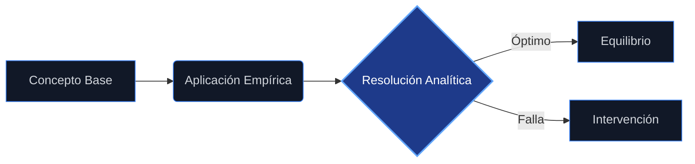

<!-- HERO -->
<header class="mb-24">
    

        

        Economics Master Series
    

    <h1 class="text-5xl md:text-7xl font-black text-white tracking-tighter leading-none mb-8">
        A18
    </h1>
    

        Zero-Noise UX
        v9.0 · Dark Mode
    

</header>

    📈
    <h2 class="text-2xl md:text-4xl font-black tracking-tight leading-tight bg-gradient-to-r from-indigo-300 to-violet-400 bg-clip-text text-transparent">Guía de Estudio: Fundamentos de Mercadotecnia</h2>

Esta guía desarrolla el contenido completo del Temario Oficial proporcionado en las fuentes, integrando definiciones, conceptos y explicaciones derivadas de los textos académicos y materiales de referencia disponibles.

<section class="mb-16 last:mb-0">
<!-- section: 18.1. -->

    📈
    

        <h2 class="text-xl md:text-3xl font-black tracking-tight bg-gradient-to-r from-indigo-300 to-violet-400 bg-clip-text text-transparent">Introducción a la mercadotecnia</h2>
        

    

<!-- section: 18.1.1. -->

    📈
    <h3 class="text-xl font-bold text-indigo-300 tracking-tight">Concepto de mercadotecnia</h3>

<!-- section: 18.1.1.1. -->

    📈
    <h4 class="text-sm font-black text-indigo-300 uppercase tracking-[0.15em]">Definición de mercadotecnia</h4>

La mercadotecnia es una disciplina con múltiples definiciones que convergen en la satisfacción de necesidades. <em>   <strong>Enfoque de proceso social y administrativo:</strong> Kotler y Armstrong la definen como el proceso mediante el cual individuos y grupos obtienen lo que necesitan y desean a través de la creación y el intercambio de productos y valor con otros . </em>   <strong>Enfoque de actividades de negocios:</strong> Stanton y Walker la describen como un sistema total de actividades ideado para planear productos satisfactores de necesidades, asignarles precios, promoverlos y distribuirlos a los mercados meta para lograr objetivos organizacionales , . <em>   <strong>Enfoque de intercambio:</strong> La </em>American Marketing Association<em> (AMA) la define como el proceso de planeación, ejecución y conceptualización de precios, promoción y distribución de ideas, mercancías y términos para crear intercambios que satisfagan objetivos individuales y organizacionales , . </em>   <strong>Enfoque de valor:</strong> Se trata de la ciencia y el arte de explorar, crear y entregar valor para satisfacer las necesidades de un mercado objetivo obteniendo una utilidad .

<!-- section: 18.1.1.2. -->

    📈
    <h4 class="text-sm font-black text-indigo-300 uppercase tracking-[0.15em]">Evolución y actualidad de la mercadotecnia</h4>

La evolución de la mercadotecnia ha transitado por diversas etapas históricas y de enfoque: <em>   <strong>Antecedentes históricos:</strong> En México, sus raíces se remontan al periodo prehispánico con los </em>pochtecas<em> y los tianguis de Tenochtitlán . </em>   <strong>Evolución cronológica:</strong> 1.  <strong>Mercadotecnia Masiva (1940-1950):</strong> Esfuerzos dirigidos a toda la población sin distinción, apoyados en medios masivos . 2.  <strong>Mercadotecnia de Segmentos (1960):</strong> Impulsada por cambios sociales como la liberación femenina, diseñando actividades para grupos específicos . 3.  <strong>Mercadotecnia de Nichos (1980):</strong> Ante crisis financieras y subdivisión de mercados, se busca satisfacer expectativas muy específicas . 4.  <strong>Mercadotecnia Personalizada (1990):</strong> Gracias a las bases de datos y tecnología, se identifican comportamientos individuales . <em>   <strong>Actualidad:</strong> Se ha desarrollado el comercio electrónico (</em>e-commerce) y el uso de TICs para lograr una relación directa y colaborativa con el cliente , .

<!-- section: 18.1.2. -->

    📈
    <h3 class="text-xl font-bold text-indigo-300 tracking-tight">Diferentes enfoques de la mercadotecnia</h3>

Las organizaciones han adoptado distintas filosofías a lo largo del tiempo , : 1.  <strong>Enfoque de Producción:</strong> Preocupación por vender todo lo producido; el consumidor solo quiere disponibilidad. 2.  <strong>Enfoque de Producto:</strong> Énfasis en la calidad; se asume que un buen producto no requiere promoción. 3.  <strong>Enfoque de Ventas:</strong> Uso intensivo de promoción ante una oferta mayor que la demanda. 4.  <strong>Enfoque de Mercadotecnia (Orientación al mercado):</strong> El consumidor es el centro; se identifican necesidades para satisfacerlas y obtener beneficios. 5.  <strong>Enfoque de Mercadotecnia Social:</strong> Busca satisfacer necesidades del consumidor y de la empresa, pero preservando o mejorando el bienestar de la sociedad y el medio ambiente a largo plazo , .

    

    

        <h5 class="text-indigo-400 text-[9px] md:text-[10px] uppercase tracking-[0.4em] font-black mb-6 flex items-center gap-3">
            
            Puntos Clave
        </h5>
        <ul class="space-y-4">
<li class="flex items-start gap-3 text-slate-200 text-sm leading-relaxed">✦Esta guía desarrolla el contenido completo del Temario Oficial proporcionado en las fuentes, integrando definiciones, conceptos y explicaciones derivadas de los textos académicos y materiales de referencia disponibles.</li>
<li class="flex items-start gap-3 text-slate-200 text-sm leading-relaxed">✦La mercadotecnia es una disciplina con múltiples definiciones que convergen en la satisfacción de necesidades.</li>
<li class="flex items-start gap-3 text-slate-200 text-sm leading-relaxed">✦La evolución de la mercadotecnia ha transitado por diversas etapas históricas y de enfoque:    Antecedentes históricos: En México, sus raíces se remontan al periodo prehispánico con los pochtecas y los tianguis de Tenochtitlán.</li>
<li class="flex items-start gap-3 text-slate-200 text-sm leading-relaxed">✦Las organizaciones han adoptado distintas filosofías a lo largo del tiempo , : 1.</li>
        </ul>
    

</section>

<section class="mb-16 last:mb-0">
<!-- section: 18.2. -->

    📈
    

        <h2 class="text-xl md:text-3xl font-black tracking-tight bg-gradient-to-r from-cyan-300 to-blue-400 bg-clip-text text-transparent">Mercadotecnia en la empresa: estratégica y operativa. El plan de mercadotecnia</h2>
        

    

<!-- section: 18.2.1. -->

    🏢
    <h3 class="text-xl font-bold text-cyan-300 tracking-tight">La dirección comercial</h3>

<!-- section: 18.2.1.1. -->

    🏢
    <h4 class="text-sm font-black text-cyan-300 uppercase tracking-[0.15em]">Importancia de la dirección comercial</h4>

La dirección comercial o de mercadotecnia es crucial porque actúa como el medio de enlace entre la empresa y la sociedad, sirviendo como intérprete de las necesidades y deseos del mercado objetivo . Su función operativa asegura la relación entre la empresa y el cliente, encargándose de recolectar información, procesar deseos y proponer productos .

<!-- section: 18.2.1.2. -->

    🏢
    <h4 class="text-sm font-black text-cyan-300 uppercase tracking-[0.15em]">Diversidad de formas de dirección</h4>

La estructura organizacional de la mercadotecnia ha evolucionado en etapas , , : 1.  Funciones sencillas (financiamiento, operaciones, ventas). 2.  Orientación al producto con investigación de mercados. 3.  Separación de ventas y mercadotecnia. 4.  Dirección integrada bajo un Director de Mercadotecnia que coordina ventas, investigación, publicidad y relaciones públicas.

<!-- section: 18.2.2. -->

    📈
    <h3 class="text-xl font-bold text-cyan-300 tracking-tight">La mercadotecnia digital</h3>

<!-- section: 18.2.2.1. -->

    🎯
    <h4 class="text-sm font-black text-cyan-300 uppercase tracking-[0.15em]">La estrategia comercial</h4>

La estrategia en el ámbito digital implica la transición del marketing tradicional a uno interactivo. Utiliza plataformas en línea y redes sociales para conectar con los consumidores y personalizar ofertas .

<!-- section: 18.2.2.2. -->

    📌
    <h4 class="text-sm font-black text-cyan-300 uppercase tracking-[0.15em]">Ámbitos de aplicación</h4>

Incluye el marketing por correo (catálogos digitales), marketing en línea (sitios web), redes sociales y marketing móvil (apps, SMS) , . Permite la interacción directa y una mejora dinámica con los usuarios .

<!-- section: 18.2.2.3. -->

    🎯
    <h4 class="text-sm font-black text-cyan-300 uppercase tracking-[0.15em]">La planificación comercial</h4>

En el entorno digital, la planificación se apoya en bases de datos para segmentar y conocer mejor a los clientes, consiguiendo una relación de colaboración que antes no existía .

<!-- section: 18.2.3. -->

    📈
    <h3 class="text-xl font-bold text-cyan-300 tracking-tight">El plan de mercadotecnia</h3>

<!-- section: 18.2.3.1. -->

    📖
    <h4 class="text-sm font-black text-cyan-300 uppercase tracking-[0.15em]">Concepto y definiciones</h4>

El plan de mercadotecnia es un instrumento que identifica las acciones para cubrir las necesidades de la empresa y del mercado . Es un plan de acción para utilizar los recursos de la empresa con el fin de alcanzar metas .

<!-- section: 18.2.3.2. -->

    📈
    <h4 class="text-sm font-black text-cyan-300 uppercase tracking-[0.15em]">Etapas del plan de mercadotecnia</h4>

El proceso administrativo de la mercadotecnia incluye , : 1.  <strong>Planeación:</strong> Determinar objetivos, investigar mercados y seleccionar estrategias. 2.  <strong>Organización:</strong> Delimitar responsabilidades y autoridad. 3.  <strong>Dirección:</strong> Tomar decisiones y coordinar actividades. 4.  <strong>Control:</strong> Establecer normas y medir resultados.

<!-- section: 18.2.3.3. -->

    📈
    <h4 class="text-sm font-black text-cyan-300 uppercase tracking-[0.15em]">Tipos de plan de mercadotecnia</h4>

Existen planes estratégicos (largo plazo) y tácticos u operativos (corto plazo, acciones concretas para ejecutar la estrategia) , .

    

    

        <h5 class="text-cyan-400 text-[9px] md:text-[10px] uppercase tracking-[0.4em] font-black mb-6 flex items-center gap-3">
            
            Puntos Clave
        </h5>
        <ul class="space-y-4">
<li class="flex items-start gap-3 text-slate-200 text-sm leading-relaxed">✦La dirección comercial o de mercadotecnia es crucial porque actúa como el medio de enlace entre la empresa y la sociedad, sirviendo como intérprete de las necesidades y deseos del mercado objetivo.</li>
<li class="flex items-start gap-3 text-slate-200 text-sm leading-relaxed">✦La estructura organizacional de la mercadotecnia ha evolucionado en etapas , , : 1.</li>
<li class="flex items-start gap-3 text-slate-200 text-sm leading-relaxed">✦La estrategia en el ámbito digital implica la transición del marketing tradicional a uno interactivo.</li>
<li class="flex items-start gap-3 text-slate-200 text-sm leading-relaxed">✦Incluye el marketing por correo (catálogos digitales), marketing en línea (sitios web), redes sociales y marketing móvil (apps, SMS) ,.</li>
        </ul>
    

</section>

<section class="mb-16 last:mb-0">
<!-- section: 18.3. -->

    📈
    

        <h2 class="text-xl md:text-3xl font-black tracking-tight bg-gradient-to-r from-emerald-300 to-teal-400 bg-clip-text text-transparent">El entorno empresarial y el mercado de las organizaciones</h2>
        

    

<!-- section: 18.3.1. -->

    📌
    <h3 class="text-xl font-bold text-emerald-300 tracking-tight">El entorno</h3>

<!-- section: 18.3.1.1. -->

    📖
    <h4 class="text-sm font-black text-emerald-300 uppercase tracking-[0.15em]">Conceptos y límites del entorno</h4>

El entorno comprende fuerzas y actores que afectan la capacidad de la empresa para servir a sus clientes , . Se divide en dos grandes grupos: micro y macro ambiente .

<!-- section: 18.3.1.2. -->

    📌
    <h4 class="text-sm font-black text-emerald-300 uppercase tracking-[0.15em]">Macro-entorno</h4>

Son fuerzas externas no controlables por la empresa que moldean oportunidades y amenazas , : <em>   <strong>Demográficas:</strong> Edad, género, ocupación. </em>   <strong>Económicas:</strong> Ingresos, poder adquisitivo, crisis. <em>   <strong>Naturales/Ecológicas:</strong> Recursos naturales, sustentabilidad. </em>   <strong>Tecnológicas:</strong> Avances e innovaciones. <em>   <strong>Políticas y Legales:</strong> Leyes y regulaciones. </em>   <strong>Culturales:</strong> Valores y comportamientos de la sociedad.

<!-- section: 18.3.1.3. -->

    📌
    <h4 class="text-sm font-black text-emerald-300 uppercase tracking-[0.15em]">Micro-entorno</h4>

Son actores cercanos a la compañía que afectan su capacidad de servir al cliente , : <em>   La compañía misma. </em>   Proveedores. <em>   Intermediarios de marketing. </em>   Clientes. <em>   Competidores. </em>   Públicos (financieros, medios, gubernamentales, acción ciudadana).

<!-- section: 18.3.2. -->

    📈
    <h3 class="text-xl font-bold text-emerald-300 tracking-tight">El mercado</h3>

<!-- section: 18.3.2.1. -->

    📈
    <h4 class="text-sm font-black text-emerald-300 uppercase tracking-[0.15em]">Conceptos y límites del mercado</h4>

    
El mercado es el conjunto de todos los compradores reales y potenciales de un producto o servicio que tienen una necesidad o deseo y la capacidad de intercambio , . También se define como el lugar donde se desarrolla la mercadotecnia .

    
Fundamento Conceptual

<!-- section: 18.3.2.2. -->

    📈
    <h4 class="text-sm font-black text-emerald-300 uppercase tracking-[0.15em]">Evolución de los mercados</h4>

La visión del mercado ha cambiado desde un enfoque de producción masiva hacia la fragmentación en nichos y la personalización individual, impulsada por la tecnología y la exigencia de los consumidores , .

<!-- section: 18.3.2.3. -->

    📈
    <h4 class="text-sm font-black text-emerald-300 uppercase tracking-[0.15em]">Tipos de mercados</h4>

Los mercados pueden clasificarse según su ubicación (geográfica), tipo de cliente (consumo, industrial, revendedor, gubernamental) o tipo de producto (bienes, servicios) , .

<!-- section: 18.3.2.4. -->

    📈
    <h4 class="text-sm font-black text-emerald-300 uppercase tracking-[0.15em]">La importancia de la competencia</h4>

    
En la estrategia de marketing, es vital analizar a los competidores para identificar sus objetivos, estrategias, fortalezas y debilidades . El posicionamiento de un producto se define a menudo en relación directa con la competencia , .

    
Fundamento Conceptual

    

    

        <h5 class="text-emerald-400 text-[9px] md:text-[10px] uppercase tracking-[0.4em] font-black mb-6 flex items-center gap-3">
            
            Puntos Clave
        </h5>
        <ul class="space-y-4">
<li class="flex items-start gap-3 text-slate-200 text-sm leading-relaxed">✦El entorno comprende fuerzas y actores que afectan la capacidad de la empresa para servir a sus clientes ,.</li>
<li class="flex items-start gap-3 text-slate-200 text-sm leading-relaxed">✦Son fuerzas externas no controlables por la empresa que moldean oportunidades y amenazas , :    Demográficas: Edad, género, ocupación.</li>
<li class="flex items-start gap-3 text-slate-200 text-sm leading-relaxed">✦Son actores cercanos a la compañía que afectan su capacidad de servir al cliente , :    La compañía misma.</li>
<li class="flex items-start gap-3 text-slate-200 text-sm leading-relaxed">✦El mercado es el conjunto de todos los compradores reales y potenciales de un producto o servicio que tienen una necesidad o deseo y la capacidad de intercambio ,.</li>
        </ul>
    

</section>

<section class="mb-16 last:mb-0">
<!-- section: 18.4. -->

    📌
    

        <h2 class="text-xl md:text-3xl font-black tracking-tight bg-gradient-to-r from-amber-300 to-orange-400 bg-clip-text text-transparent">El comportamiento del consumidor</h2>
        

    

<!-- section: 18.4.1. -->

    🎯
    <h3 class="text-xl font-bold text-amber-300 tracking-tight">La importancia del comportamiento en la estrategia</h3>

<!-- section: 18.4.1.1. -->

    📌
    <h4 class="text-sm font-black text-amber-300 uppercase tracking-[0.15em]">Factores influyentes</h4>

El comportamiento de compra está influido por factores internos (motivación, percepción, aprendizaje, personalidad) y externos (sociales, culturales, grupos de referencia, familia) , .

<!-- section: 18.4.1.2. -->

    🏢
    <h4 class="text-sm font-black text-amber-300 uppercase tracking-[0.15em]">Beneficios para la empresa</h4>

Comprender el comportamiento permite a las empresas desarrollar estrategias de mezcla mercadológica (producto, precio, plaza, promoción) más efectivas para satisfacer necesidades y deseos .

<!-- section: 18.4.1.3. -->

    📌
    <h4 class="text-sm font-black text-amber-300 uppercase tracking-[0.15em]">Beneficios para el consumidor</h4>

Al entender al consumidor, las empresas crean ofertas de valor superior que mejoran la satisfacción y la calidad de vida del individuo , .

<!-- section: 18.4.2. -->

    📌
    <h3 class="text-xl font-bold text-amber-300 tracking-tight">Enfoques del comportamiento del consumidor</h3>

<!-- section: 18.4.2.1. -->

    📌
    <h4 class="text-sm font-black text-amber-300 uppercase tracking-[0.15em]">Características y complejidad</h4>

El comportamiento es complejo y abarca actos, procesos y relaciones sociales sostenidas por individuos y grupos para la obtención, uso y experiencia con productos , .

<!-- section: 18.4.2.2. -->

    🔢
    <h4 class="text-sm font-black text-amber-300 uppercase tracking-[0.15em]">Variables que interviene</h4>

Intervienen variables demográficas, psicográficas (estilos de vida), conductuales (frecuencia de uso) y geográficas , .

<!-- section: 18.4.2.3. -->

    📖
    <h4 class="text-sm font-black text-amber-300 uppercase tracking-[0.15em]">Diferentes tipos de enfoques</h4>

Existen enfoques económicos (racionales), psicológicos (motivacionales/emocionales) y de comportamiento mixto que integran variables sociales y culturales .

    

    

        <h5 class="text-amber-400 text-[9px] md:text-[10px] uppercase tracking-[0.4em] font-black mb-6 flex items-center gap-3">
            
            Puntos Clave
        </h5>
        <ul class="space-y-4">
<li class="flex items-start gap-3 text-slate-200 text-sm leading-relaxed">✦El comportamiento de compra está influido por factores internos (motivación, percepción, aprendizaje, personalidad) y externos (sociales, culturales, grupos de referencia, familia) ,.</li>
<li class="flex items-start gap-3 text-slate-200 text-sm leading-relaxed">✦Comprender el comportamiento permite a las empresas desarrollar estrategias de mezcla mercadológica (producto, precio, plaza, promoción) más efectivas para satisfacer necesidades y deseos.</li>
<li class="flex items-start gap-3 text-slate-200 text-sm leading-relaxed">✦Al entender al consumidor, las empresas crean ofertas de valor superior que mejoran la satisfacción y la calidad de vida del individuo ,.</li>
<li class="flex items-start gap-3 text-slate-200 text-sm leading-relaxed">✦El comportamiento es complejo y abarca actos, procesos y relaciones sociales sostenidas por individuos y grupos para la obtención, uso y experiencia con productos ,.</li>
        </ul>
    

</section>

<section class="mb-16 last:mb-0">
<!-- section: 18.5. -->

    ⚙️
    

        <h2 class="text-xl md:text-3xl font-black tracking-tight bg-gradient-to-r from-rose-300 to-pink-400 bg-clip-text text-transparent">Etapas en el proceso de compra del consumidor</h2>
        

    

<!-- section: 18.5.1. -->

    📌
    <h3 class="text-xl font-bold text-rose-300 tracking-tight">Enfoque</h3>

<!-- section: 18.5.1.1. -->

    📌
    <h4 class="text-sm font-black text-rose-300 uppercase tracking-[0.15em]">Enfoque según diferentes autores</h4>

Autores como Kotler y Stanton destacan que la compra no es un acto aislado, sino un proceso que comienza mucho antes de la adquisición y continúa después de ella .

<!-- section: 18.5.1.2. -->

    ⚙️
    <h4 class="text-sm font-black text-rose-300 uppercase tracking-[0.15em]">La evolución del proceso en la historia</h4>

El entendimiento de este proceso ha evolucionado desde modelos puramente económicos hacia modelos que incorporan la psicología y, más recientemente, la neurociencia para entender impulsos inconscientes , .

<!-- section: 18.5.2. -->

    📌
    <h3 class="text-xl font-bold text-rose-300 tracking-tight">Etapas</h3>

<!-- section: 18.5.2.1. -->

    📌
    <h4 class="text-sm font-black text-rose-300 uppercase tracking-[0.15em]">Reconocimiento del problema</h4>

El consumidor percibe una diferencia entre su estado actual y su estado deseado (una necesidad no satisfecha) , .

<!-- section: 18.5.2.2. -->

    💻
    <h4 class="text-sm font-black text-rose-300 uppercase tracking-[0.15em]">Búsqueda de información</h4>

El consumidor busca datos sobre cómo satisfacer esa necesidad, utilizando fuentes personales, comerciales o públicas .

<!-- section: 18.5.2.3. -->

    📌
    <h4 class="text-sm font-black text-rose-300 uppercase tracking-[0.15em]">Evaluación de alternativas</h4>

El consumidor procesa la información para evaluar las distintas opciones de marca o producto disponibles .

<!-- section: 18.5.2.4. -->

    📌
    <h4 class="text-sm font-black text-rose-300 uppercase tracking-[0.15em]">Decisión de compra</h4>

El individuo decide adquirir el producto más preferido, aunque factores situacionales pueden afectar esta decisión final .

<!-- section: 18.5.2.5. -->

    📌
    <h4 class="text-sm font-black text-rose-300 uppercase tracking-[0.15em]">Postcompra</h4>

El consumidor evalúa su satisfacción con el producto. La relación entre las expectativas y el desempeño percibido determina si hay satisfacción o disonancia cognitiva , .

<!-- section: 18.5.3. -->

    🔢
    <h3 class="text-xl font-bold text-rose-300 tracking-tight">Modelos en la toma de decisiones</h3>

<!-- section: 18.5.3.1. -->

    🔢
    <h4 class="text-sm font-black text-rose-300 uppercase tracking-[0.15em]">Modelo económico</h4>

Asume que el consumidor es racional y busca maximizar la utilidad con el menor costo posible , .

<!-- section: 18.5.3.2. -->

    🔢
    <h4 class="text-sm font-black text-rose-300 uppercase tracking-[0.15em]">Modelo psicológico</h4>

Se centra en factores internos como la motivación (Maslow), la percepción y el aprendizaje. El neuromarketing, por ejemplo, estudia cómo el cerebro reacciona a estímulos , .

<!-- section: 18.5.3.3. -->

    🔢
    <h4 class="text-sm font-black text-rose-300 uppercase tracking-[0.15em]">Modelos de comportamientos mixtos</h4>

Integran factores psicológicos con influencias sociales, culturales y ambientales para explicar decisiones complejas .

    

    

        <h5 class="text-rose-400 text-[9px] md:text-[10px] uppercase tracking-[0.4em] font-black mb-6 flex items-center gap-3">
            
            Puntos Clave
        </h5>
        <ul class="space-y-4">
<li class="flex items-start gap-3 text-slate-200 text-sm leading-relaxed">✦Autores como Kotler y Stanton destacan que la compra no es un acto aislado, sino un proceso que comienza mucho antes de la adquisición y continúa después de ella.</li>
<li class="flex items-start gap-3 text-slate-200 text-sm leading-relaxed">✦El entendimiento de este proceso ha evolucionado desde modelos puramente económicos hacia modelos que incorporan la psicología y, más recientemente, la neurociencia para entender impulsos inconscientes ,.</li>
<li class="flex items-start gap-3 text-slate-200 text-sm leading-relaxed">✦El consumidor percibe una diferencia entre su estado actual y su estado deseado (una necesidad no satisfecha) ,.</li>
<li class="flex items-start gap-3 text-slate-200 text-sm leading-relaxed">✦El consumidor busca datos sobre cómo satisfacer esa necesidad, utilizando fuentes personales, comerciales o públicas.</li>
        </ul>
    

</section>

<section class="mb-16 last:mb-0">
<!-- section: 18.6. -->

    📈
    

        <h2 class="text-xl md:text-3xl font-black tracking-tight bg-gradient-to-r from-fuchsia-300 to-purple-400 bg-clip-text text-transparent">La segmentación del mercado en la estrategia de las organizaciones</h2>
        

    

<!-- section: 18.6.1. -->

    📈
    <h3 class="text-xl font-bold text-fuchsia-300 tracking-tight">La segmentación del mercado</h3>

<!-- section: 18.6.1.1. -->

    📖
    <h4 class="text-sm font-black text-fuchsia-300 uppercase tracking-[0.15em]">Concepto</h4>

Es el proceso de dividir un mercado heterogéneo en subgrupos significativos, relativamente similares e identificables (segmentos) , .

<!-- section: 18.6.1.2. -->

    📖
    <h4 class="text-sm font-black text-fuchsia-300 uppercase tracking-[0.15em]">Tipos de segmentación</h4>

    
Se refiere a las bases utilizadas para dividir el mercado: geográfica, demográfica, psicográfica y conductual .

    
Fundamento Conceptual

<!-- section: 18.6.2. -->

    🎯
    <h3 class="text-xl font-bold text-fuchsia-300 tracking-tight">La influencia de la segmentación en las estrategias</h3>

<!-- section: 18.6.2.1. -->

    🏢
    <h4 class="text-sm font-black text-fuchsia-300 uppercase tracking-[0.15em]">Importancia de la segmentación en la empresa</h4>

Ayuda a definir con precisión las necesidades del cliente, permite una asignación más eficiente de recursos y objetivos más precisos .

<!-- section: 18.6.2.2. -->

    🎯
    <h4 class="text-sm font-black text-fuchsia-300 uppercase tracking-[0.15em]">Planificación de estrategias en base a la segmentación</h4>

Permite a la empresa decidir si adopta una estrategia no diferenciada (masiva), concentrada (nicho) o de segmentos múltiples (diferenciada) , .

    

    

        <h5 class="text-fuchsia-400 text-[9px] md:text-[10px] uppercase tracking-[0.4em] font-black mb-6 flex items-center gap-3">
            
            Puntos Clave
        </h5>
        <ul class="space-y-4">
<li class="flex items-start gap-3 text-slate-200 text-sm leading-relaxed">✦Es el proceso de dividir un mercado heterogéneo en subgrupos significativos, relativamente similares e identificables (segmentos) ,.</li>
<li class="flex items-start gap-3 text-slate-200 text-sm leading-relaxed">✦Se refiere a las bases utilizadas para dividir el mercado: geográfica, demográfica, psicográfica y conductual.</li>
<li class="flex items-start gap-3 text-slate-200 text-sm leading-relaxed">✦Ayuda a definir con precisión las necesidades del cliente, permite una asignación más eficiente de recursos y objetivos más precisos.</li>
<li class="flex items-start gap-3 text-slate-200 text-sm leading-relaxed">✦Permite a la empresa decidir si adopta una estrategia no diferenciada (masiva), concentrada (nicho) o de segmentos múltiples (diferenciada) ,.</li>
        </ul>
    

</section>

<section class="mb-16 last:mb-0">
<!-- section: 18.7. -->

    📈
    

        <h2 class="text-xl md:text-3xl font-black tracking-tight bg-gradient-to-r from-sky-300 to-blue-400 bg-clip-text text-transparent">Los criterios de segmentación de mercados de consumo e industriales</h2>
        

    

<!-- section: 18.7.1. -->

    📌
    <h3 class="text-xl font-bold text-sky-300 tracking-tight">Procedimiento para la segmentación</h3>

<!-- section: 18.7.1.1. -->

    📣
    <h4 class="text-sm font-black text-sky-300 uppercase tracking-[0.15em]">Delimitación del segmento</h4>

Implica seleccionar un mercado o categoría de producto para analizarlo .

<!-- section: 18.7.1.2. -->

    📌
    <h4 class="text-sm font-black text-sky-300 uppercase tracking-[0.15em]">Identificación de perfiles</h4>

Se seleccionan los descriptores (variables) y se crea un perfil que incluye tamaño, crecimiento esperado y frecuencia de compra .

<!-- section: 18.7.1.3. -->

    📌
    <h4 class="text-sm font-black text-sky-300 uppercase tracking-[0.15em]">Evaluación del procedimiento</h4>

Se analiza si el segmento resultante es medible, accesible, sustancial y accionable .

<!-- section: 18.7.2. -->

    📌
    <h3 class="text-xl font-bold text-sky-300 tracking-tight">Criterios para la segmentación</h3>

<!-- section: 18.7.2.1. -->

    📌
    <h4 class="text-sm font-black text-sky-300 uppercase tracking-[0.15em]">Características geográficas</h4>

División por naciones, regiones, estados, ciudades, clima o densidad de población .

<!-- section: 18.7.2.2. -->

    🌱
    <h4 class="text-sm font-black text-sky-300 uppercase tracking-[0.15em]">Características sociales y económicas</h4>

Incluye variables demográficas como edad, género, ingreso, educación, ocupación, ciclo de vida familiar y clase social , .

<!-- section: 18.7.2.3. -->

    📌
    <h4 class="text-sm font-black text-sky-300 uppercase tracking-[0.15em]">Otros criterios</h4>

Incluye variables psicográficas (personalidad, estilo de vida) y conductuales (tasa de uso, beneficios buscados, lealtad a la marca) , .

<!-- section: 18.7.3. -->

    📌
    <h3 class="text-xl font-bold text-sky-300 tracking-tight">Respuesta del consumidor a la segmentación</h3>

Los consumidores responden de manera diferente a la mezcla de mercadotecnia. La segmentación es efectiva solo si los grupos formados reaccionan de forma distinta a las estrategias de marketing .

    

    

        <h5 class="text-sky-400 text-[9px] md:text-[10px] uppercase tracking-[0.4em] font-black mb-6 flex items-center gap-3">
            
            Puntos Clave
        </h5>
        <ul class="space-y-4">
<li class="flex items-start gap-3 text-slate-200 text-sm leading-relaxed">✦Implica seleccionar un mercado o categoría de producto para analizarlo.</li>
<li class="flex items-start gap-3 text-slate-200 text-sm leading-relaxed">✦Se seleccionan los descriptores (variables) y se crea un perfil que incluye tamaño, crecimiento esperado y frecuencia de compra.</li>
<li class="flex items-start gap-3 text-slate-200 text-sm leading-relaxed">✦Se analiza si el segmento resultante es medible, accesible, sustancial y accionable.</li>
<li class="flex items-start gap-3 text-slate-200 text-sm leading-relaxed">✦División por naciones, regiones, estados, ciudades, clima o densidad de población.</li>
        </ul>
    

</section>

<section class="mb-16 last:mb-0">
<!-- section: 18.8. -->

    📈
    

        <h2 class="text-xl md:text-3xl font-black tracking-tight bg-gradient-to-r from-lime-300 to-green-400 bg-clip-text text-transparent">Mercado de la oferta-demanda. Evaluación de la segmentación</h2>
        

    

<!-- section: 18.8.1. -->

    📈
    <h3 class="text-xl font-bold text-lime-300 tracking-tight">Análisis de Oferta</h3>

<!-- section: 18.8.1.1. -->

    📈
    <h4 class="text-sm font-black text-lime-300 uppercase tracking-[0.15em]">Clasificaciones de la oferta</h4>

La oferta es la cantidad de productos o servicios que las organizaciones ponen a disposición del comprador . Puede clasificarse según el tipo de competencia en el mercado.

<!-- section: 18.8.1.2. -->

    📈
    <h4 class="text-sm font-black text-lime-300 uppercase tracking-[0.15em]">Determinación de la oferta</h4>

Depende de la capacidad de producción, costos y objetivos de las empresas oferentes .

<!-- section: 18.8.1.3. -->

    📈
    <h4 class="text-sm font-black text-lime-300 uppercase tracking-[0.15em]">Factores que afectan a la oferta</h4>

Factores económicos, tecnológicos, costos de insumos y competencia influyen en la cantidad ofertada , .

<!-- section: 18.8.2. -->

    📈
    <h3 class="text-xl font-bold text-lime-300 tracking-tight">Análisis de la demanda</h3>

<!-- section: 18.8.2.1. -->

    📈
    <h4 class="text-sm font-black text-lime-300 uppercase tracking-[0.15em]">Clasificaciones de la demanda</h4>

La demanda está respaldada por necesidades, deseos y poder de compra . Se analiza si es demanda de consumo final o industrial.

<!-- section: 18.8.2.2. -->

    📈
    <h4 class="text-sm font-black text-lime-300 uppercase tracking-[0.15em]">Áreas de mercado</h4>

    
Se refiere a la ubicación geográfica y alcance donde se manifiesta la demanda .

    
Fundamento Conceptual

<!-- section: 18.8.2.3. -->

    📈
    <h4 class="text-sm font-black text-lime-300 uppercase tracking-[0.15em]">Estimación de la demanda</h4>

Implica medir y cuantificar el tamaño del mercado identificado y su utilidad potencial .

<!-- section: 18.8.3. -->

    📌
    <h3 class="text-xl font-bold text-lime-300 tracking-tight">Evaluación de la segmentación</h3>

<!-- section: 18.8.3.1. -->

    💻
    <h4 class="text-sm font-black text-lime-300 uppercase tracking-[0.15em]">Sistemas de evaluación</h4>

Los segmentos deben evaluarse por su tamaño, crecimiento y atractivo estructural (competencia, sustitutos) .

<!-- section: 18.8.3.2. -->

    📌
    <h4 class="text-sm font-black text-lime-300 uppercase tracking-[0.15em]">Métodos de seguimiento</h4>

Uso de investigación de mercados y análisis de ventas para monitorear el desempeño del segmento .

<!-- section: 18.8.3.3. -->

    📌
    <h4 class="text-sm font-black text-lime-300 uppercase tracking-[0.15em]">Retroalimentación</h4>

Ajuste de las estrategias de segmentación basado en la respuesta del mercado y cambios en el entorno .

    

    

        <h5 class="text-lime-400 text-[9px] md:text-[10px] uppercase tracking-[0.4em] font-black mb-6 flex items-center gap-3">
            
            Puntos Clave
        </h5>
        <ul class="space-y-4">
<li class="flex items-start gap-3 text-slate-200 text-sm leading-relaxed">✦La oferta es la cantidad de productos o servicios que las organizaciones ponen a disposición del comprador.</li>
<li class="flex items-start gap-3 text-slate-200 text-sm leading-relaxed">✦Depende de la capacidad de producción, costos y objetivos de las empresas oferentes.</li>
<li class="flex items-start gap-3 text-slate-200 text-sm leading-relaxed">✦Factores económicos, tecnológicos, costos de insumos y competencia influyen en la cantidad ofertada ,.</li>
<li class="flex items-start gap-3 text-slate-200 text-sm leading-relaxed">✦La demanda está respaldada por necesidades, deseos y poder de compra.</li>
        </ul>
    

</section>

<section class="mb-16 last:mb-0">
<!-- section: 18.9. -->

    📈
    

        <h2 class="text-xl md:text-3xl font-black tracking-tight bg-gradient-to-r from-indigo-300 to-violet-400 bg-clip-text text-transparent">La mezcla de mercadotecnia</h2>
        

    

<!-- section: 18.9.1. -->

    📈
    <h3 class="text-xl font-bold text-indigo-300 tracking-tight">Definición de mezcla de mercadotecnia</h3>

<!-- section: 18.9.1.1. -->

    📖
    <h4 class="text-sm font-black text-indigo-300 uppercase tracking-[0.15em]">Concepto y definición</h4>

Conocida como <em>Marketing Mix</em>, es el conjunto de herramientas tácticas que la empresa combina para producir la respuesta deseada en el mercado meta .

<!-- section: 18.9.1.2. -->

    📜
    <h4 class="text-sm font-black text-indigo-300 uppercase tracking-[0.15em]">Historia y evolución</h4>

Introducido por E. Jerome McCarthy en 1960 como las 4Ps. Ha evolucionado hacia modelos centrados en el cliente como las 4Cs y 4Es debido a la tecnología , .

<!-- section: 18.9.2. -->

    📈
    <h3 class="text-xl font-bold text-indigo-300 tracking-tight">Elementos de mezcla de mercadotecnia</h3>

<!-- section: 18.9.2.1. -->

    📣
    <h4 class="text-sm font-black text-indigo-300 uppercase tracking-[0.15em]">Producto</h4>

El bien tangible, servicio o idea que satisface las necesidades del cliente. Incluye diseño, características, marca y empaque , .

<!-- section: 18.9.2.2. -->

    📈
    <h4 class="text-sm font-black text-indigo-300 uppercase tracking-[0.15em]">Precio</h4>

La cantidad de dinero que los clientes deben pagar para obtener el producto. Es la única variable que genera ingresos , .

<!-- section: 18.9.2.3. -->

    📌
    <h4 class="text-sm font-black text-indigo-300 uppercase tracking-[0.15em]">Distribución</h4>

(Plaza). Actividades que ponen el producto a disposición de los consumidores meta (canales, logística) , .

<!-- section: 18.9.2.4. -->

    📌
    <h4 class="text-sm font-black text-indigo-300 uppercase tracking-[0.15em]">Promoción</h4>

Actividades que comunican las ventajas del producto y persuaden a los clientes a comprarlo (publicidad, ventas personales, relaciones públicas) , .

<!-- section: 18.9.3. -->

    📈
    <h3 class="text-xl font-bold text-indigo-300 tracking-tight">Las nuevas 4p de mercadotecnia</h3>

En el contexto digital y moderno, surgen nuevos paradigmas , :

<!-- section: 18.9.3.1. -->

    👥
    <h4 class="text-sm font-black text-indigo-300 uppercase tracking-[0.15em]">Personalización</h4>

Adaptación de productos y mensajes a las necesidades específicas de individuos, facilitada por bases de datos y tecnología , .

<!-- section: 18.9.3.2. -->

    📌
    <h4 class="text-sm font-black text-indigo-300 uppercase tracking-[0.15em]">Participación</h4>

Involucramiento del cliente en el proceso de marketing y creación de marca, fomentando una comunicación bidireccional ,  (Relacionado con "Evangelismo" y comunidad).

<!-- section: 18.9.3.3. -->

    📌
    <h4 class="text-sm font-black text-indigo-300 uppercase tracking-[0.15em]">Peer to peer</h4>

(De igual a igual). La influencia de las redes sociales y comunidades donde los consumidores confían más en las opiniones de sus pares que en la publicidad tradicional , .

<!-- section: 18.9.3.4. -->

    💻
    <h4 class="text-sm font-black text-indigo-300 uppercase tracking-[0.15em]">Predicciones modeladas</h4>

Uso de análisis de datos e inteligencia para anticipar el comportamiento del consumidor y el éxito de las campañas , .

    

    

        <h5 class="text-indigo-400 text-[9px] md:text-[10px] uppercase tracking-[0.4em] font-black mb-6 flex items-center gap-3">
            
            Puntos Clave
        </h5>
        <ul class="space-y-4">
<li class="flex items-start gap-3 text-slate-200 text-sm leading-relaxed">✦Conocida como Marketing Mix, es el conjunto de herramientas tácticas que la empresa combina para producir la respuesta deseada en el mercado meta.</li>
<li class="flex items-start gap-3 text-slate-200 text-sm leading-relaxed">✦El bien tangible, servicio o idea que satisface las necesidades del cliente.</li>
<li class="flex items-start gap-3 text-slate-200 text-sm leading-relaxed">✦La cantidad de dinero que los clientes deben pagar para obtener el producto.</li>
<li class="flex items-start gap-3 text-slate-200 text-sm leading-relaxed">✦Actividades que comunican las ventajas del producto y persuaden a los clientes a comprarlo (publicidad, ventas personales, relaciones públicas) ,.</li>
        </ul>
    

</section>

<section class="mb-16 last:mb-0">
<!-- section: 18.10. -->

    📈
    

        <h2 class="text-xl md:text-3xl font-black tracking-tight bg-gradient-to-r from-cyan-300 to-blue-400 bg-clip-text text-transparent">Estrategias de gestión actual de la cartera de productos. Crecimiento y estrategias competitivas de mercadotecnia</h2>
        

    

<!-- section: 18.10.1. -->

    🎯
    <h3 class="text-xl font-bold text-cyan-300 tracking-tight">Estrategias de cartera</h3>

<!-- section: 18.10.1.1. -->

    📌
    <h4 class="text-sm font-black text-cyan-300 uppercase tracking-[0.15em]">La matriz del Grupo Consultor de Boston (BCG)</h4>

Método para evaluar unidades de negocio según su crecimiento y participación de mercado, clasificándolas en Estrella, Vaca Lechera, Interrogante y Perro , .

<!-- section: 18.10.1.2. -->

    📌
    <h4 class="text-sm font-black text-cyan-300 uppercase tracking-[0.15em]">La matriz de Ansoff</h4>

Herramienta para identificar oportunidades de crecimiento mediante: penetración de mercado, desarrollo de mercado, desarrollo de productos y diversificación .

<!-- section: 18.10.1.3. -->

    📌
    <h4 class="text-sm font-black text-cyan-300 uppercase tracking-[0.15em]">La matriz de posición competitiva</h4>

Evalúa la fortaleza de la empresa frente a sus competidores para determinar estrategias de ataque o defensa .

<!-- section: 18.10.2. -->

    🎯
    <h3 class="text-xl font-bold text-cyan-300 tracking-tight">Estrategias</h3>

<!-- section: 18.10.2.1. -->

    🎯
    <h4 class="text-sm font-black text-cyan-300 uppercase tracking-[0.15em]">Estrategia de segmentación</h4>

Decisión sobre qué segmentos atender (concentrada, diferenciada o no diferenciada) .

<!-- section: 18.10.2.2. -->

    🎯
    <h4 class="text-sm font-black text-cyan-300 uppercase tracking-[0.15em]">Estrategia de posicionamiento</h4>

Diseño de la oferta e imagen de la empresa para ocupar un lugar distintivo en la mente del mercado meta , .

<!-- section: 18.10.2.3. -->

    🎯
    <h4 class="text-sm font-black text-cyan-300 uppercase tracking-[0.15em]">Estrategia de fidelización</h4>

Acciones enfocadas en retener clientes a largo plazo, como programas de lealtad y CRM (Customer Relationship Management) , .

<!-- section: 18.10.2.4. -->

    🎯
    <h4 class="text-sm font-black text-cyan-300 uppercase tracking-[0.15em]">Estrategia funcional</h4>

Planes específicos para cada variable de la mezcla de mercadotecnia (producto, precio, plaza, promoción) .

    

    

        <h5 class="text-cyan-400 text-[9px] md:text-[10px] uppercase tracking-[0.4em] font-black mb-6 flex items-center gap-3">
            
            Puntos Clave
        </h5>
        <ul class="space-y-4">
<li class="flex items-start gap-3 text-slate-200 text-sm leading-relaxed">✦Método para evaluar unidades de negocio según su crecimiento y participación de mercado, clasificándolas en Estrella, Vaca Lechera, Interrogante y Perro ,.</li>
<li class="flex items-start gap-3 text-slate-200 text-sm leading-relaxed">✦Herramienta para identificar oportunidades de crecimiento mediante: penetración de mercado, desarrollo de mercado, desarrollo de productos y diversificación.</li>
<li class="flex items-start gap-3 text-slate-200 text-sm leading-relaxed">✦Evalúa la fortaleza de la empresa frente a sus competidores para determinar estrategias de ataque o defensa.</li>
<li class="flex items-start gap-3 text-slate-200 text-sm leading-relaxed">✦Decisión sobre qué segmentos atender (concentrada, diferenciada o no diferenciada).</li>
        </ul>
    

</section>

<section class="mb-16 last:mb-0">
<!-- section: 18.11. -->

    📈
    

        <h2 class="text-xl md:text-3xl font-black tracking-tight bg-gradient-to-r from-emerald-300 to-teal-400 bg-clip-text text-transparent">Los componentes de un sistema de información de mercadotecnia</h2>
        

    

<!-- section: 18.11.1. -->

    💻
    <h3 class="text-xl font-bold text-emerald-300 tracking-tight">Definición Sistemas de información</h3>

<!-- section: 18.11.1.1. -->

    📖
    <h4 class="text-sm font-black text-emerald-300 uppercase tracking-[0.15em]">Definición y conceptos</h4>

Es el conjunto de personas, equipos y procedimientos para recopilar, ordenar, analizar, evaluar y distribuir información necesaria, oportuna y exacta a quienes toman decisiones de marketing .

<!-- section: 18.11.1.2. -->

    🏢
    <h4 class="text-sm font-black text-emerald-300 uppercase tracking-[0.15em]">El sistema de información de gestión</h4>

Estructura que permite gestionar el flujo de datos internos y externos para apoyar la planeación y control .

<!-- section: 18.11.1.3. -->

    💻
    <h4 class="text-sm font-black text-emerald-300 uppercase tracking-[0.15em]">Introducción al Almacenamiento de datos masivo</h4>

Uso de tecnologías para manejar grandes volúmenes de datos (Big Data) que permiten análisis profundos del consumidor , .

<!-- section: 18.11.2. -->

    💻
    <h3 class="text-xl font-bold text-emerald-300 tracking-tight">Componentes de un sistema de información</h3>

<!-- section: 18.11.2.1. -->

    📌
    <h4 class="text-sm font-black text-emerald-300 uppercase tracking-[0.15em]">Componentes</h4>

Incluye bases de datos internas, inteligencia de marketing y análisis de información .

<!-- section: 18.11.2.2. -->

    💻
    <h4 class="text-sm font-black text-emerald-300 uppercase tracking-[0.15em]">Tipos de datos</h4>

Datos primarios (recabados para un fin específico) y datos secundarios (información ya existente) , .

<!-- section: 18.11.2.3. -->

    📈
    <h4 class="text-sm font-black text-emerald-300 uppercase tracking-[0.15em]">Investigación de mercado</h4>

Proceso sistemático de diseño, obtención, análisis y presentación de datos pertinentes a una situación de marketing específica .

    

    

        <h5 class="text-emerald-400 text-[9px] md:text-[10px] uppercase tracking-[0.4em] font-black mb-6 flex items-center gap-3">
            
            Puntos Clave
        </h5>
        <ul class="space-y-4">
<li class="flex items-start gap-3 text-slate-200 text-sm leading-relaxed">✦Es el conjunto de personas, equipos y procedimientos para recopilar, ordenar, analizar, evaluar y distribuir información necesaria, oportuna y exacta a quienes toman decisiones de marketing.</li>
<li class="flex items-start gap-3 text-slate-200 text-sm leading-relaxed">✦Estructura que permite gestionar el flujo de datos internos y externos para apoyar la planeación y control.</li>
<li class="flex items-start gap-3 text-slate-200 text-sm leading-relaxed">✦Uso de tecnologías para manejar grandes volúmenes de datos (Big Data) que permiten análisis profundos del consumidor ,.</li>
<li class="flex items-start gap-3 text-slate-200 text-sm leading-relaxed">✦Incluye bases de datos internas, inteligencia de marketing y análisis de información.</li>
        </ul>
    

</section>

<section class="mb-16 last:mb-0">
<!-- section: 18.12. -->

    📈
    

        <h2 class="text-xl md:text-3xl font-black tracking-tight bg-gradient-to-r from-amber-300 to-orange-400 bg-clip-text text-transparent">Concepto, objetivos, aplicaciones y fuentes de la investigación de mercados</h2>
        

    

<!-- section: 18.12.1. -->

    📈
    <h3 class="text-xl font-bold text-amber-300 tracking-tight">Observación y definición del mercado</h3>

<!-- section: 18.12.1.1. -->

    🔬
    <h4 class="text-sm font-black text-amber-300 uppercase tracking-[0.15em]">Estudio de las necesidades</h4>

Identificación de carencias y deseos del consumidor mediante la recolección de información .

<!-- section: 18.12.1.2. -->

    🔬
    <h4 class="text-sm font-black text-amber-300 uppercase tracking-[0.15em]">Tipos de estudios</h4>

Pueden ser exploratorios, descriptivos o causales, dependiendo del objetivo de la investigación .

<!-- section: 18.12.1.3. -->

    📈
    <h4 class="text-sm font-black text-amber-300 uppercase tracking-[0.15em]">Concepto de mercados</h4>

Análisis del conjunto de compradores reales y potenciales .

<!-- section: 18.12.2. -->

    🔬
    <h3 class="text-xl font-bold text-amber-300 tracking-tight">Investigación estratégica</h3>

<!-- section: 18.12.2.1. -->

    🔬
    <h4 class="text-sm font-black text-amber-300 uppercase tracking-[0.15em]">Análisis del entorno</h4>

Estudio de fuerzas macro y micro ambientales , .

<!-- section: 18.12.2.2. -->

    📌
    <h4 class="text-sm font-black text-amber-300 uppercase tracking-[0.15em]">Segmentación</h4>

Investigación para identificar grupos homogéneos y perfiles de consumidores .

<!-- section: 18.12.2.3. -->

    📌
    <h4 class="text-sm font-black text-amber-300 uppercase tracking-[0.15em]">Posicionamiento</h4>

Investigación para determinar cómo perciben los consumidores la marca frente a la competencia .

<!-- section: 18.12.3. -->

    🔬
    <h3 class="text-xl font-bold text-amber-300 tracking-tight">Investigación táctica</h3>

<!-- section: 18.12.3.1. -->

    📈
    <h4 class="text-sm font-black text-amber-300 uppercase tracking-[0.15em]">Mercadotecnia operativa</h4>

Investigación para apoyar decisiones de corto plazo sobre la mezcla de marketing.

<!-- section: 18.12.3.2. -->

    📈
    <h4 class="text-sm font-black text-amber-300 uppercase tracking-[0.15em]">Mezcla de mercadotecnia</h4>

Estudios sobre precio, producto, distribución y promoción (ej. pruebas de mercado) .

<!-- section: 18.12.3.3. -->

    📈
    <h4 class="text-sm font-black text-amber-300 uppercase tracking-[0.15em]">Mercadotecnia analítica</h4>

Uso de modelos y datos para evaluar el desempeño de las acciones de marketing .

    

    

        <h5 class="text-amber-400 text-[9px] md:text-[10px] uppercase tracking-[0.4em] font-black mb-6 flex items-center gap-3">
            
            Puntos Clave
        </h5>
        <ul class="space-y-4">
<li class="flex items-start gap-3 text-slate-200 text-sm leading-relaxed">✦Identificación de carencias y deseos del consumidor mediante la recolección de información.</li>
<li class="flex items-start gap-3 text-slate-200 text-sm leading-relaxed">✦Pueden ser exploratorios, descriptivos o causales, dependiendo del objetivo de la investigación.</li>
<li class="flex items-start gap-3 text-slate-200 text-sm leading-relaxed">✦Análisis del conjunto de compradores reales y potenciales.</li>
<li class="flex items-start gap-3 text-slate-200 text-sm leading-relaxed">✦Estudio de fuerzas macro y micro ambientales ,.</li>
        </ul>
    

</section>

<section class="mb-16 last:mb-0">
<!-- section: 18.13. -->

    📈
    

        <h2 class="text-xl md:text-3xl font-black tracking-tight bg-gradient-to-r from-rose-300 to-pink-400 bg-clip-text text-transparent">Metodología para la realización de un estudio de investigación de mercados</h2>
        

    

<!-- section: 18.13.1. -->

    📣
    <h3 class="text-xl font-bold text-rose-300 tracking-tight">Definición del producto y del público objetivo</h3>

<!-- section: 18.13.1.1. -->

    📣
    <h4 class="text-sm font-black text-rose-300 uppercase tracking-[0.15em]">El producto</h4>

Definición clara de qué bien o servicio será objeto del estudio .

<!-- section: 18.13.1.2. -->

    📌
    <h4 class="text-sm font-black text-rose-300 uppercase tracking-[0.15em]">El público</h4>

Determinación del mercado meta o segmento al cual se investigará .

<!-- section: 18.13.2. -->

    📈
    <h3 class="text-xl font-bold text-rose-300 tracking-tight">Objetivos del estudio de mercado</h3>

<!-- section: 18.13.2.1. -->

    🎯
    <h4 class="text-sm font-black text-rose-300 uppercase tracking-[0.15em]">Definición de objetivos</h4>

Establecer qué información se necesita y cómo se utilizará para la toma de decisiones .

<!-- section: 18.13.2.2. -->

    📣
    <h4 class="text-sm font-black text-rose-300 uppercase tracking-[0.15em]">Tipos de productos</h4>

Consideración de si el estudio es para productos de consumo, industriales o servicios .

<!-- section: 18.13.2.3. -->

    📈
    <h4 class="text-sm font-black text-rose-300 uppercase tracking-[0.15em]">Selección de la oferta</h4>

Análisis de la capacidad de la empresa para satisfacer la demanda detectada.

<!-- section: 18.13.3. -->

    🔬
    <h3 class="text-xl font-bold text-rose-300 tracking-tight">Elementos de la investigación</h3>

<!-- section: 18.13.3.1. -->

    💻
    <h4 class="text-sm font-black text-rose-300 uppercase tracking-[0.15em]">Captación de datos</h4>

Trabajo de campo para recolectar información mediante encuestas, observaciones o experimentos .

<!-- section: 18.13.3.2. -->

    🔬
    <h4 class="text-sm font-black text-rose-300 uppercase tracking-[0.15em]">Análisis del comportamiento del consumidor</h4>

Interpretación de datos para entender motivaciones y patrones de compra .

<!-- section: 18.13.3.3. -->

    📌
    <h4 class="text-sm font-black text-rose-300 uppercase tracking-[0.15em]">Informe</h4>

Presentación de hallazgos y conclusiones a la dirección .

<!-- section: 18.13.4. -->

    📌
    <h3 class="text-xl font-bold text-rose-300 tracking-tight">Diseños cuantitativos y cualitativos</h3>

<!-- section: 18.13.4.1. -->

    🔬
    <h4 class="text-sm font-black text-rose-300 uppercase tracking-[0.15em]">Tipos de investigación</h4>

Elección entre métodos que generan datos numéricos o datos de cualidad/profundidad .

<!-- section: 18.13.4.2. -->

    📌
    <h4 class="text-sm font-black text-rose-300 uppercase tracking-[0.15em]">Diseños cuantitativos</h4>

Encuestas y análisis estadísticos para medir variables de mercado .

<!-- section: 18.13.4.3. -->

    📌
    <h4 class="text-sm font-black text-rose-300 uppercase tracking-[0.15em]">Diseños cualitativos</h4>

Focus groups, entrevistas a profundidad y observación etnográfica para obtener "insights" profundos .

    📌
    <h2 class="text-2xl md:text-4xl font-black tracking-tight leading-tight bg-gradient-to-r from-rose-300 to-pink-400 bg-clip-text text-transparent">Resumen Clave</h2>

    <!-- step:1 -->
    
1

    
<strong>Fundamentos y Evolución:</strong> La mercadotecnia ha evolucionado de un enfoque centrado en la producción y las ventas hacia una orientación total al mercado y al cliente, integrando actualmente la responsabilidad social y las herramientas digitales para crear valor y relaciones a largo plazo.

    <!-- step:2 -->
    
2

    
<strong>Estrategia y Segmentación:</strong> El éxito depende de dividir el mercado heterogéneo en segmentos homogéneos (geográficos, demográficos, psicográficos) para dirigir estrategias específicas (posicionamiento) y aplicar la mezcla de mercadotecnia (4Ps) de manera efectiva.

    <!-- step:3 -->
    
3

    
<strong>Investigación y Decisión:</strong> La toma de decisiones se sustenta en sistemas de información e investigación de mercados (cuantitativa y cualitativa) que permiten entender el comportamiento del consumidor y el entorno competitivo para minimizar riesgos.

    

    

        <h5 class="text-rose-400 text-[9px] md:text-[10px] uppercase tracking-[0.4em] font-black mb-6 flex items-center gap-3">
            
            Puntos Clave
        </h5>
        <ul class="space-y-4">
<li class="flex items-start gap-3 text-slate-200 text-sm leading-relaxed">✦Definición clara de qué bien o servicio será objeto del estudio.</li>
<li class="flex items-start gap-3 text-slate-200 text-sm leading-relaxed">✦Determinación del mercado meta o segmento al cual se investigará.</li>
<li class="flex items-start gap-3 text-slate-200 text-sm leading-relaxed">✦Establecer qué información se necesita y cómo se utilizará para la toma de decisiones.</li>
<li class="flex items-start gap-3 text-slate-200 text-sm leading-relaxed">✦Consideración de si el estudio es para productos de consumo, industriales o servicios.</li>
        </ul>
    

</section>

<!-- VISUAL_ENRICHMENT -->

    

        [DIAGRAMA]
        <h3 class="text-white font-bold text-xl">Esquema Conceptual Módulo A18</h3>
    

    

        

    

<!-- GLOSARIO -->
<section class="mb-24">
    

        [GL]
        <h2 class="text-white font-black text-2xl uppercase tracking-tighter">Glosario: Módulo A18</h2>
    

    

        

            Varianza
            
Sismógrafo de dispersión asintótica alrededor de la media fáctica.

        

        

            Regresión
            
Modelaje algebraico escrutador para predecir acoplamientos y órbitas asimétricas.

        

        

            Inflación
            
Erosión asfixiante de la base nominal transaccional.

        

        

            Tipo de Cambio
            
Precio oracular que transfigura asimétricamente paridades de divisas.

        

        

            Mercado de Valores
            
Arena de tracciones algorítmicas y colisión fiduciaria secundaria.

        

        

            Derivados Financieros
            
Armamento hegemónico fútil atado simbióticamente a colaterales subyacentes.

        

        

            Globalización
            
Amalgama inorgánica colosal disolviendo murallas y aranceles fácticos.

        

        

            Balanza de Pagos
            
Registro y oráculo notarial de interacciones simbióticas transfronterizas.

        

        

            Costo Hundido
            
Zozobra temporal fútil e inversión irretornable amnésica vaciadora.

        

        

            Tasa de Redescuento
            
Interés dictaminado dogmáticamente por el prestatario supremo asimilador.

        

    

</section>

<!-- FOOTER -->
<footer class="mt-28 pt-10 border-t border-white/10">
    

        

            
TE

            

                
Tech Economics Institute

                
Zero-Noise Architecture v9

            

        

        

            <a href="#" class="hover:text-indigo-400 transition-colors">Glosario</a>
            <a href="#" class="hover:text-indigo-400 transition-colors">Recursos</a>
        

    

</footer>

