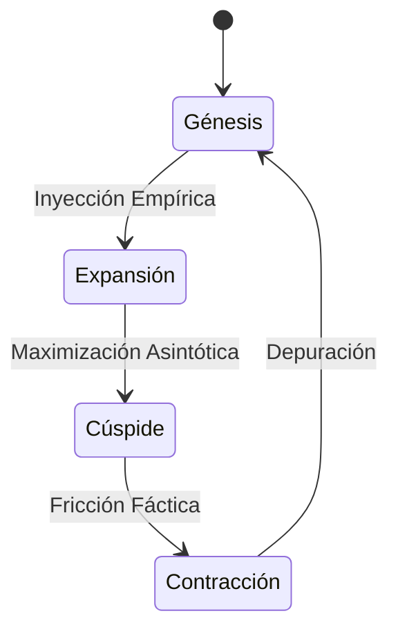

# GUÍA DE ESTUDIO ACADÉMICA: FISCALIDAD INTERNACIONAL

Esta guía de estudio desarrolla de manera exhaustiva el **Temario Oficial de Fiscalidad Internacional (Asignatura 25)** [1]. El contenido se ha estructurado para proporcionar un análisis profundo, teórico y práctico, fundamentado en las fuentes académicas y normativas proporcionadas.

---

# 25. Fiscalidad internacional

## 25.1. Fuentes y conceptos Básicos

### 25.1.1. Normativa

La fiscalidad internacional no constituye un código legal supranacional único, sino que es el resultado de la interacción entre las normativas internas de los Estados y los tratados internacionales. En este sentido, es imperativo distinguir entre las fuentes típicas y atípicas. Las fuentes primarias incluyen los tratados internacionales, específicamente los Convenios para evitar la Doble Imposición (CDI), y la normativa interna de cada país (derecho doméstico) que regula la tributación de no residentes y la fiscalidad exterior de sus residentes [2]. La normativa interna actúa como el fundamento de la soberanía fiscal, estableciendo los hechos imponibles, mientras que los tratados internacionales funcionan principalmente como mecanismos de restricción a dicha potestad tributaria para evitar la duplicidad impositiva [3], [4].

Además de las fuentes vinculantes, existe una influencia determinante del denominado *Soft Law* o "Derecho en agraz". Este concepto abarca instrumentos no jurídicamente vinculantes per se, pero de gran autoridad interpretativa, como los Comentarios al Modelo de Convenio de la OCDE y las Directrices sobre Precios de Transferencia [5], [6]. Aunque carecen de fuerza normativa directa en muchos ordenamientos (salvo remisión expresa), estas directrices moldean la interpretación judicial y administrativa global, buscando una estandarización y armonización en la aplicación de las normas tributarias entre jurisdicciones divergentes [7], [8].

### 25.1.2. Acuerdos de intercambio de información tributaria entre países

El intercambio de información es la piedra angular de la transparencia fiscal internacional moderna y la lucha contra la evasión. Históricamente, la falta de cooperación permitía la opacidad de rentas transfronterizas. Sin embargo, a partir de la crisis financiera de 2008 y el impulso del G20, se ha consolidado un estándar global que obliga a las administraciones tributarias a compartir datos relevantes [9]. Este intercambio se instrumenta a través de diversas vías: cláusulas específicas en los CDI (artículo 26 del Modelo OCDE), Acuerdos de Intercambio de Información Tributaria (TIEA) específicos, y el Convenio Multilateral sobre Asistencia Administrativa Mutua en Materia Fiscal [10], [11].

La evolución de estos acuerdos ha transitado desde el intercambio "previa petición" (donde se requería una solicitud motivada y específica) hacia el intercambio automático de información, que es el estándar actual promovido por el Foro Global sobre Transparencia [12]. Este mecanismo permite a las administraciones tributarias reducir la asimetría de información existente entre ellas y los contribuyentes multinacionales, permitiendo fiscalizar rentas que anteriormente permanecían ocultas en otras jurisdicciones [13]. La efectividad de estos acuerdos es tal que la falta de intercambio efectivo es uno de los criterios clave para catalogar a una jurisdicción como no cooperante o paraíso fiscal [14].

### 25.1.3. Residencia fiscal

#### 25.1.3.1. Definición

La residencia fiscal es el nexo de unión principal en los sistemas tributarios modernos para aplicar el principio de tributación por renta mundial (sujeción integral). Se define como la condición jurídica que vincula a un contribuyente (persona física o jurídica) con una jurisdicción específica, obligándole a tributar por la totalidad de sus rentas, independientemente del lugar donde se generen [15]. Para las personas físicas, la definición suele basarse en criterios de permanencia física (como la regla de los 183 días) o en el centro de intereses vitales y económicos [16].

Para las personas jurídicas y sociedades, la definición de residencia es más compleja y suele determinarse por criterios formales, como el lugar de constitución o registro, o por criterios materiales, como la sede de dirección efectiva [17], [18]. El Modelo de Convenio de la OCDE y el de la ONU establecen reglas de desempate (*tie-breaker rules*) para resolver situaciones donde dos Estados reclaman a un mismo sujeto como residente, dando preeminencia, en el caso de sociedades, tradicionalmente a la sede de dirección efectiva, aunque esto está evolucionando hacia procedimientos de acuerdo mutuo bajo el proyecto BEPS [18], [19].

#### 25.1.3.2. Aplicación

La aplicación del concepto de residencia conlleva la responsabilidad fiscal ilimitada. Un residente fiscal debe declarar y tributar por sus rentas globales, permitiéndosele, generalmente, deducir los impuestos pagados en el extranjero para evitar la doble imposición [20]. La correcta determinación de la residencia es crítica, ya que es el punto de partida para la aplicación de los Convenios de Doble Imposición; solo los residentes de uno o ambos Estados contratantes pueden acceder a los beneficios de dichos tratados [21].

En la práctica, la aplicación puede generar conflictos de "doble residencia". Por ejemplo, una persona puede ser considerada residente en el País A por pasar más de 183 días allí, y simultáneamente en el País B por tener allí su núcleo principal de intereses económicos [22]. La aplicación de las normas internacionales busca resolver estos conflictos asignando la potestad tributaria exclusiva o compartida, asegurando que el contribuyente no sea gravado dos veces por la totalidad de su renta basándose en una doble vinculación personal [23].

### 25.1.4. Régimen de atribución de rentas

El régimen de atribución de rentas se refiere a la metodología fiscal aplicada a entidades que, en determinadas jurisdicciones, no son sujetos pasivos del Impuesto sobre Sociedades (entidades transparentes o en régimen de atribución), como ciertas sociedades civiles o comunidades de bienes. En este sistema, las rentas generadas por la entidad se "atribuyen" directamente a los socios o partícipes, quienes deben tributar por ellas en sus respectivos impuestos personales (IRPF o Impuesto de Sociedades) [24].

En el contexto internacional, este régimen presenta desafíos significativos debido a las asimetrías híbridas. Una entidad puede ser considerada "transparente" en un país (atribución de rentas a los socios) y "opaca" en otro (sujeta a imposición corporativa). Estas discrepancias, conocidas como mecanismos híbridos, han sido utilizadas para la planificación fiscal agresiva, logrando situaciones de doble no imposición o doble deducción de gastos [25]. La Acción 2 del plan BEPS busca neutralizar estos efectos, asegurando una tributación coherente de estas entidades transfronterizas [26].

### 25.1.5. Hechos imponibles y exenciones

El hecho imponible en la fiscalidad internacional se configura cuando se verifica el presupuesto de naturaleza jurídica o económica fijado por la ley para configurar el tributo, que en este ámbito suele ser la obtención de renta o la titularidad de patrimonio con un elemento transfronterizo [27]. Los hechos imponibles típicos incluyen la obtención de dividendos, intereses, cánones, ganancias de capital o rentas empresariales por parte de un no residente en el Estado de la fuente, o la obtención de rentas extranjeras por un residente [28].

Las exenciones, por su parte, son técnicas de desgravación que pueden operar de forma unilateral o bilateral. En el método de exención, el Estado de residencia renuncia a gravar las rentas obtenidas en el extranjero, considerándolas exentas para eliminar la doble imposición [29]. Existen dos modalidades: la exención íntegra (donde la renta extranjera no se cuenta para nada) y la exención con progresividad (donde la renta extranjera se toma en cuenta para determinar el tipo impositivo aplicable al resto de las rentas del contribuyente) [30]. Estas exenciones son fundamentales para la neutralidad en la importación de capital [31].

## 25.2. Tributación de los No Residentes de acuerdo con la normativa interna

### 25.2.1. Rentas de la actividad generada durante la permanencia en América Latina

Cuando un no residente realiza actividades económicas en un país (por ejemplo, en Latinoamérica) con cierto grado de permanencia o infraestructura, se aplica el concepto de Establecimiento Permanente (EP). Según la normativa interna y los estándares internacionales, si la actividad genera un EP (como una sucursal, oficina, fábrica o una obra de construcción que exceda cierta duración), el Estado fuente tiene derecho a gravar los beneficios empresariales atribuibles a dicho EP como si fuera una entidad separada e independiente [32], [17].

La tributación de estas rentas se realiza generalmente sobre una base neta. Esto significa que al EP se le permite deducir los gastos necesarios para la generación de los ingresos, de manera similar a una sociedad residente. La base imponible se determina realizando un análisis funcional de los activos utilizados, riesgos asumidos y funciones desempeñadas por el EP en el territorio [33], [17]. Es crucial distinguir esta situación de la mera presencia esporádica, ya que la existencia de un EP detona una tributación sustancial en el país de destino de la inversión.

### 25.2.2. Rentas de la actividad generada sin el establecimiento permanente en América Latina

En ausencia de un Establecimiento Permanente, las rentas obtenidas por no residentes suelen someterse a tributación mediante el mecanismo de retención en la fuente sobre el importe bruto (*Gross basis*). Esto aplica típicamente a rentas pasivas (dividendos, intereses, regalías) o a prestaciones de servicios técnicos y profesionales esporádicos donde no hay presencia física sustancial [34], [35].

La normativa interna suele establecer tipos impositivos fijos para estas rentas (por ejemplo, un porcentaje sobre el pago bruto realizado al extranjero), sin admitir deducción de gastos. Este enfoque responde al principio de la fuente pagadora, donde el Estado ejerce su jurisdicción tributaria sobre la riqueza que se hace disponible dentro de su territorio [35]. En el contexto de la economía digital, muchos países de Latinoamérica están reformando sus normativas para gravar servicios digitales prestados sin presencia física, aplicando impuestos indirectos (IVA) o nuevos impuestos a servicios digitales [36], [37].

### 25.2.3. Entidades en régimen de atribución de rentas

Las entidades en régimen de atribución de rentas no residentes plantean la cuestión de quién es el sujeto pasivo del impuesto. La normativa interna debe determinar si se grava a la entidad en sí misma (si se considera opaca en la jurisdicción de la fuente) o si se mira a través de ella para gravar a los socios no residentes [24].

Si la legislación local considera a la entidad extranjera como transparente, la obligación tributaria recae sobre los partícipes en proporción a su participación. Esto obliga a identificar la residencia fiscal de los socios finales para aplicar los tipos de retención correctos o los beneficios de los tratados correspondientes. La falta de armonización en la calificación de estas entidades es una fuente común de conflictos de calificación y doble imposición o doble no imposición [18].

## 25.3. Tributación de las Rentas en los Convenios para evitar la Doble Imposición

### 25.3.1. Objetivo

El objetivo primordial de los Convenios para evitar la Doble Imposición (CDI) es eliminar las barreras fiscales al comercio y la inversión transfronteriza promoviendo la seguridad jurídica. Esto se logra mediante el reparto de la potestad tributaria entre los Estados contratantes, evitando que ambos graven la misma renta de manera ilimitada [7], [3].

Además de evitar la doble imposición jurídica, estos convenios tienen como objetivos secundarios prevenir la evasión y elusión fiscal (especialmente tras el proyecto BEPS), y garantizar la no discriminación entre nacionales y residentes de los otros Estados contratantes [38]. Los CDI buscan un equilibrio entre el principio de residencia (favorecido por países exportadores de capital) y el principio de fuente (defendido por países importadores de capital o en vías de desarrollo) [4].

### 25.3.2. Definiciones

El Capítulo II de los Modelos de Convenio (OCDE y ONU) se dedica a las definiciones, las cuales son esenciales para la interpretación uniforme del tratado. Conceptos clave como "persona", "sociedad", "empresa" y "tráfico internacional" se definen para asegurar que ambos Estados apliquen el tratado al mismo universo de sujetos y actividades [17].

Dos definiciones son especialmente críticas: "Residente" (Artículo 4) y "Establecimiento Permanente" (Artículo 5). La definición de residente determina quién tiene derecho a los beneficios del tratado [17]. La definición de EP establece el umbral de presencia física (o económica en nuevas tendencias) que permite al Estado de la fuente gravar los beneficios empresariales. El Modelo ONU, a diferencia del OCDE, suele tener una definición de EP más amplia, incluyendo, por ejemplo, la prestación de servicios durante periodos más cortos (6 meses vs 12 meses en obras) o la entrega de bienes, favoreciendo así la tributación en la fuente [39].

### 25.3.3. Método para evitar la doble imposición internacional

Una vez que el CDI asigna derechos de imposición (ya sea exclusivos a un Estado o compartidos), el Estado de residencia está obligado a eliminar la doble imposición si el Estado de la fuente ha gravado la renta conforme al convenio. Los tratados estipulan explícitamente qué método debe utilizar el Estado de residencia: el método de exención o el método de imputación (crédito fiscal) [17], [29].

El **método de exención** (Artículo 23A Modelo OCDE) implica que el Estado de residencia no grava la renta que ya tributó en la fuente. El **método de imputación** (Artículo 23B Modelo OCDE) implica que el Estado de residencia grava la renta, pero permite al contribuyente deducir el impuesto pagado en el extranjero hasta el límite del impuesto nacional correspondiente a esa renta [17]. El Modelo ONU contempla métodos similares, aunque a veces incluye variantes como el "tax sparing" (crédito por impuesto no pagado pero exonerado por incentivos en la fuente) para proteger incentivos fiscales de países en desarrollo [40].

## 25.4. Mecanismos para evitar la doble imposición

### 25.4.1. Procedimiento de actuación unilateral por parte de la normativa tributaria

Ante la ausencia de un tratado, los Estados pueden adoptar medidas unilaterales en su legislación interna para mitigar la doble imposición. Estas medidas son una expresión de soberanía y política fiscal para no desincentivar la internacionalización de sus empresas. El mecanismo más común es la deducción del impuesto extranjero como un gasto (método de deducción), aunque es el menos eficiente para neutralizar la carga fiscal [41].

Más avanzados son los sistemas unilaterales de crédito fiscal, donde la ley interna permite acreditar impuestos extranjeros análogos al impuesto sobre la renta nacional, generalmente con topes (crédito ordinario). También existen regímenes de exención unilateral para ciertos tipos de rentas, como dividendos de filiales extranjeras o rentas de trabajos realizados en el extranjero, siempre que se cumplan requisitos de tributación mínima en origen [42].

### 25.4.2. Mecanismos internacionales

Los mecanismos internacionales son fundamentalmente los Convenios de Doble Imposición (bilaterales) y, más recientemente, los instrumentos multilaterales. El **Procedimiento Amistoso (MAP)**, regulado en el artículo 25 de los Modelos OCDE/ONU, es el mecanismo principal para resolver disputas cuando un contribuyente considera que las acciones de uno o ambos Estados resultan en una imposición no conforme al convenio [11].

Adicionalmente, el **Arbitraje Fiscal Internacional** se ha introducido como una fase final para casos donde las autoridades competentes no logran un acuerdo en el MAP tras un periodo determinado (generalmente 2 años). Esto garantiza una resolución vinculante para el contribuyente, eliminando la incertidumbre y la doble tributación efectiva [43], [44].

### 25.4.3. Normas de Derecho tributario internacional

El Derecho Tributario Internacional se compone de un conjunto de principios y normas consuetudinarias y convencionales. Principios como la **neutralidad** (la fiscalidad no debe alterar las decisiones de inversión), la **equidad** (tratamiento igualitario) y la **eficiencia** económica guían la creación de normas [45], [46].

Las normas incluyen reglas de distribución de potestad tributaria (fuente vs. residencia) y cláusulas de salvaguarda. En el contexto de la Unión Europea, por ejemplo, el derecho comunitario (Directivas y jurisprudencia del TJUE) actúa como un límite supranacional a la potestad tributaria de los Estados miembros, prohibiendo restricciones a las libertades fundamentales y ayudas de estado ilegales bajo la apariencia de normas fiscales [47], [48].

## 25.5. Elementos personales y aspectos formales del Impuesto sobre la Renta de los No Residentes

### 25.5.1. Introducción

El Impuesto sobre la Renta de los No Residentes (IRNR) es un tributo directo que grava la renta obtenida en territorio nacional por personas físicas y entidades no residentes. Su configuración técnica difiere sustancialmente del impuesto sobre la renta personal o corporativa de residentes, ya que se basa en el principio de territorialidad [49], [20].

La naturaleza de este impuesto es real (grava la renta en sí misma) más que personal (no atiende a la capacidad económica global del sujeto, salvo excepciones para residentes de la UE en ciertos contextos). Se estructura generalmente en dos modalidades: tributación mediante Establecimiento Permanente (similar al impuesto de sociedades) y tributación sin Establecimiento Permanente (retención única y definitiva) [20].

### 25.5.2. Obligaciones

Los contribuyentes no residentes tienen obligaciones formales y materiales específicas. La principal obligación material es el pago de la deuda tributaria, que en el caso de no residentes sin EP suele realizarse instantáneamente en cada devengo de renta (devengo operación por operación) [23].

Existe la figura del **responsable solidario** o el **representante fiscal**. Debido a la dificultad de perseguir tributariamente a un sujeto fuera de la jurisdicción, la normativa suele designar al pagador de la renta (retenedor) o a un representante residente como responsable del ingreso del impuesto. El incumplimiento de la obligación de retener no exime al contribuyente principal, pero la administración suele actuar contra el retenedor local [50].

### 25.5.3. Normas de declaración

Las normas de declaración varían según la existencia de un EP. Los EP deben llevar contabilidad separada, presentar declaraciones periódicas (anuales y pagos fraccionados) similares a las empresas residentes [51].

Para los no residentes sin EP, la declaración se realiza generalmente a través de autoliquidaciones por cada operación o agrupaciones periódicas (mensuales o trimestrales) de rentas. El modelo de declaración debe identificar al contribuyente, al representante, el tipo de renta, y aplicar el tipo de gravamen correspondiente, descontando, si procede, los límites establecidos en los CDI aplicables [52]. Es fundamental acreditar la residencia fiscal mediante certificados válidos para aplicar tipos reducidos de convenios.

## 25.6. Régimen de expatriados e impatriados

### 25.6.1. Definición

Los regímenes de expatriados e impatriados se refieren a las normas fiscales especiales aplicables a trabajadores que se desplazan internacionalmente por motivos laborales. Un expatriado es un empleado enviado por su empresa desde su país de origen al extranjero, mientras que un impatriado es el trabajador recibido en el país de destino [51].

El estatus fiscal de estos individuos a menudo cambia de "residente" a "no residente" (o viceversa), o pueden caer en situaciones de doble residencia. El objetivo de las normas especiales es facilitar la movilidad internacional del capital humano, evitando cargas fiscales excesivas que desincentiven el desplazamiento o, por el contrario, asegurando que no se produzca una doble no imposición de los salarios [53].

### 25.6.2. Tipo de régimen

Muchos países han implementado regímenes especiales para impatriados (como la "Ley Beckham" en España o regímenes similares en Europa y Latinoamérica) que permiten a las personas físicas que adquieren la residencia fiscal tributar bajo reglas similares a las de los no residentes durante un periodo determinado. Esto implica tributar solo por las rentas de fuente local y a tipos fijos, en lugar de tipos progresivos sobre la renta mundial [51].

Para los expatriados, suelen existir exenciones para los rendimientos del trabajo percibidos por trabajos realizados efectivamente en el extranjero (exención por trabajos en el extranjero), siempre que se cumplan requisitos como que exista un impuesto análogo en el país de destino. Esto busca la neutralidad en la exportación de capital humano [42].

### 25.6.3. Normas de declaración

La normativa exige procedimientos específicos para optar por estos regímenes. Generalmente, se requiere una comunicación formal a la administración tributaria al inicio del desplazamiento (cambio de domicilio fiscal). Los impatriados bajo regímenes especiales suelen presentar un modelo de declaración distinto al IRPF general, donde solo se consignan las rentas locales [54].

Los expatriados deben conservar pruebas del desplazamiento, días de estancia en el extranjero y la naturaleza del trabajo para justificar exenciones. La carga de la prueba sobre la realidad del desplazamiento recae en el contribuyente [55].

### 25.6.4. Plazos de aplicación

Los regímenes especiales suelen tener una duración limitada. Por ejemplo, el tratamiento de no residente para un impatriado puede durar entre 5 y 10 años, dependiendo de la legislación local. Pasado este tiempo, el contribuyente pasa al régimen general de tributación por renta mundial [51].

Para determinar la residencia fiscal ordinaria, se aplica la regla de los 183 días en el año natural. Si el desplazamiento supera este umbral, el cambio de residencia se cristaliza, afectando a la tributación de todo el ejercicio fiscal [15].

### 25.6.5. Cambios en la residencia

El cambio de residencia fiscal implica una ruptura con el sistema tributario de origen y la entrada en uno nuevo. Esto puede activar impuestos de salida (*Exit Taxes*) sobre ganancias de capital latentes en el país de origen, diseñados para evitar que la riqueza generada en un territorio escape sin tributar antes de que el contribuyente se mude a una jurisdicción de baja tributación [56], [57].

El cambio debe ser efectivo y no simulado. Las administraciones utilizan las reglas de desempate de los CDI (vivienda permanente, centro de intereses vitales, estancia habitual) para evitar que los contribuyentes manipulen su residencia formalmente sin trasladar su vida real [58].

### 25.6.6. Contribuyentes residentes en otros Países de Latinoamérica

En el contexto regional latinoamericano, la movilidad de trabajadores es frecuente. La Comunidad Andina, por ejemplo, intentó establecer modelos (Decisión 40) para evitar la doble tributación con un fuerte énfasis en la tributación en la fuente, aunque su éxito ha sido limitado [59].

Cuando un contribuyente se desplaza entre países de Latinoamérica, la existencia de una red de convenios (como el modelo de la Alianza del Pacífico o convenios bilaterales) es crucial. Sin convenios, el riesgo de doble imposición es alto, ya que ambos países pueden reclamar impuestos sobre los salarios (uno por fuente, otro por residencia). Se aplican mecanismos de crédito fiscal unilateral para mitigar este impacto [60].

## 25.7. Paraísos Fiscales

### 25.7.1. Definición

Un paraíso fiscal, o jurisdicción no cooperativa, se caracteriza por ofrecer una tributación nula o nominalmente baja a no residentes, combinada con una falta de transparencia y una negativa a intercambiar información efectiva con otras administraciones tributarias. La OCDE y la Unión Europea han evolucionado esta definición para incluir la falta de "sustancia económica" real en las actividades que se atraen [61].

El concepto no solo es tributario, sino que implica opacidad legal y administrativa que facilita la elusión y evasión fiscal. Se definen a menudo por listados negativos ("listas negras") elaborados por organismos internacionales o legislaciones nacionales [62].

### 25.7.2. Tipos

Se pueden distinguir diferentes tipologías:
1.  **Paraísos fiscales puros:** Jurisdicciones sin impuestos directos sobre la renta o el patrimonio.
2.  **Jurisdicciones de baja tributación:** Países con tipos impositivos muy bajos que actúan como gancho para la deslocalización de beneficios.
3.  **Regímenes fiscales perniciosos:** Regímenes específicos dentro de países de alta tributación que ofrecen tratos preferenciales a no residentes ( *ring-fencing*), aislados de la economía doméstica [63].

### 25.7.3. Países sin tributación

Son aquellos territorios donde no existe imposición directa sobre las rentas o ganancias de capital. Históricamente, estos países atraían sociedades pantalla (*letterbox companies*) que acumulaban rentas pasivas (dividendos, intereses, regalías) sin realizar actividad económica real. El proyecto BEPS (Acción 5) ataca estas estructuras exigiendo sustancia económica demostrable para acceder a beneficios fiscales [64].

### 25.7.4. Países con efectivo intercambio de información tributaria

La distinción moderna más relevante no es tanto la tasa impositiva, sino la transparencia. Un país de baja tributación puede no ser considerado un "paraíso fiscal" en sentido peyorativo si colabora plenamente con el intercambio de información internacional. El Foro Global de la OCDE evalúa a los países mediante revisiones de pares; aquellos que implementan el intercambio automático y bajo demanda salen de las listas negras, pasando a ser jurisdicciones cooperantes [13].

## 25.8. Ley del Impuesto sobre Sociedades en los paraísos fiscales

### 25.8.1. Efectos sobre empresas que operen en paraísos fiscales

Las legislaciones domésticas penalizan la operativa con paraísos fiscales. Las medidas anti-abuso incluyen: la no deducibilidad de gastos pagados a entidades en paraísos fiscales, la aplicación de retenciones agravadas en la fuente, y la aplicación de normas de Transparencia Fiscal Internacional (CFC rules) [65]. Las reglas CFC permiten al país de la matriz gravar las rentas pasivas acumuladas en la filial del paraíso fiscal como si hubieran sido distribuidas, eliminando el beneficio del diferimiento [66].

### 25.8.2. Procedimiento de actuación

Las administraciones tributarias invierten la carga de la prueba en operaciones con paraísos fiscales. Se presume que dichas operaciones son simuladas o realizadas con el propósito principal de evadir impuestos, salvo que el contribuyente demuestre motivos económicos válidos y sustancia real [67]. Además, se exige documentación reforzada de Precios de Transferencia [68].

### 25.8.3. Transparencia informativa como declaración de buena praxis

Las empresas multinacionales están sometidas a una presión creciente para adoptar la "transparencia corporativa". Esto se materializa en el reporte "País por País" (CbC Reporting - Acción 13 de BEPS), donde deben desglosar ingresos, beneficios, impuestos pagados y empleados en cada jurisdicción, incluidos los paraísos fiscales. Esta información permite a las autoridades detectar desajustes entre la actividad económica real y el lugar de tributación [69], [70].

## 25.9. Ley del Impuesto sobre la renta de las personas físicas en paraísos fiscales

### 25.9.1. Efectos sobre los particulares y personas físicas que operen en paraísos fiscales

Las personas físicas que utilizan paraísos fiscales para ocultar patrimonio o rentas enfrentan consecuencias severas. Además de las sanciones administrativas y penales por evasión, muchas legislaciones aplican la "cuarentena fiscal": si un nacional traslada su residencia a un paraíso fiscal, el país de origen puede seguir considerándolo residente fiscal (y gravándolo por renta mundial) durante un periodo extendido (e.g., 5 años) [23].

### 25.9.2. Procedimiento de actuación

El procedimiento de inspección se centra en la identificación del beneficiario efectivo. Dado el secreto bancario y societario de estas jurisdicciones, las administraciones utilizan los acuerdos de intercambio de información y filtraciones de datos para levantar el velo corporativo. La imputación de rentas es automática bajo las normas de transparencia fiscal internacional para personas físicas en muchos ordenamientos [71].

### 25.9.3. Transparencia informativa como declaración de buena praxis

Los contribuyentes personas físicas están obligados en muchos países a presentar declaraciones informativas sobre bienes y derechos situados en el extranjero (incluyendo cuentas, valores e inmuebles en paraísos fiscales). El incumplimiento de estas obligaciones informativas suele llevar aparejadas sanciones muy superiores a las del régimen general, e imprescriptibilidad de la deuda en algunos casos [72].

## 25.10. Ley del Impuesto sobre la renta de los No Residentes en paraísos fiscales

### 25.10.1. Efectos sobre los No Residentes que también operen en paraísos fiscales

Si un no residente opera en un país a través de una entidad situada en un paraíso fiscal, se le niegan los beneficios de los convenios de doble imposición (cláusulas de limitación de beneficios o LOB). Además, las rentas obtenidas (como ganancias de capital por venta de inmuebles o acciones locales) suelen estar sujetas a tipos de retención punitivos o incrementados en comparación con residentes de jurisdicciones cooperantes [73].

### 25.10.2. Procedimiento de actuación

Las transacciones se someten a un escrutinio estricto de valoración. Se aplica el principio de plena competencia (*arm's length*) con rigor extremo para evitar que se erosionen las bases imponibles locales mediante pagos inflados a la entidad en el paraíso fiscal. La administración puede recalificar las operaciones ignorando la entidad interpuesto en el paraíso fiscal [74].

### 25.10.3. Transparencia informativa como declaración de buena praxis

La buena praxis exige la revelación voluntaria de las estructuras de propiedad y la cadena de control. Los intermediarios fiscales (asesores, abogados) están obligados en muchas jurisdicciones (como bajo la directiva DAC6 en Europa o normas similares inspiradas en BEPS Acción 12) a reportar esquemas de planificación fiscal agresiva que involucren paraísos fiscales, aumentando el riesgo reputacional y legal para quienes operan en la opacidad [75].
<!-- VISUAL_ENRICHMENT -->

    

        [DIAGRAMA]
        <h3 class="text-white font-bold text-xl">Modelo Conceptual A25</h3>
    

    

        

    

