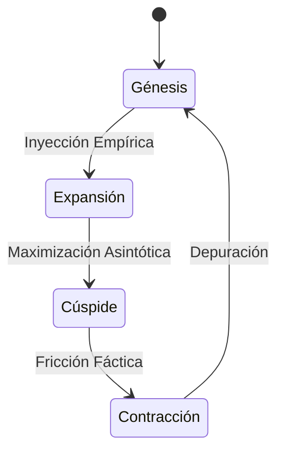

# Guía de Estudio: Estadística II

Esta guía sigue estrictamente la estructura del "Temario Oficial de Estadística II" encontrado en las fuentes, desarrollando cada punto con la información disponible en los textos proporcionados.

## 26.1. Probabilidad: Variable aleatoria

### 26.1.1. El experimento aleatorio
Un experimento aleatorio se define como aquel en el cual no se puede predecir el resultado exacto, pero se conoce el conjunto de posibles resultados. Estos experimentos son la base para el estudio de la probabilidad y la estadística inferencial, permitiendo modelar fenómenos donde interviene el azar [1].

### 26.1.2. Axiomas de probabilidad
El desarrollo axiomático de la probabilidad proporciona las reglas fundamentales que rigen el cálculo de probabilidades. Aunque las fuentes no listan todos los axiomas de Kolmogorov explícitamente, mencionan el desarrollo axiomático como base para establecer teoremas posteriores, como la ley aditiva [1].

### 26.1.3. Propiedades elementales
Entre las propiedades elementales derivadas de los axiomas se encuentran la ley aditiva de la probabilidad, la probabilidad conjunta, marginal y condicional, así como la ley multiplicativa. Estas propiedades permiten calcular probabilidades de eventos compuestos y entender la independencia estadística [1].

## 26.2. Modelos de probabilidad

### 26.2.1. Las variables aleatorias
Una variable aleatoria es una función que asigna un valor numérico a cada resultado de un experimento aleatorio. Puede ser discreta (toma valores contables) o continua (toma valores en un intervalo). Intuitivamente, es cualquier característica que puede tomar diversos valores en un grupo de individuos [1], [2].

### 26.2.2. Distribución de Bernouilli
Aunque las fuentes se centran en la Binomial, la distribución de Bernoulli es la base de los ensayos binomiales, donde se considera un experimento con dos resultados posibles (éxito o fracaso) [3].

### 26.2.3. Distribución binomial
La distribución binomial modela el número de éxitos en una secuencia de $n$ ensayos independientes de Bernoulli, con una probabilidad fija de éxito $p$. Sus parámetros son $n$ (número de ensayos) y $p$ (probabilidad de éxito). Tiene un valor promedio y una varianza definidos [3].

### 26.2.4. Distribución multinomial
Este modelo se menciona en el temario oficial como parte de los modelos de probabilidad [4]. En el contexto del análisis de datos categóricos o recuentos (similar a lo visto en pruebas de bondad de ajuste), se utiliza cuando hay más de dos categorías posibles de resultados, generalizando la binomial [5].

## 26.3. Cálculo de probabilidades y puntos críticos con R

### 26.3.1. La distribución normal o de Gauss
La distribución normal es la más importante en estadística. Tiene forma de campana, es simétrica respecto a su media $\mu$ y sus colas son asintóticas al eje x. Se utiliza ampliamente debido al Teorema del Límite Central, el cual establece que los promedios muestrales tienden a distribuirse normalmente [6], [7].

### 26.3.2. Programa R commander
El uso de software como R es fundamental para evitar el uso de tablas tradicionales. R permite calcular probabilidades acumuladas y cuantiles (puntos críticos) de forma precisa para distribuciones como la normal, t de Student, y F de Fisher [8], [9].

### 26.3.3. Propiedades
Las distribuciones utilizadas en R (como la Normal o t de Student) poseen propiedades clave como la simetría y la relación entre el área bajo la curva y la probabilidad. Por ejemplo, la distribución t de Student es simétrica alrededor de cero y tiene colas más pesadas que la normal, convergiendo a esta última cuando los grados de libertad aumentan [10], [11].

## 26.4. Inferencia estadística: algunos conceptos previos

### 26.4.1. Definiciones y conceptos previos
La inferencia estadística busca obtener conclusiones válidas sobre una población a partir de una muestra. Incluye la estimación de parámetros (como $\mu$ o $\sigma^2$) y la prueba de hipótesis. Conceptos clave incluyen la población (totalidad de individuos) y la muestra (subconjunto representativo) [12], [13].

### 26.4.2. La distribución binomial y cálculo
En el contexto de la inferencia, la distribución binomial se utiliza para analizar proporciones en muestras. Las herramientas computacionales permiten calcular probabilidades exactas o acumuladas para variables discretas que siguen este modelo [14].

### 26.4.3. Curva normal y cálculo
La curva normal estándar (Z) se utiliza para calcular probabilidades asociadas a variables continuas. Mediante la estandarización ($Z = (X - \mu) / \sigma$), cualquier variable normal puede transformarse en una normal estándar para facilitar el cálculo de probabilidades e intervalos [15], [16].

## 26.5. Los estimadores puntuales: distribuciones muestrales y propiedades

### 26.5.1. Conceptos generales de la distribución muestral
La distribución de muestreo de una estadística (como el promedio $\bar{X}$) es la distribución de probabilidad que se obtendría si se tomaran infinitas muestras del mismo tamaño. Permite conocer el comportamiento probabilístico de los estimadores [17].

### 26.5.2. Estimación puntual
La estimación puntual consiste en utilizar un único valor estadístico (como la media muestral $\bar{x}$) para aproximar un parámetro poblacional desconocido (como la media poblacional $\mu$). Es un valor variable que cambia de muestra a muestra [18], [19].

### 26.5.3. Estimación por intervalo
La estimación por intervalo proporciona un rango de valores dentro del cual se espera que se encuentre el parámetro con un cierto nivel de confianza (por ejemplo, 95%). Ofrece una medida de la precisión de la estimación [20], [21].

## 26.6. Los intervalos de confianza: para la media, proporción, varianza

### 26.6.1. Intervalos para una o varias muestras
Se pueden construir intervalos de confianza para estimar:
*   **La media ($\mu$):** Utilizando la distribución Z (si $\sigma$ es conocida) o t de Student (si $\sigma$ es desconocida) [16], [22].
*   **La proporción ($p$):** Basada en la aproximación normal de la binomial [23].
*   **La varianza ($\sigma^2$):** Utilizando la distribución Chi-cuadrado ($\chi^2$) [24].
También existen intervalos para la diferencia de medias y cociente de varianzas [25].

### 26.6.2. Método Bootstrap
El "Bootstrapping" se menciona como una alternativa moderna para calcular intervalos de confianza para parámetros (como $\hat{\beta}$ en regresión), especialmente útil cuando no se cumplen ciertos supuestos teóricos [26].

### 26.6.3. Intervalos bayesianos
Aunque el enfoque principal es frecuentista, el temario incluye intervalos bayesianos. Estos se fundamentan en el Teorema de Bayes, que permite actualizar la probabilidad de una hipótesis dada nueva evidencia [3].

## 26.7. Los contrastes de hipótesis en los métodos de inferencia estadística

### 26.7.1. Test de hipótesis estadística
Una prueba de hipótesis es un procedimiento para tomar una decisión sobre el valor de verdad de una proposición acerca de un parámetro. Se contrastan dos hipótesis: la hipótesis nula ($H_0$) y la hipótesis alternativa ($H_a$) [27], [28].

### 26.7.2. Región de rechazo y de aceptación
La región de rechazo está formada por los valores de la estadística de prueba que llevan a rechazar la hipótesis nula. Los puntos críticos (como $Z_{\alpha}$ o $t_{\alpha}$) definen los límites de esta región según el nivel de significancia $\alpha$ [28], [29].

### 26.7.3. Reglas de decisión
La decisión de rechazar o no $H_0$ se basa en comparar la estadística de prueba calculada con el valor crítico, o mediante el uso del **valor-p**. Si el valor-p es menor que la significancia $\alpha$, se rechaza la hipótesis nula [30], [31].

## 26.8. Casos particulares: media poblacional, varianza y proporción. Contrastes paramétricos

### 26.8.1. Varianzas conocidas y desconocidas
Para contrastar la media poblacional:
*   Si la varianza es **conocida**, se usa la distribución Normal (Z).
*   Si la varianza es **desconocida**, se usa la distribución t de Student con $n-1$ grados de libertad [32], [28].

### 26.8.2. Razón de verosimilitudes
En el contexto de comparación de varianzas, se utiliza la razón o cociente de varianzas ($S_X^2 / S_Y^2$). Esta estadística sigue una distribución F de Fisher y sirve para contrastar la homocedasticidad (igualdad de varianzas) entre dos poblaciones [25], [33].

### 26.8.3. Contraste de igualdad
Se realizan pruebas para determinar si dos parámetros son iguales, como $H_0: \mu_1 = \mu_2$ (igualdad de medias) o $H_0: \sigma_1^2 = \sigma_2^2$ (igualdad de varianzas). Esto es fundamental para comparar tratamientos o grupos [30], [34].

## 26.9. Contraste de bondad de ajuste Chi-cuadrado

### 26.9.1. Agrupación de datos
Para realizar pruebas de bondad de ajuste, los datos pueden agruparse en clases o categorías. Se verifica si la frecuencia observada en cada grupo se ajusta a una distribución teórica esperada [35], [36].

### 26.9.2. Región crítica
La prueba Chi-cuadrado utiliza una estadística que mide la discrepancia entre lo observado y lo esperado. La región crítica se ubica en la cola derecha de la distribución $\chi^2$; si la discrepancia es muy grande, se rechaza la hipótesis de ajuste [36].

### 26.9.3. Frecuencia esperada
Es el conteo teórico de casos que deberían caer en cada categoría si la hipótesis nula fuera verdadera. La estadística Chi-cuadrado se calcula sumando las diferencias cuadradas entre frecuencias observadas y esperadas, ponderadas por la frecuencia esperada [37].

## 26.10. Contraste del supuesto de normalidad: el contraste de Jarque-Bera

### 26.10.1. Variables significativas
En el análisis de regresión y otras pruebas paramétricas, es crucial determinar qué variables independientes tienen un efecto significativo sobre la dependiente. Esto se valida a menudo revisando los supuestos del modelo, como la normalidad de los residuos [38], [39].

### 26.10.2. Teorema central del limite
Este teorema establece que, dada una muestra suficientemente grande, la distribución de la media muestral se aproxima a una normal, independientemente de la distribución original de los datos. Esto justifica el uso de pruebas paramétricas en muestras grandes [40], [7].

### 26.10.3. Los estimadores, histograma
Para evaluar la normalidad, se pueden inspeccionar visualmente los estimadores mediante histogramas para ver si tienen forma de campana. Pruebas formales (como Shapiro-Wilk o Lilliefors, mencionadas en fuentes de estadística no paramétrica) complementan el análisis gráfico [41], [42].

## 26.11. Contraste de independencia con dos variables cualitativas

### 26.11.1. Concepto de independencia de variables
Dos variables cualitativas son independientes si la ocurrencia de una categoría en una variable no afecta la probabilidad de ocurrencia de las categorías de la otra. Se evalúa mediante tablas de contingencia [1], [36].

### 26.11.2. Frecuencias observadas y esperadas
En una tabla de contingencia, se comparan los conteos reales (observados) con los que se esperarían si las variables fueran totalmente independientes (calculados como el producto de los totales marginales dividido por el total general) [37].

### 26.11.3. Cálculo del contraste
Se utiliza la estadística Chi-cuadrado de independencia. Se suman las diferencias entre frecuencias observadas y esperadas al cuadrado, divididas por las esperadas. Si el valor calculado excede el crítico, se rechaza la independencia [36].

## 26.12. El modelo de regresión lineal simple y la estimación puntual

### 26.12.1. Coeficiente de regresión y de correlación lineal
El modelo busca una relación lineal $Y = \beta_0 + \beta_1 X + \epsilon$. El coeficiente $\beta_1$ (pendiente) indica el cambio en Y por unidad de X. El coeficiente de correlación ($r$) mide la fuerza y dirección de la relación lineal [43], [44], [45].

### 26.12.2. Inferencia de parámetros
Los parámetros del modelo ($\beta_0$ y $\beta_1$) se estiman mediante el método de Mínimos Cuadrados, que minimiza la suma de los errores al cuadrado. Se pueden realizar pruebas de hipótesis (t-student) para determinar si $\beta_1$ es significativamente distinto de cero [46], [47].

### 26.12.3. Supuestos del modelo
Para que la inferencia sea válida, se asume que los errores ($\epsilon$) son independientes, tienen distribución normal con media cero y varianza constante (homocedasticidad) [45].

## 26.13. Intervalo de confianza y recta de regresión

### 26.13.1. La función lineal y regresión
La ecuación estimada $\hat{y} = \hat{\beta}_0 + \hat{\beta}_1 x$ permite predecir valores de la variable dependiente. Esta recta representa el valor esperado de Y dado un valor de X [45].

### 26.13.2. La regresión lineal simple
El análisis de varianza (ANOVA) aplicado a la regresión permite descomponer la variabilidad total en variabilidad explicada por el modelo y variabilidad del error, usando una prueba F para evaluar la significancia global del modelo [48], [49].

### 26.13.3. Variables exógenas y endógenas
En el modelo, la variable dependiente (endógena) es aquella que se quiere explicar (ej. salario), mientras que la variable independiente (exógena o factor) es la que explica la variación (ej. edad o sexo) [5].

## 26.14. Predicciones y aplicaciones para las Tecnologías de Información y Comunicación

### 26.14.1. Marco teórico y conceptual
El contexto estadístico proporciona el marco para entender y criticar métodos usados en publicaciones científicas y aplicaciones tecnológicas. Es fundamental comprender los principios detrás de los algoritmos utilizados por el software [50].

### 26.14.2. Técnicas de recolección y análisis
El uso de TICs se manifiesta en software estadístico como R o SAS. Estas herramientas permiten procesar grandes volúmenes de datos, realizar simulaciones y visualizar patrones que serían difíciles de detectar manualmente [8], [51].

### 26.14.3. Objetivos generales y específicos
El objetivo es que el estudiante pueda interpretar resultados generados por computadoras (valores-p, intervalos) y aplicarlos a la toma de decisiones bajo incertidumbre en contextos profesionales [13].

## 26.15. El modelo de regresión múltiple y estimación puntual

### 26.15.1. Hipótesis y estimación
La regresión lineal múltiple extiende el modelo simple para incluir múltiples predictores. Se evalúa la significancia del modelo en conjunto (Test-F) y de cada predictor individualmente [26].

### 26.15.2. Tipos de errores y ajustes del modelo
Es necesario evaluar el ajuste del modelo, identificando valores atípicos (outliers) y puntos de alto apalancamiento que puedan distorsionar las estimaciones. Se utilizan diagnósticos de residuos para validar las condiciones del modelo [26].

### 26.15.3. Extensiones del modelo lineal
El modelo lineal puede extenderse para incluir interacciones entre predictores (donde el efecto de una variable depende de otra) y regresión polinomial para modelar relaciones no lineales [26].

***

# Resumen

1.  **Fundamentos Probabilísticos y Muestrales:** El curso se cimienta en la teoría de probabilidad (axiomas, variables aleatorias discretas y continuas como la Binomial y Normal) y en la teoría de muestreo (Teorema del Límite Central), elementos indispensables para realizar inferencias válidas sobre una población a partir de datos muestrales.
2.  **Inferencia Estadística (Estimación y Contraste):** Se desarrollan métodos para estimar parámetros poblacionales mediante estimación puntual e intervalos de confianza, y se aplican pruebas de hipótesis (paramétricas y no paramétricas, como Chi-cuadrado y Jarque-Bera) para tomar decisiones estadísticas rigurosas con base en la evidencia muestral.
3.  **Modelos de Relación (Regresión):** El temario culmina con el estudio de modelos de regresión lineal (simple y múltiple), permitiendo analizar y predecir la relación entre variables, validando los supuestos del modelo y utilizando herramientas tecnológicas (TICs/R) para el cálculo y análisis.
<!-- VISUAL_ENRICHMENT -->

    

        [DIAGRAMA]
        <h3 class="text-white font-bold text-xl">Modelo Conceptual A26</h3>
    

    

        

    

