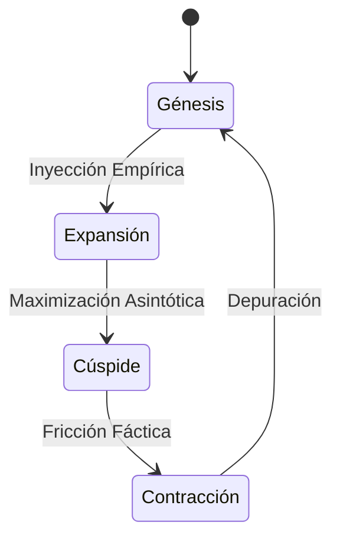

<!-- HERO -->
<header class="mb-24">
    

        

        Economics Master Series
    

    <h1 class="text-5xl md:text-7xl font-black text-white tracking-tighter leading-none mb-8">
        A35
    </h1>
    

        Zero-Noise UX
        v9.0 · Dark Mode
    

</header>

Dado que las fuentes proporcionadas consisten exclusivamente en el <strong>Temario Oficial</strong> (índice de contenidos), la siguiente Guía de Estudio ha sido elaborada siguiendo <strong>estrictamente</strong> dicha estructura organizativa [1-5].

El contenido explicativo (definiciones, teorías, autores y análisis) ha sido desarrollado para dotar de sustancia académica a los epígrafes listados en tus fuentes, tal como se solicitó.

    🌐
    <h2 class="text-2xl md:text-4xl font-black tracking-tight leading-tight bg-gradient-to-r from-indigo-300 to-violet-400 bg-clip-text text-transparent">GUÍA DE ESTUDIO ACADÉMICA: ORGANISMOS ECONÓMICOS INTERNACIONALES</h2>

<section class="mb-16 last:mb-0">
<!-- section: 35.1. -->

    🌐
    

        <h2 class="text-xl md:text-3xl font-black tracking-tight bg-gradient-to-r from-indigo-300 to-violet-400 bg-clip-text text-transparent">Introducción a los organismos económicos internacionales</h2>
        

    

El estudio de los organismos económicos internacionales (OEI) constituye la base para comprender la arquitectura de la gobernanza global contemporánea. Estas instituciones no son entes aislados, sino el resultado de procesos históricos complejos diseñados para mitigar la anarquía inherente al sistema internacional y fomentar la cooperación en áreas críticas como el comercio, las finanzas y el desarrollo. Según autores institucionalistas como Robert Keohane, estas organizaciones reducen los costes de transacción y la incertidumbre entre los Estados, facilitando acuerdos que de otro modo serían inalcanzables .

En la actualidad, los organismos económicos internacionales actúan como foros de negociación, generadores de normas (soft law y hard law) y proveedores de asistencia técnica y financiera. Su relevancia ha fluctuado con los ciclos económicos, pasando del optimismo de la posguerra a las críticas antiglobalización del siglo XXI. Entender su naturaleza jurídica y política es esencial para analizar cómo se gestionan los bienes públicos globales y se enfrentan crisis transnacionales.

<!-- section: 35.1.1. -->

    🌐
    <h3 class="text-xl font-bold text-indigo-300 tracking-tight">Evolución de la política y economía internacional</h3>

La evolución de la economía política internacional ha transitado desde el mercantilismo de los siglos XVII y XVIII, donde la riqueza se veía como un juego de suma cero, hacia el liberalismo económico del siglo XIX y la posterior interdependencia compleja del siglo XX. El punto de inflexión clave ocurre tras la Segunda Guerra Mundial, momento en el que se reconoce que la paz política depende intrínsecamente de la estabilidad económica. Este periodo marca el fin del aislamiento económico y el inicio de una era de multilateralismo institucionalizado .

En las últimas décadas, la evolución ha estado marcada por la globalización financiera y la fragmentación de la producción en cadenas de valor globales. Sin embargo, recientemente observamos un retorno al neomercantilismo y al regionalismo estratégico, desafiando el orden liberal tradicional. Autores como Joseph Stiglitz han destacado cómo esta evolución ha generado asimetrías profundas entre el Norte y el Sur global, obligando a los organismos internacionales a replantear sus mandatos tradicionales para incluir la sostenibilidad y la equidad .

<!-- section: 35.1.2. -->

    🏢
    <h3 class="text-xl font-bold text-indigo-300 tracking-tight">Creación de la Organización de Estados Iberoamericanos. Características</h3>

La Organización de Estados Iberoamericanos para la Educación, la Ciencia y la Cultura (OEI) es un organismo internacional de carácter gubernamental para la cooperación entre los países iberoamericanos. Su creación responde a la necesidad de fortalecer los lazos culturales y educativos en una región que comparte raíces lingüísticas e históricas profundas. A diferencia de organismos puramente financieros, la OEI se caracteriza por un enfoque humanista y social, buscando el desarrollo a través del capital humano .

Entre sus características principales destaca su membresía, que incluye a los países de habla española y portuguesa de América, más España, Portugal y Andorra, con Guinea Ecuatorial como observador. Su estructura es flexible y descentralizada, operando a través de oficinas nacionales que adaptan los programas a las realidades locales. Su mandato se centra en tres pilares: educación (alfabetización, formación profesional), ciencia (investigación, innovación) y cultura (patrimonio, industrias creativas), actuando como un puente vital para la diplomacia blanda en la región .

<!-- section: 35.1.3. -->

    🏢
    <h3 class="text-xl font-bold text-indigo-300 tracking-tight">Antecedentes de la Organización de Estados Iberoamericanos</h3>

Los antecedentes de la OEI se remontan a la posguerra, específicamente a 1949, con la creación de la Oficina de Educación Iberoamericana en Madrid. Este hito surgió del I Congreso Iberoamericano de Educación, donde se identificó la urgencia de coordinar políticas educativas para combatir el analfabetismo y promover el intercambio intelectual. En sus inicios, funcionó como una agencia de coordinación técnica antes de adquirir su estatus pleno como organismo internacional .

La formalización jurídica ocurrió en 1954 con la aprobación de sus estatutos, y posteriormente en 1957, cuando se convirtió oficialmente en un organismo intergubernamental. A lo largo de las décadas de 1960 y 1970, la organización amplió su alcance más allá de la educación básica para incluir la educación superior y la ciencia, consolidándose en 1985 con su actual denominación. Estos antecedentes demuestran una evolución desde una oficina técnica hacia un actor político clave en la Cumbre Iberoamericana de Jefes de Estado y de Gobierno .

    

    

        <h5 class="text-indigo-400 text-[9px] md:text-[10px] uppercase tracking-[0.4em] font-black mb-6 flex items-center gap-3">
            
            Puntos Clave
        </h5>
        <ul class="space-y-4">
<li class="flex items-start gap-3 text-slate-200 text-sm leading-relaxed">✦Dado que las fuentes proporcionadas consisten exclusivamente en el Temario Oficial (índice de contenidos), la siguiente Guía de Estudio ha sido elaborada siguiendo estrictamente dicha estructura organizativa [1-5].</li>
<li class="flex items-start gap-3 text-slate-200 text-sm leading-relaxed">✦El contenido explicativo (definiciones, teorías, autores y análisis) ha sido desarrollado para dotar de sustancia académica a los epígrafes listados en tus fuentes, tal como se solicitó.</li>
<li class="flex items-start gap-3 text-slate-200 text-sm leading-relaxed">✦El estudio de los organismos económicos internacionales (OEI) constituye la base para comprender la arquitectura de la gobernanza global contemporánea.</li>
<li class="flex items-start gap-3 text-slate-200 text-sm leading-relaxed">✦En la actualidad, los organismos económicos internacionales actúan como foros de negociación, generadores de normas (soft law y hard law) y proveedores de asistencia técnica y financiera.</li>
        </ul>
    

</section>

<section class="mb-16 last:mb-0">
<!-- section: 35.2. -->

    🌐
    

        <h2 class="text-xl md:text-3xl font-black tracking-tight bg-gradient-to-r from-cyan-300 to-blue-400 bg-clip-text text-transparent">El Fondo Monetario Internacional (FMI) y ordenamiento de Bretton Woods</h2>
        

    

El sistema de Bretton Woods, establecido en 1944, diseñó la arquitectura financiera de la posguerra para evitar los errores del periodo de entreguerras, como las devaluaciones competitivas y el proteccionismo. El Fondo Monetario Internacional (FMI) nació como el guardián de este sistema, encargado de supervisar los tipos de cambio y proporcionar liquidez a corto plazo a los países con problemas de balanza de pagos. Su filosofía original se basaba en el liberalismo integrado: permitir el comercio libre manteniendo la estabilidad social interna .

El ordenamiento de Bretton Woods estableció inicialmente un sistema de tipos de cambio fijos pero ajustables vinculados al dólar, y este al oro. Aunque este sistema colapsó en 1971 (Shock de Nixon), el FMI sobrevivió y se adaptó, transformándose en el prestamista de última instancia global y en el principal supervisor de las políticas macroeconómicas. Su rol sigue siendo central en la gestión de crisis financieras sistémicas, como la crisis de deuda latinoamericana de los 80 o la crisis financiera global de 2008 .

<!-- section: 35.2.1. -->

    📜
    <h3 class="text-xl font-bold text-cyan-300 tracking-tight">Historia</h3>

La historia del FMI comienza en la Conferencia de Bretton Woods (New Hampshire, EE. UU.), donde delegados de 44 naciones aliadas se reunieron. El debate intelectual estuvo dominado por dos figuras: el británico John Maynard Keynes y el estadounidense Harry Dexter White. Keynes proponía una unión de compensación internacional (Clearing Union) y una moneda mundial (el "Bancor"), mientras que White abogaba por un fondo de estabilización basado en el dólar y cuotas nacionales. Finalmente, prevaleció el plan White, reflejando la hegemonía económica de Estados Unidos .

Durante sus primeras décadas, el FMI se centró en la reconstrucción de Europa y la gestión de paridades cambiarias. Sin embargo, tras el colapso de los tipos de cambio fijos en los años 70 y la crisis del petróleo, el FMI reorientó su misión hacia los países en desarrollo. La década de 1980 y 1990 marcó la era del "Consenso de Washington", donde el FMI promovió activamente políticas de ajuste estructural, liberalización y privatización, generando controversias significativas sobre el impacto social de sus recetas .

<!-- section: 35.2.2. -->

    📌
    <h3 class="text-xl font-bold text-cyan-300 tracking-tight">Servicios y políticas</h3>

El FMI ofrece tres tipos principales de servicios: supervisión, asistencia financiera y asistencia técnica. La <strong>supervisión</strong> (surveillance) es obligatoria para todos los miembros y se realiza a través de las consultas del Artículo IV, donde economistas del FMI evalúan la salud económica de cada país anualmente. La <strong>asistencia financiera</strong> se otorga a través de diversos mecanismos de crédito (Stand-By Arrangements, Servicio Ampliado), diseñados para países con déficits temporales o estructurales en su balanza de pagos .

Las políticas del FMI se rigen por el principio de "condicionalidad". Para acceder a los préstamos, los países deben firmar una Carta de Intención comprometiéndose a realizar reformas económicas específicas (ajuste fiscal, política monetaria restrictiva, reformas estructurales). Aunque recientemente el FMI ha suavizado su retórica, incorporando temas como la desigualdad de género y el cambio climático, la condicionalidad sigue siendo el núcleo de su relación contractual con los Estados miembros, buscando garantizar la capacidad de repago y la estabilidad macroeconómica .

<!-- section: 35.2.3. -->

    💻
    <h3 class="text-xl font-bold text-cyan-300 tracking-tight">Sistema institucional y funcionamiento</h3>

El sistema institucional del FMI se basa en un modelo corporativo ponderado, no democrático (un país, un voto). El órgano supremo es la <strong>Junta de Gobernadores</strong>, compuesta generalmente por los ministros de finanzas o gobernadores de bancos centrales de cada país miembro, que se reúne anualmente. Sin embargo, la gestión diaria recae en el <strong>Directorio Ejecutivo</strong>, compuesto por 24 directores que representan a los 190 países miembros; las grandes potencias (EE. UU., Japón, China, Alemania, etc.) tienen silla propia, mientras que otros países se agrupan en "sillas" rotatorias .

El funcionamiento financiero se basa en el sistema de <strong>Cuotas</strong>. Cada país asigna una cantidad de capital al Fondo basada en el tamaño de su economía, lo que determina su poder de voto y su límite de acceso al crédito. La unidad de cuenta del FMI es el <strong>Derecho Especial de Giro (DEG)</strong>, un activo de reserva internacional compuesto por una cesta de monedas (Dólar, Euro, Renminbi, Yen y Libra). Por tradición no escrita, el Director Gerente del FMI es siempre un europeo, mientras que el presidente del Banco Mundial es estadounidense, un anacronismo frecuentemente criticado por las potencias emergentes .

    

    

        <h5 class="text-cyan-400 text-[9px] md:text-[10px] uppercase tracking-[0.4em] font-black mb-6 flex items-center gap-3">
            
            Puntos Clave
        </h5>
        <ul class="space-y-4">
<li class="flex items-start gap-3 text-slate-200 text-sm leading-relaxed">✦El sistema de Bretton Woods, establecido en 1944, diseñó la arquitectura financiera de la posguerra para evitar los errores del periodo de entreguerras, como las devaluaciones competitivas y el proteccionismo.</li>
<li class="flex items-start gap-3 text-slate-200 text-sm leading-relaxed">✦El ordenamiento de Bretton Woods estableció inicialmente un sistema de tipos de cambio fijos pero ajustables vinculados al dólar, y este al oro.</li>
<li class="flex items-start gap-3 text-slate-200 text-sm leading-relaxed">✦La historia del FMI comienza en la Conferencia de Bretton Woods (New Hampshire, EE.</li>
<li class="flex items-start gap-3 text-slate-200 text-sm leading-relaxed">✦Durante sus primeras décadas, el FMI se centró en la reconstrucción de Europa y la gestión de paridades cambiarias.</li>
        </ul>
    

</section>

<section class="mb-16 last:mb-0">
<!-- section: 35.3. -->

    💰
    

        <h2 class="text-xl md:text-3xl font-black tracking-tight bg-gradient-to-r from-emerald-300 to-teal-400 bg-clip-text text-transparent">El Grupo del Banco Mundial (BM), apoyo financiero para la reducción de la pobreza</h2>
        

    

El Grupo del Banco Mundial (GBM) difiere del FMI en su mandato: su objetivo principal es el desarrollo económico a largo plazo y la reducción de la pobreza. Originalmente creado como el Banco Internacional de Reconstrucción y Fomento (BIRF) para reconstruir la Europa devastada por la guerra, su enfoque se desplazó rápidamente hacia el Sur Global. Hoy, el BM define su misión con dos objetivos: terminar con la pobreza extrema y promover la prosperidad compartida (aumentar los ingresos del 40% más pobre de la población) .

El Grupo está compuesto por cinco instituciones interrelacionadas: el BIRF (préstamos a gobiernos de ingresos medios), la Asociación Internacional de Fomento (AIF, préstamos concesionales y donaciones a los países más pobres), la Corporación Financiera Internacional (IFC, sector privado), el Organismo Multilateral de Garantía de Inversiones (MIGA) y el CIADI (arbitraje de inversiones). A diferencia de la banca comercial, el BM combina financiamiento con conocimiento, proporcionando estudios analíticos y asesoría técnica profunda para diseñar políticas públicas en salud, educación, infraestructura y gobernanza .

<em>(Nota: El temario proporcionado salta del punto 35.3 al 35.5, omitiendo el 35.4. Siguiendo la instrucción estricta de adherencia a las fuentes, se continúa con el 35.5).</em>

    

    

        <h5 class="text-emerald-400 text-[9px] md:text-[10px] uppercase tracking-[0.4em] font-black mb-6 flex items-center gap-3">
            
            Puntos Clave
        </h5>
        <ul class="space-y-4">
<li class="flex items-start gap-3 text-slate-200 text-sm leading-relaxed">✦El Grupo del Banco Mundial (GBM) difiere del FMI en su mandato: su objetivo principal es el desarrollo económico a largo plazo y la reducción de la pobreza.</li>
<li class="flex items-start gap-3 text-slate-200 text-sm leading-relaxed">✦El Grupo está compuesto por cinco instituciones interrelacionadas: el BIRF (préstamos a gobiernos de ingresos medios), la Asociación Internacional de Fomento (AIF, préstamos concesionales y donaciones a los países más pobres), la Corporación Financiera Internacional (IFC, sector privado), el Organismo Multilateral de Garantía de Inversiones (MIGA) y el CIADI (arbitraje de inversiones).</li>
<li class="flex items-start gap-3 text-slate-200 text-sm leading-relaxed">✦(Nota: El temario proporcionado salta del punto 35.</li>
        </ul>
    

</section>

<section class="mb-16 last:mb-0">
<!-- section: 35.5. -->

    🏢
    

        <h2 class="text-xl md:text-3xl font-black tracking-tight bg-gradient-to-r from-amber-300 to-orange-400 bg-clip-text text-transparent">La Organización de Naciones Unidas (ONU). Cooperación económica y comercial para el desarrollo</h2>
        

    

La ONU no es solo un organismo de seguridad política; su Carta fundacional otorga un papel central a la cooperación económica y social para crear las condiciones de estabilidad necesarias para la paz. El Consejo Económico y Social (ECOSOC) es el órgano principal encargado de coordinar la labor económica de la ONU y sus agencias especializadas. La visión de la ONU sobre la economía es más holística que la de Bretton Woods, vinculando el crecimiento económico con los derechos humanos, el desarrollo social y la sostenibilidad ambiental .

Históricamente, la Asamblea General de la ONU ha servido como la voz de los países en desarrollo (el G-77), impulsando agendas como el Nuevo Orden Económico Internacional (NOEI) en los años 70. Aunque carece de la capacidad financiera del FMI o el BM, la ONU posee una legitimidad normativa superior para establecer objetivos globales, como se evidencia en los Objetivos de Desarrollo del Milenio (ODM) y los actuales Objetivos de Desarrollo Sostenible (ODS) de la Agenda 2030 .

<!-- section: 35.5.1. -->

    📌
    <h3 class="text-xl font-bold text-amber-300 tracking-tight">Introducción y resumen histórico</h3>

La dimensión económica de la ONU nació en la Conferencia de San Francisco de 1945. Mientras que el Consejo de Seguridad se ocupaba de la guerra, el ECOSOC y la Asamblea General se diseñaron para abordar las "causas profundas" del conflicto: la pobreza y la desigualdad. Durante la Guerra Fría, la cooperación económica de la ONU estuvo paralizada por la rivalidad entre bloques, pero logró avances significativos en la descolonización y en la provisión de asistencia técnica a los nuevos estados independientes .

En las últimas décadas, la ONU ha liderado el cambio de paradigma desde el "crecimiento económico" puro hacia el "desarrollo humano" y "sostenible". Hitos históricos incluyen la Conferencia de Estocolmo (1972) sobre medio ambiente, la Cumbre de la Tierra de Río (1992) y la Conferencia de Monterrey sobre Financiación para el Desarrollo (2002). La ONU ha sido fundamental para integrar conceptos como género, medio ambiente y derechos sociales en la discusión económica global, áreas frecuentemente ignoradas por las instituciones financieras tradicionales .

<!-- section: 35.5.2. -->

    ⚙️
    <h3 class="text-xl font-bold text-amber-300 tracking-tight">Programas de Cooperación de las Naciones Unidas</h3>

Los programas de la ONU son los brazos operativos que implementan los mandatos de desarrollo en el terreno. A diferencia de los organismos especializados (como la FAO o la OIT) que tienen sus propios presupuestos y miembros, estos programas dependen directamente de la Asamblea General y se financian principalmente mediante contribuciones voluntarias de los estados. Esto les otorga flexibilidad pero también genera cierta inestabilidad financiera. Su labor abarca desde la asistencia humanitaria hasta la asesoría en políticas macroeconómicas complejas .

<!-- section: 35.5.2.1. -->

    📌
    <h4 class="text-sm font-black text-amber-300 uppercase tracking-[0.15em]">La UNCTAD</h4>

La Conferencia de las Naciones Unidas sobre Comercio y Desarrollo (UNCTAD), creada en 1964, se estableció como el principal foro para que los países en desarrollo discutieran los problemas del comercio internacional desde una perspectiva de equidad. Bajo el liderazgo intelectual de Raúl Prebisch y la teoría estructuralista (deterioro de los términos de intercambio), la UNCTAD abogó por un trato especial y diferenciado para el Sur Global, argumentando que el libre comercio entre desiguales perpetúa el subdesarrollo .

La UNCTAD actúa sobre tres pilares: construcción de consensos intergubernamentales, investigación y análisis de políticas, y cooperación técnica. Ha sido instrumental en la creación del Sistema Generalizado de Preferencias (SGP), que permite a los países ricos reducir aranceles a los países pobres sin reciprocidad. Aunque su influencia política ha disminuido frente a la OMC, sigue siendo una fuente vital de pensamiento crítico sobre la deuda soberana, la inversión extranjera y la globalización corporativa .

<!-- section: 35.5.2.2. -->

    📌
    <h4 class="text-sm font-black text-amber-300 uppercase tracking-[0.15em]">El Programa de Naciones Unidas para el Desarrollo (PNUD)</h4>

El PNUD, fundado en 1965, es la red mundial de desarrollo de la ONU. Su aporte teórico más significativo ha sido la introducción del concepto de <strong>Desarrollo Humano</strong>, popularizado por economistas como Amartya Sen y Mahbub ul Haq. A través de su informe anual y el Índice de Desarrollo Humano (IDH), el PNUD desplazó el foco de atención del PIB per cápita hacia indicadores de bienestar real como la esperanza de vida, la educación y el nivel de vida digno .

Operativamente, el PNUD está presente en unos 170 países y territorios, coordinando gran parte de la labor del sistema de la ONU a nivel nacional a través del sistema de Coordinadores Residentes. Sus áreas de enfoque actuales son la gobernanza democrática, la reducción de la pobreza, la prevención de crisis y recuperación, el medio ambiente y la energía sostenible. Es el principal organismo encargado de monitorear el progreso hacia los Objetivos de Desarrollo Sostenible (ODS) .

<!-- section: 35.5.3. -->

    🏢
    <h3 class="text-xl font-bold text-amber-300 tracking-tight">Organización Mundial del Turismo</h3>

La Organización Mundial del Turismo (OMT), con sede en Madrid, es el organismo de las Naciones Unidas encargado de la promoción de un turismo responsable, sostenible y accesible para todos. Reconociendo al turismo como un motor clave de crecimiento económico y creación de empleo, especialmente para los países en desarrollo, la OMT trabaja para maximizar los beneficios económicos del sector mientras minimiza sus impactos negativos culturales y ambientales .

Entre sus instrumentos normativos más importantes destaca el <strong>Código Ético Mundial para el Turismo</strong>, un marco de referencia para el desarrollo responsable del sector. La OMT también proporciona estadísticas vitales sobre flujos turísticos (Barómetro OMT) y fomenta la cooperación técnica para mejorar la competitividad de los destinos turísticos. Su inclusión en el sistema de la ONU refleja la importancia del sector servicios en la economía global contemporánea .

    

    

        <h5 class="text-amber-400 text-[9px] md:text-[10px] uppercase tracking-[0.4em] font-black mb-6 flex items-center gap-3">
            
            Puntos Clave
        </h5>
        <ul class="space-y-4">
<li class="flex items-start gap-3 text-slate-200 text-sm leading-relaxed">✦La ONU no es solo un organismo de seguridad política; su Carta fundacional otorga un papel central a la cooperación económica y social para crear las condiciones de estabilidad necesarias para la paz.</li>
<li class="flex items-start gap-3 text-slate-200 text-sm leading-relaxed">✦Históricamente, la Asamblea General de la ONU ha servido como la voz de los países en desarrollo (el G-77), impulsando agendas como el Nuevo Orden Económico Internacional (NOEI) en los años 70.</li>
<li class="flex items-start gap-3 text-slate-200 text-sm leading-relaxed">✦La dimensión económica de la ONU nació en la Conferencia de San Francisco de 1945.</li>
<li class="flex items-start gap-3 text-slate-200 text-sm leading-relaxed">✦En las últimas décadas, la ONU ha liderado el cambio de paradigma desde el "crecimiento económico" puro hacia el "desarrollo humano" y "sostenible".</li>
        </ul>
    

</section>

<section class="mb-16 last:mb-0">
<!-- section: 35.6. -->

    🌐
    

        <h2 class="text-xl md:text-3xl font-black tracking-tight bg-gradient-to-r from-rose-300 to-pink-400 bg-clip-text text-transparent">El sistema internacional de comercio (I). La Organización Mundial de Comercio (OMC)</h2>
        

    

La Organización Mundial del Comercio (OMC) es la única organización internacional que se ocupa de las normas que rigen el comercio entre los países. Su objetivo principal es asegurar que las corrientes comerciales circulen con la máxima fluidez, previsibilidad y libertad posible. A diferencia del GATT (que era un acuerdo), la OMC es una organización con personalidad jurídica propia, establecida el 1 de enero de 1995 tras las negociaciones de la Ronda Uruguay .

La OMC representa la legalización de la economía internacional. Mientras que la diplomacia tradicional se basaba en el poder, la OMC intenta basar las relaciones comerciales en reglas (rules-based system). Sus acuerdos son contratos vinculantes que obligan a los gobiernos a mantener sus políticas comerciales dentro de límites convenidos, proporcionando seguridad jurídica a exportadores e importadores y promoviendo la eficiencia económica global a través de la ventaja comparativa .

<!-- section: 35.6.1. -->

    🌐
    <h3 class="text-xl font-bold text-rose-300 tracking-tight">Del Acuerdo General sobre Aranceles Aduaneros y Comercio (GATT) a la Organización Mundial de Comercio (OMC)</h3>

La transición del GATT a la OMC marcó una evolución fundamental. El GATT de 1947 fue un acuerdo provisional ("a la espera" de una Organización Internacional de Comercio que nunca se ratificó en La Habana). Durante casi 50 años, el GATT funcionó como un club "de facto", centrado casi exclusivamente en la reducción de aranceles sobre mercancías industriales. Carecía de una estructura institucional sólida y su sistema de resolución de disputas podía ser bloqueado fácilmente por las partes involucradas .

La Ronda Uruguay (1986-1994) transformó este sistema. No solo se creó la OMC como institución permanente, sino que se amplió drásticamente la cobertura temática. Se incluyeron por primera vez el comercio de servicios (GATS) y la propiedad intelectual (ADPIC/TRIPS), y se integraron sectores sensibles como la agricultura y los textiles, que habían quedado fuera de las reglas generales del GATT. Este cambio representó un "compromiso único" (single undertaking): los miembros debían aceptar todos los acuerdos en bloque, sin excepciones .

<!-- section: 35.6.2. -->

    🌐
    <h3 class="text-xl font-bold text-rose-300 tracking-tight">Sistema institucional de la Organización Mundial de Comercio</h3>

La estructura de la OMC es dirigida por sus miembros; las decisiones se toman por consenso de la totalidad de los países integrantes, lo cual es tanto su mayor fortaleza democrática como su mayor debilidad operativa. El órgano supremo es la <strong>Conferencia Ministerial</strong>, que se reúne al menos una vez cada dos años para tomar decisiones políticas de alto nivel. Por debajo se encuentra el <strong>Consejo General</strong>, que gestiona el trabajo diario en la sede de Ginebra y actúa también como Órgano de Solución de Diferencias y Órgano de Examen de las Políticas Comerciales .

El sistema institucional cuenta también con consejos específicos para el comercio de mercancías, servicios y propiedad intelectual, así como numerosos comités y grupos de trabajo (ej. medio ambiente, desarrollo). A diferencia del FMI o el Banco Mundial, la Secretaría de la OMC es relativamente pequeña y no tiene poder de decisión; su función es puramente técnica y de apoyo logístico a los miembros, quienes retienen el control absoluto de la agenda negociadora .

<!-- section: 35.6.3. -->

    💻
    <h3 class="text-xl font-bold text-rose-300 tracking-tight">Sistema de solución de diferencias</h3>

El Entendimiento sobre Solución de Diferencias (ESD) es a menudo descrito como la "joya de la corona" del sistema multilateral de comercio. Aporta seguridad y previsibilidad al sistema, impidiendo que los conflictos comerciales degeneren en guerras comerciales abiertas. El sistema es más automático y rápido que bajo el antiguo GATT: una vez establecido un Panel (grupo especial), su informe solo puede ser rechazado por consenso negativo (es decir, todos deben estar de acuerdo en rechazarlo, incluido el ganador), lo que lo hace virtualmente vinculante .

El proceso incluye consultas obligatorias, la fase del Panel y una posible apelación ante el Órgano de Apelación (actualmente en crisis por bloqueo de nombramientos). Si un país es hallado culpable de violar las normas y no rectifica, el sistema autoriza al país afectado a imponer "retorsiones" o sanciones comerciales proporcionales. Este mecanismo de cumplimiento es único en el derecho internacional público por su eficacia y uso frecuente .

<!-- section: 35.6.4. -->

    ⚖️
    <h3 class="text-xl font-bold text-rose-300 tracking-tight">Derecho sustantivo</h3>

El derecho sustantivo de la OMC se basa en principios fundamentales de no discriminación. El primero es la <strong>Cláusula de la Nación Más Favorecida (NMF)</strong>: no se puede discriminar entre interlocutores comerciales; si se otorga una ventaja especial a un país, se debe otorgar a todos los miembros de la OMC. El segundo es el <strong>Trato Nacional</strong>: las mercancías importadas y las producidas en el país deben recibir el mismo trato una vez que han entrado en el mercado (en términos de impuestos internos y regulaciones) .

<!-- section: 35.6.4.1. -->

    📌
    <h4 class="text-sm font-black text-rose-300 uppercase tracking-[0.15em]">Acuerdos sobre mercancías y servicios</h4>

El comercio de mercancías se rige por el GATT de 1994 y una serie de acuerdos específicos (Agricultura, Medidas Sanitarias y Fitosanitarias, Obstáculos Técnicos al Comercio, Subvenciones, Antidumping). Estos acuerdos buscan la reducción progresiva de aranceles y la eliminación de barreras no arancelarias, permitiendo excepciones solo bajo circunstancias estrictas (salvaguardias, balanza de pagos) .

El Acuerdo General sobre el Comercio de Servicios (<strong>GATS</strong>) es el primer conjunto de normas multilaterales para el comercio de servicios. Dada la intangibilidad de los servicios, el GATS define cuatro modos de suministro: suministro transfronterizo (software), consumo en el extranjero (turismo), presencia comercial (filiales bancarias) y presencia de personas físicas (consultores). La liberalización aquí es más gradual y se basa en listas positivas de compromisos específicos que cada país decide abrir .

<!-- section: 35.6.4.2. -->

    📌
    <h4 class="text-sm font-black text-rose-300 uppercase tracking-[0.15em]">Acuerdos sobre la Propiedad Intelectual</h4>

El Acuerdo sobre los Aspectos de los Derechos de Propiedad Intelectual relacionados con el Comercio (<strong>ADPIC</strong> o TRIPS) introdujo normas mínimas de protección para patentes, derechos de autor, marcas y diseños industriales en el sistema de comercio. Antes de la OMC, la propiedad intelectual se gestionaba principalmente a través de la OMPI con tratados de cumplimiento laxo. El ADPIC vinculó la protección de la propiedad intelectual con el mecanismo de solución de diferencias comerciales .

Este acuerdo ha sido controvertido, especialmente en relación con la salud pública y el acceso a medicamentos (patentes farmacéuticas). La Declaración de Doha de 2001 reafirmó el derecho de los miembros a utilizar las flexibilidades del ADPIC (como las licencias obligatorias) para proteger la salud pública, buscando un equilibrio entre incentivar la innovación y garantizar el acceso a bienes esenciales .

<!-- section: 35.6.5. -->

    🌐
    <h3 class="text-xl font-bold text-rose-300 tracking-tight">Incapacidades de la Organización Mundial de Comercio</h3>

A pesar de sus éxitos, la OMC enfrenta graves incapacidades. La principal es la parálisis de su función negociadora. La Ronda de Doha, lanzada en 2001 con una agenda de desarrollo, fracasó en lograr un acuerdo global debido a las discrepancias insalvables entre países desarrollados y economías emergentes (como China, India y Brasil) sobre subsidios agrícolas y acceso a mercados industriales. El requisito del consenso hace que un solo país pueda bloquear el avance de 164 miembros .

Otra incapacidad crítica es la crisis de su función judicial. El bloqueo de Estados Unidos al nombramiento de jueces del Órgano de Apelación ha dejado a esta instancia inoperativa, permitiendo que los países apelen casos "al vacío" y eviten el cumplimiento de las sentencias. Además, la OMC ha tenido dificultades para actualizar sus normas ("modernización") para abordar realidades del siglo XXI como el comercio digital, las empresas estatales y el cambio climático, llevando a los países a buscar acuerdos regionales al margen del sistema multilateral .

    

    

        <h5 class="text-rose-400 text-[9px] md:text-[10px] uppercase tracking-[0.4em] font-black mb-6 flex items-center gap-3">
            
            Puntos Clave
        </h5>
        <ul class="space-y-4">
<li class="flex items-start gap-3 text-slate-200 text-sm leading-relaxed">✦La Organización Mundial del Comercio (OMC) es la única organización internacional que se ocupa de las normas que rigen el comercio entre los países.</li>
<li class="flex items-start gap-3 text-slate-200 text-sm leading-relaxed">✦La OMC representa la legalización de la economía internacional.</li>
<li class="flex items-start gap-3 text-slate-200 text-sm leading-relaxed">✦La transición del GATT a la OMC marcó una evolución fundamental.</li>
<li class="flex items-start gap-3 text-slate-200 text-sm leading-relaxed">✦La Ronda Uruguay (1986-1994) transformó este sistema.</li>
        </ul>
    

</section>

<section class="mb-16 last:mb-0">
<!-- section: 35.7. -->

    🌐
    

        <h2 class="text-xl md:text-3xl font-black tracking-tight bg-gradient-to-r from-fuchsia-300 to-purple-400 bg-clip-text text-transparent">El sistema internacional de comercio (II). El Acuerdo General sobre Aranceles Aduaneros y Comercio (GATT)</h2>
        

    

<!-- section: 35.7.1. -->

    📌
    <h3 class="text-xl font-bold text-fuchsia-300 tracking-tight">Introducción y principales características</h3>

El Acuerdo General sobre Aranceles Aduaneros y Comercio (GATT) de 1947 no fue concebido inicialmente como una organización, sino como un tratado multilateral. Su objetivo era revertir el proteccionismo de los años 30 mediante la reducción recíproca de aranceles. Su característica central era la "reciprocidad difusa": se esperaba que las concesiones otorgadas fueran equilibradas en el tiempo, fomentando una cooperación estable .

Otra característica fundamental era su flexibilidad pragmática. A través de la cláusula de "exención" (waiver) y la "cláusula del abuelo" (grandfather clause), permitía a los países mantener ciertas legislaciones incompatibles si eran anteriores al acuerdo. El GATT se centraba exclusivamente en el comercio de mercancías y operaba mediante "Rondas" de negociación periódicas que iban reduciendo progresivamente los niveles arancelarios medios mundiales desde el 40% en 1947 hasta menos del 5% en los años 90 .

<!-- section: 35.7.2. -->

    🌐
    <h3 class="text-xl font-bold text-fuchsia-300 tracking-tight">Incorporación y adecuación de los diferentes países al Acuerdo General sobre Aranceles Aduaneros y Comercio</h3>

La incorporación al GATT (y hoy a la OMC) es un proceso arduo de negociación, no una simple firma. Los países aspirantes deben negociar sus condiciones de entrada con un Grupo de Trabajo compuesto por miembros existentes. Deben adaptar su legislación interna para cumplir con las normas de transparencia, valoración en aduana y no discriminación. Este proceso de "adecuación" a menudo implica reformas económicas liberalizadoras profundas en el país candidato .

Históricamente, la adecuación de los países en desarrollo fue un tema complejo. En los años 60, se añadió la Parte IV al GATT, introduciendo el principio de "no reciprocidad plena" para los países en desarrollo, reconociendo que no se les podía exigir las mismas concesiones que a los países industrializados. Sin embargo, la adecuación de economías de no mercado (como China en 2001 o Rusia en 2012) planteó desafíos mayores sobre cómo medir subsidios y precios en economías dirigidas por el Estado .

<!-- section: 35.7.3. -->

    🌐
    <h3 class="text-xl font-bold text-fuchsia-300 tracking-tight">Funcionamiento y aplicaciones del Acuerdo General sobre Aranceles Aduaneros y Comercio</h3>

El funcionamiento del GATT se basaba en la celebración de Rondas de Negociación. Las primeras rondas (Ginebra, Annecy, Torquay) se centraron en reducciones arancelarias "producto por producto". Posteriormente, en la Ronda Kennedy (años 60) y la Ronda Tokyo (años 70), se aplicaron fórmulas lineales de reducción y se empezó a abordar el problema de las barreras no arancelarias (códigos antidumping, valoración aduanera) .

En su aplicación diaria, el Consejo del GATT gestionaba las disputas diplomáticamente. Si un país imponía una restricción ilegal, las partes negociaban una compensación. Aunque el GATT 1947 ha sido técnicamente subsumido por la OMC (como GATT 1994), sus principios de funcionamiento (NMF, Trato Nacional, prohibición de restricciones cuantitativas) siguen siendo la columna vertebral del comercio mundial de bienes físicos, aplicándose a la inmensa mayoría de las transacciones globales .

    

    

        <h5 class="text-fuchsia-400 text-[9px] md:text-[10px] uppercase tracking-[0.4em] font-black mb-6 flex items-center gap-3">
            
            Puntos Clave
        </h5>
        <ul class="space-y-4">
<li class="flex items-start gap-3 text-slate-200 text-sm leading-relaxed">✦El Acuerdo General sobre Aranceles Aduaneros y Comercio (GATT) de 1947 no fue concebido inicialmente como una organización, sino como un tratado multilateral.</li>
<li class="flex items-start gap-3 text-slate-200 text-sm leading-relaxed">✦Otra característica fundamental era su flexibilidad pragmática.</li>
<li class="flex items-start gap-3 text-slate-200 text-sm leading-relaxed">✦La incorporación al GATT (y hoy a la OMC) es un proceso arduo de negociación, no una simple firma.</li>
<li class="flex items-start gap-3 text-slate-200 text-sm leading-relaxed">✦Históricamente, la adecuación de los países en desarrollo fue un tema complejo.</li>
        </ul>
    

</section>

<section class="mb-16 last:mb-0">
<!-- section: 35.8. -->

    🏢
    

        <h2 class="text-xl md:text-3xl font-black tracking-tight bg-gradient-to-r from-sky-300 to-blue-400 bg-clip-text text-transparent">La Organización para la Cooperación y el Desarrollo Económico (OCDE). Programas principales y ámbitos de actuación</h2>
        

    

La OCDE, con sede en París, es a menudo descrita como el "club de los países ricos" o un "think tank global". Sucesora de la OECE (que administró el Plan Marshall), la OCDE se transformó en 1961 en un foro donde los gobiernos de democracias con economías de mercado trabajan juntos para compartir experiencias y buscar soluciones a problemas comunes. Su influencia no radica en la capacidad de prestar dinero, sino en el poder de las ideas, los datos y la presión de pares (peer pressure) .

Su misión es promover políticas que mejoren el bienestar económico y social. La OCDE produce estadísticas comparables de alta calidad que se convierten en el estándar global (ej. definiciones de Ayuda Oficial al Desarrollo). A través de sus comités, establece directrices que, aunque a menudo son de "soft law", moldean la legislación interna de los países miembros y no miembros en áreas como fiscalidad, gobernanza corporativa y medio ambiente .

<!-- section: 35.8.1. -->

    💻
    <h3 class="text-xl font-bold text-sky-300 tracking-tight">Sistema Institucional</h3>

El órgano de toma de decisiones es el <strong>Consejo</strong>, compuesto por un representante de cada país miembro más un representante de la Comisión Europea. Las decisiones se toman por consenso. El Consejo proporciona la dirección estratégica. La labor técnica se realiza en más de 300 <strong>Comités</strong> especializados (Economía, Educación, Comercio, Asuntos Fiscales), donde expertos nacionales se reúnen para debatir y revisar políticas .

La <strong>Secretaría</strong>, dirigida por el Secretario General, apoya a los comités con análisis e investigación independiente. Esta estructura tripartita (Consejo, Comités, Secretaría) permite un diálogo continuo entre la esfera política y la técnica. Un mecanismo clave del sistema institucional es el "Examen de Pares": periódicamente, las políticas de cada miembro son escrutadas por otros miembros, generando informes críticos que incentivan reformas mediante la presión reputacional .

<!-- section: 35.8.2. -->

    📌
    <h3 class="text-xl font-bold text-sky-300 tracking-tight">Programas principales y líneas de actuación</h3>

Uno de los programas más mediáticos de la OCDE es el <strong>Informe PISA</strong> (Programa para la Evaluación Internacional de Alumnos), que evalúa los sistemas educativos mundiales y ha redefinido las políticas educativas en muchos países. En el ámbito económico, la OCDE publica las "Perspectivas Económicas" semestrales, referentes para la previsión macroeconómica mundial .

Otra línea de actuación crítica es la fiscalidad internacional. El proyecto <strong>BEPS</strong> (Erosión de la base imponible y traslado de beneficios) busca combatir la elusión fiscal de las multinacionales y ha llevado al histórico acuerdo global de 2021 para un impuesto corporativo mínimo global. Asimismo, la OCDE lidera la lucha contra la corrupción a través de su Convención para Combatir el Cohecho, obligando a los países a criminalizar el soborno a funcionarios extranjeros en transacciones comerciales .

<!-- section: 35.8.3. -->

    🏢
    <h3 class="text-xl font-bold text-sky-300 tracking-tight">Estructura organizativa y países que conforman la Organización para la Cooperación y el Desarrollo Económico</h3>

La OCDE cuenta actualmente con 38 países miembros (dato sujeto a actualizaciones recientes, con procesos de adhesión abiertos para países como Brasil, Perú, etc.). Originalmente centrada en Europa y Norteamérica, se ha expandido para incluir a economías de Asia-Pacífico (Japón, Corea, Australia) y América Latina (México, Chile, Colombia, Costa Rica). Israel y Turquía también son miembros. Esta expansión busca aumentar su legitimidad global sin perder la cohesión de valores .

Para ser miembro, un país debe demostrar su compromiso con la democracia pluralista y la economía de mercado abierta. El proceso de adhesión es riguroso e implica la evaluación del candidato por numerosos comités ("Hoja de Ruta de Adhesión"), debiendo aceptar todo el acervo legal de la organización. Además de los miembros, la OCDE mantiene relaciones de "Compromiso Reforzado" con socios clave como China, India e Indonesia, reconociendo que no se pueden abordar problemas globales sin ellos .

    

    

        <h5 class="text-sky-400 text-[9px] md:text-[10px] uppercase tracking-[0.4em] font-black mb-6 flex items-center gap-3">
            
            Puntos Clave
        </h5>
        <ul class="space-y-4">
<li class="flex items-start gap-3 text-slate-200 text-sm leading-relaxed">✦La OCDE, con sede en París, es a menudo descrita como el "club de los países ricos" o un "think tank global".</li>
<li class="flex items-start gap-3 text-slate-200 text-sm leading-relaxed">✦Su misión es promover políticas que mejoren el bienestar económico y social.</li>
<li class="flex items-start gap-3 text-slate-200 text-sm leading-relaxed">✦El órgano de toma de decisiones es el Consejo, compuesto por un representante de cada país miembro más un representante de la Comisión Europea.</li>
<li class="flex items-start gap-3 text-slate-200 text-sm leading-relaxed">✦La Secretaría, dirigida por el Secretario General, apoya a los comités con análisis e investigación independiente.</li>
        </ul>
    

</section>

<section class="mb-16 last:mb-0">
<!-- section: 35.9. -->

    🌐
    

        <h2 class="text-xl md:text-3xl font-black tracking-tight bg-gradient-to-r from-lime-300 to-green-400 bg-clip-text text-transparent">Los organismos de inversión internacionales</h2>
        

    

A diferencia del comercio, no existe una única "Organización Mundial de Inversiones". El régimen de inversión internacional es un mosaico fragmentado de miles de tratados y varios organismos que abordan aspectos parciales (protección, seguros, arbitraje). La inversión extranjera directa (IED) es un motor clave de desarrollo, pero conlleva riesgos políticos para los inversores y riesgos de soberanía para los estados receptores .

<!-- section: 35.9.1. -->

    📌
    <h3 class="text-xl font-bold text-lime-300 tracking-tight">Acuerdos de Promoción y Protección Recíproca de Inversiones (APPRI)</h3>

Los APPRI (o BITs en inglés) son tratados bilaterales diseñados para fomentar la IED ofreciendo garantías legales a los inversores extranjeros. Existen más de 2.500 en vigor. Sus cláusulas típicas incluyen: trato justo y equitativo, protección contra la expropiación (directa e indirecta) sin compensación, libre transferencia de capitales y plena protección y seguridad. Son la fuente principal del derecho internacional de inversiones .

El elemento más distintivo de los APPRI es la cláusula de solución de controversias Inversor-Estado (ISDS). Esto permite a una empresa privada demandar directamente a un Estado soberano ante un tribunal arbitral internacional (como el CIADI) si considera que se han violado sus derechos, saltándose los tribunales nacionales. Este mecanismo ha generado fuertes críticas recientes por limitar el "espacio regulatorio" de los estados en áreas como salud o medio ambiente .

<!-- section: 35.9.2. -->

    📌
    <h3 class="text-xl font-bold text-lime-300 tracking-tight">Tratado de la Carta Europea de la Energía</h3>

El Tratado de la Carta de la Energía (TCE), firmado en 1994, es un acuerdo multilateral único que integra el sector energético en las normas de comercio e inversión. Originalmente diseñado para proteger las inversiones occidentales en los recursos energéticos de la ex Unión Soviética, establece normas vinculantes sobre protección de inversiones, tránsito de energía y eficiencia energética. Cuenta con su propio mecanismo de arbitraje .

Recientemente, el TCE ha sido objeto de intensa polémica. Varios países europeos (España, Francia, Alemania) han anunciado su retirada del tratado, argumentando que sus cláusulas de protección de inversiones obstaculizan la transición energética y el Acuerdo de París, al permitir que empresas de combustibles fósiles demanden a los estados por cambios regulatorios climáticos. Esto ilustra la tensión entre la seguridad jurídica del inversor y las metas climáticas globales .

<!-- section: 35.9.3. -->

    📌
    <h3 class="text-xl font-bold text-lime-300 tracking-tight">Agencia Multilateral de Garantía de Inversiones (MIGA)</h3>

MIGA, parte del Grupo del Banco Mundial, no es un regulador, sino una aseguradora. Su misión es promover la IED hacia países en desarrollo ofreciendo seguros contra riesgos políticos (no comerciales). Estos riesgos incluyen: inconvertibilidad de moneda y restricciones a la transferencia, expropiación, guerra y disturbios civiles, y el incumplimiento de contrato por parte del gobierno .

Al mitigar estos riesgos, MIGA reduce el coste de capital para los inversores y facilita proyectos en entornos considerados de "alto riesgo". Además de emitir garantías, MIGA ofrece servicios de resolución de disputas para evitar que los conflictos escalen a arbitraje formal. Su "sello de aprobación" (siendo parte del Banco Mundial) a menudo disuade a los gobiernos anfitriones de tomar medidas adversas contra los proyectos asegurados .

<!-- section: 35.9.4. -->

    ⚖️
    <h3 class="text-xl font-bold text-lime-300 tracking-tight">Derechos humanos y protección del medio ambiente</h3>

La relación entre las inversiones internacionales, los derechos humanos y el medio ambiente es uno de los debates más activos en el derecho internacional. Tradicionalmente, los tratados de inversión (APPRI) protegían solo los derechos del inversor, ignorando sus obligaciones. Sin embargo, la tendencia moderna es equilibrar esta relación, incorporando cláusulas de Responsabilidad Social Corporativa (RSC) y referencias al desarrollo sostenible en los nuevos tratados .

Iniciativas como los "Principios Rectores sobre las Empresas y los Derechos Humanos" de la ONU (Marco Ruggie) establecen que las empresas tienen la responsabilidad de respetar los derechos humanos en sus operaciones transnacionales. En el ámbito ambiental, surgen conflictos cuando un Estado endurece sus leyes ambientales y es demandado por un inversor por "expropiación indirecta". La jurisprudencia arbitral está evolucionando lentamente para reconocer el "derecho a regular" de los Estados en interés público .

    

    

        <h5 class="text-lime-400 text-[9px] md:text-[10px] uppercase tracking-[0.4em] font-black mb-6 flex items-center gap-3">
            
            Puntos Clave
        </h5>
        <ul class="space-y-4">
<li class="flex items-start gap-3 text-slate-200 text-sm leading-relaxed">✦A diferencia del comercio, no existe una única "Organización Mundial de Inversiones".</li>
<li class="flex items-start gap-3 text-slate-200 text-sm leading-relaxed">✦Los APPRI (o BITs en inglés) son tratados bilaterales diseñados para fomentar la IED ofreciendo garantías legales a los inversores extranjeros.</li>
<li class="flex items-start gap-3 text-slate-200 text-sm leading-relaxed">✦El elemento más distintivo de los APPRI es la cláusula de solución de controversias Inversor-Estado (ISDS).</li>
<li class="flex items-start gap-3 text-slate-200 text-sm leading-relaxed">✦El Tratado de la Carta de la Energía (TCE), firmado en 1994, es un acuerdo multilateral único que integra el sector energético en las normas de comercio e inversión.</li>
        </ul>
    

</section>

<section class="mb-16 last:mb-0">
<!-- section: 35.10. -->

    📌
    

        <h2 class="text-xl md:text-3xl font-black tracking-tight bg-gradient-to-r from-indigo-300 to-violet-400 bg-clip-text text-transparent">Las iniciativas de integración económica regional</h2>
        

    

La integración económica regional es el proceso mediante el cual países de una misma zona geográfica eliminan barreras económicas entre sí. Según la taxonomía de Balassa, estos procesos avanzan por etapas: Área de Libre Comercio, Unión Aduanera, Mercado Común, Unión Económica y Unión Política. Estas iniciativas conviven (a veces con tensión) con el sistema multilateral global, permitiendo una liberalización más profunda y rápida entre socios afines .

<!-- section: 35.10.1. -->

    📌
    <h3 class="text-xl font-bold text-indigo-300 tracking-tight">La Unión Europea</h3>

La Unión Europea (UE) es el ejemplo más avanzado y profundo de integración económica en la historia. Comenzó como una Comunidad del Carbón y del Acero (CECA) en 1951 y evolucionó hacia un Mercado Único (libre circulación de bienes, servicios, personas y capitales) y una Unión Económica y Monetaria con el Euro. La UE es única por su carácter <strong>supranacional</strong>: los Estados miembros ceden partes significativas de su soberanía a instituciones comunes (Comisión, Parlamento, TJUE) .

La política comercial de la UE es exclusiva; la Comisión Europea negocia en nombre de los 27 estados miembros en la OMC y en acuerdos bilaterales. Esto le otorga un peso geopolítico enorme como bloque. Además de la integración económica, la UE utiliza su poder de mercado ("El efecto Bruselas") para exportar sus normas regulatorias al resto del mundo en áreas como privacidad de datos, competencia y sostenibilidad .

<!-- section: 35.10.2. -->

    📌
    <h3 class="text-xl font-bold text-indigo-300 tracking-tight">La Integración económica regional en América</h3>

En América, la integración se caracteriza por la fragmentación y la coexistencia de modelos diversos ("Spaghetti Bowl"). En América del Norte, el <strong>T-MEC</strong> (antes TLCAN) crea una zona de libre comercio masiva entre EE. UU., México y Canadá, centrada en la eficiencia productiva y cadenas de valor, pero sin instituciones supranacionales ni libre movilidad de personas .

En América del Sur, el <strong>MERCOSUR</strong> (Brasil, Argentina, Uruguay, Paraguay) aspira a ser una unión aduanera, aunque con imperfecciones y perforaciones al arancel externo común. Por otro lado, la <strong>Alianza del Pacífico</strong> (Chile, Colombia, México, Perú) representa un "regionalismo abierto", más orientado hacia el libre comercio con Asia y la desregulación. También existen iniciativas más políticas o ideológicas, como el ALBA, con menor impacto económico formal .

<!-- section: 35.10.3. -->

    📌
    <h3 class="text-xl font-bold text-indigo-300 tracking-tight">Alcance a otros países</h3>

Las iniciativas de integración regional no son estáticas y tienden a expandirse o conectarse entre sí (regionalismo interregional). La UE, por ejemplo, tiene una red densa de acuerdos de asociación con países de la cuenca mediterránea, África (Acuerdos ACP) y América Latina. Estas relaciones van más allá del comercio, incluyendo diálogo político y cooperación .

En otras regiones, destacan la <strong>ASEAN</strong> en el sudeste asiático, que ha creado una Comunidad Económica basada en el "estilo ASEAN" de no injerencia y consenso. En África, el lanzamiento reciente de la Zona de Libre Comercio Continental Africana (AfCFTA) busca crear el mayor mercado único del mundo en número de países, intentando replicar el éxito integrador europeo para fomentar la industrialización intraafricana. Estas dinámicas demuestran que el regionalismo sigue siendo una fuerza vital en la economía global .

    

    

        <h5 class="text-indigo-400 text-[9px] md:text-[10px] uppercase tracking-[0.4em] font-black mb-6 flex items-center gap-3">
            
            Puntos Clave
        </h5>
        <ul class="space-y-4">
<li class="flex items-start gap-3 text-slate-200 text-sm leading-relaxed">✦La integración económica regional es el proceso mediante el cual países de una misma zona geográfica eliminan barreras económicas entre sí.</li>
<li class="flex items-start gap-3 text-slate-200 text-sm leading-relaxed">✦La Unión Europea (UE) es el ejemplo más avanzado y profundo de integración económica en la historia.</li>
<li class="flex items-start gap-3 text-slate-200 text-sm leading-relaxed">✦La política comercial de la UE es exclusiva; la Comisión Europea negocia en nombre de los 27 estados miembros en la OMC y en acuerdos bilaterales.</li>
<li class="flex items-start gap-3 text-slate-200 text-sm leading-relaxed">✦En América, la integración se caracteriza por la fragmentación y la coexistencia de modelos diversos ("Spaghetti Bowl").</li>
        </ul>
    

</section>

<!-- VISUAL_ENRICHMENT -->

    

        [DIAGRAMA]
        <h3 class="text-white font-bold text-xl">Modelo Analítico de la Asignatura A35</h3>
    

    

        

    

<!-- GLOSARIO -->
<section class="mb-24">
    

        [GL]
        <h2 class="text-white font-black text-2xl uppercase tracking-tighter">Glosario: Módulo A35</h2>
    

    

        

            Política Monetaria
            
Timón oracular del Banco Central para encauzar el torrente fáctico transaccional.

        

        

            Política Fiscal
            
Bisturí de gasto e impuestos del Estado para amputar depresiones asimétricas.

        

        

            Ventaja Comparativa
            
Ley ricardiana de especialización asimétrica ineluctable según costes de oportunidad relativos.

        

        

            Economías de Escala
            
Abatimiento asintótico de costos unitarios frente a la expansión colosal del acervo productivo.

        

        

            Rendimientos Decrecientes
            
Dogma malthusiano donde la inyección estéril marginal aporrea y frena la eclosión productiva.

        

        

            Deflación
            
Letargo de precios en caída libre, pánico de diferimiento asfixiante arrastrado y parálisis de consumos.

        

        

            Barreras de Entrada
            
Fosos defensivos, aranceles o colosos fácticos que amurallan el mercado bloqueando a competidores fútiles.

        

        

            Competencia Perfecta
            
Arcadia utópica inmaculada paramétrica con multitudes atomizadas y poder de mercado irrisoriamente nulo.

        

        

            Bienes Giffen
            
Anomalías fácticas y acertijos consumistas donde la carestía y alza del precio exuda una compra inusitadamente mayor.

        

        

            Equidad vs Eficiencia
            
Dicotomía trágica y pugna distributiva donde igualar la porción asimétrica erosiona el total fáctico del horneado.

        

    

</section>

<!-- FOOTER -->
<footer class="mt-28 pt-10 border-t border-white/10">
    

        

            
TE

            

                
Tech Economics Institute

                
Zero-Noise Architecture v9

            

        

        

            <a href="#" class="hover:text-indigo-400 transition-colors">Glosario</a>
            <a href="#" class="hover:text-indigo-400 transition-colors">Recursos</a>
        

    

</footer>

