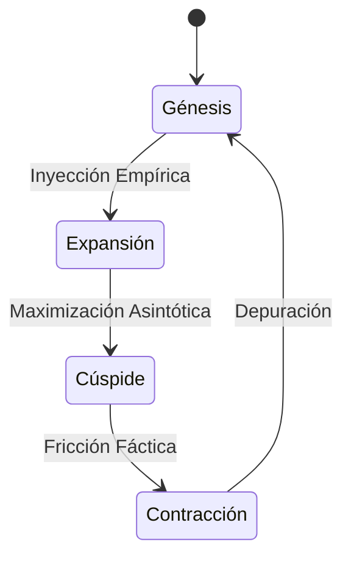

<!-- HERO -->
<header class="mb-24">
    

        

        Economics Master Series
    

    <h1 class="text-5xl md:text-7xl font-black text-white tracking-tighter leading-none mb-8">
        A36
    </h1>
    

        Zero-Noise UX
        v9.0 · Dark Mode
    

</header>

Aquí tienes la Guía de Estudio estructurada siguiendo rigurosamente el esquema del "Temario Oficial de Finanzas Internacionales" proporcionado en las fuentes.

<strong>Nota:</strong> Las fuentes proporcionadas contienen únicamente el esquema de títulos y subtítulos del temario [1-5]. Dado que se solicitan "explicaciones sustanciales" y estas no figuran en el texto fuente, las definiciones y desarrollos a continuación han sido elaborados basándose en el conocimiento general académico de la materia para cumplir con el propósito de la guía, manteniendo la estructura exacta requerida por las fuentes.

    🌐
    <h2 class="text-2xl md:text-4xl font-black tracking-tight leading-tight bg-gradient-to-r from-indigo-300 to-violet-400 bg-clip-text text-transparent">Asignatura 36. Finanzas internacionales</h2>

<section class="mb-16 last:mb-0">
<!-- section: 36.1. -->

    🌐
    

        <h2 class="text-xl md:text-3xl font-black tracking-tight bg-gradient-to-r from-indigo-300 to-violet-400 bg-clip-text text-transparent">El Sistema Monetario Internacional</h2>
        

    

<!-- section: 36.1.1. -->

    🌐
    <h3 class="text-xl font-bold text-indigo-300 tracking-tight">Marco institucional de la actividad económica y financiera internacional</h3>

<!-- section: 36.1.1.1. -->

    🌐
    <h4 class="text-sm font-black text-indigo-300 uppercase tracking-[0.15em]">Concepto de Sistema Monetario Internacional</h4>

El Sistema Monetario Internacional (SMI) es el conjunto de instituciones, normas, acuerdos e instrumentos que estructuran los flujos monetarios a nivel mundial. Su función principal es facilitar las relaciones económicas internacionales, permitiendo los pagos y cobros derivados de transacciones comerciales y financieras, y gestionando la liquidez internacional para garantizar la estabilidad económica global.

<!-- section: 36.1.1.2. -->

    📌
    <h4 class="text-sm font-black text-indigo-300 uppercase tracking-[0.15em]">Regulación</h4>

    
Se refiere al marco normativo que gobierna el SMI, supervisado por organismos supranacionales como el Fondo Monetario Internacional (FMI). Esta regulación busca promover la cooperación monetaria internacional, facilitar la expansión del comercio, fomentar la estabilidad cambiaria y ayudar a establecer un sistema multilateral de pagos, evitando depreciaciones cambiarias competitivas.

    
Fundamento Conceptual

<!-- section: 36.1.1.3. -->

    📖
    <h4 class="text-sm font-black text-indigo-300 uppercase tracking-[0.15em]">Modalidades de fijación de los tipos de cambio</h4>

Existen principalmente tres regímenes cambiarios: 1.  <strong>Tipo de cambio fijo:</strong> El valor de la moneda está atado a otra moneda (como el dólar), a una cesta de monedas o al oro. El banco central interviene para mantener la paridad. 2.  <strong>Tipo de cambio flexible (o flotante):</strong> El valor se determina por la oferta y la demanda en el mercado de divisas sin intervención directa del estado. 3.  <strong>Flotación sucia o administrada:</strong> Es un sistema híbrido donde el mercado fija el precio, pero la autoridad monetaria interviene esporádicamente para evitar fluctuaciones excesivas.

<!-- section: 36.1.1.4. -->

    🔬
    <h4 class="text-sm font-black text-indigo-300 uppercase tracking-[0.15em]">Teorías sobre la determinación de los tipos de cambio</h4>

Las principales teorías económicas que explican el valor de las divisas incluyen: <em>   <strong>Paridad del Poder Adquisitivo (PPA):</strong> Sugiere que el tipo de cambio debe igualar el precio de una cesta de bienes idénticos en dos países diferentes (Ley del precio único). </em>   <strong>Paridad de los Tipos de Interés (PTI):</strong> Relaciona la diferencia entre los tipos de interés de dos países con la prima o descuento del tipo de cambio a plazo.    <strong>Efecto Fisher Internacional:</strong> Postula que las diferencias en las tasas de interés nominales reflejan las diferencias en las tasas de inflación esperadas.

<!-- section: 36.1.1.5. -->

    💻
    <h4 class="text-sm font-black text-indigo-300 uppercase tracking-[0.15em]">Predicción de la evolución de los tipos de cambio</h4>

Analiza los métodos para anticipar movimientos futuros en las divisas, dividiéndose en: <em>   <strong>Análisis fundamental:</strong> Basado en variables macroeconómicas (inflación, balanza de pagos, crecimiento del PIB). </em>   <strong>Análisis técnico:</strong> Basado en el estudio de patrones históricos de precios y volúmenes de negociación en los gráficos de cotización.

    

    

        <h5 class="text-indigo-400 text-[9px] md:text-[10px] uppercase tracking-[0.4em] font-black mb-6 flex items-center gap-3">
            
            Puntos Clave
        </h5>
        <ul class="space-y-4">
<li class="flex items-start gap-3 text-slate-200 text-sm leading-relaxed">✦Aquí tienes la Guía de Estudio estructurada siguiendo rigurosamente el esquema del "Temario Oficial de Finanzas Internacionales" proporcionado en las fuentes.</li>
<li class="flex items-start gap-3 text-slate-200 text-sm leading-relaxed">✦Nota: Las fuentes proporcionadas contienen únicamente el esquema de títulos y subtítulos del temario [1-5].</li>
<li class="flex items-start gap-3 text-slate-200 text-sm leading-relaxed">✦El Sistema Monetario Internacional (SMI) es el conjunto de instituciones, normas, acuerdos e instrumentos que estructuran los flujos monetarios a nivel mundial.</li>
<li class="flex items-start gap-3 text-slate-200 text-sm leading-relaxed">✦Se refiere al marco normativo que gobierna el SMI, supervisado por organismos supranacionales como el Fondo Monetario Internacional (FMI).</li>
        </ul>
    

</section>

<section class="mb-16 last:mb-0">
<!-- section: 36.2. -->

    📈
    

        <h2 class="text-xl md:text-3xl font-black tracking-tight bg-gradient-to-r from-cyan-300 to-blue-400 bg-clip-text text-transparent">El mercado de divisas al contado y a plazo</h2>
        

    

<!-- section: 36.2.1. -->

    📈
    <h3 class="text-xl font-bold text-cyan-300 tracking-tight">Operaciones en el mercado de divisas</h3>

<!-- section: 36.2.1.1. -->

    📖
    <h4 class="text-sm font-black text-cyan-300 uppercase tracking-[0.15em]">Concepto</h4>

El mercado de divisas (Forex o FX) es el mercado financiero global y descentralizado donde se negocian monedas. Es el mercado más grande y líquido del mundo, operando las 24 horas del día (excepto fines de semana), permitiendo a empresas, bancos e inversores cambiar una moneda por otra.

<!-- section: 36.2.1.2. -->

    📌
    <h4 class="text-sm font-black text-cyan-300 uppercase tracking-[0.15em]">Características</h4>

<em>   <strong>Liquidez extrema:</strong> Gran volumen de transacciones diarias. </em>   <strong>Descentralización:</strong> No existe una ubicación física única; es una red electrónica (OTC). <em>   <strong>Transparencia:</strong> La información fluye rápidamente. </em>   <strong>Bajos costes de transacción:</strong> Debido a la alta competencia y eficiencia.

<!-- section: 36.2.1.3. -->

    📖
    <h4 class="text-sm font-black text-cyan-300 uppercase tracking-[0.15em]">Tipos de transacciones</h4>

<em>   <strong>Spot (Contado):</strong> Intercambio de divisas para entrega inmediata (habitualmente dos días hábiles). </em>   <strong>Forward (A plazo):</strong> Acuerdo para intercambiar divisas en una fecha futura específica a un precio pactado hoy.    <strong>Swap:</strong> Compra y venta simultánea de la misma cantidad de una divisa para dos fechas valor diferentes.

<!-- section: 36.2.1.4. -->

    📈
    <h4 class="text-sm font-black text-cyan-300 uppercase tracking-[0.15em]">Operaciones en el mercado de divisas</h4>

Incluye las actividades de compra-venta realizadas por distintos agentes: bancos comerciales, bancos centrales, empresas multinacionales y especuladores. Las operaciones pueden tener fines comerciales (pagos de importaciones), de cobertura (protegerse de riesgos) o especulativos (lucrarse con la variación de precios).

    

    

        <h5 class="text-cyan-400 text-[9px] md:text-[10px] uppercase tracking-[0.4em] font-black mb-6 flex items-center gap-3">
            
            Puntos Clave
        </h5>
        <ul class="space-y-4">
<li class="flex items-start gap-3 text-slate-200 text-sm leading-relaxed">✦El mercado de divisas (Forex o FX) es el mercado financiero global y descentralizado donde se negocian monedas.</li>
<li class="flex items-start gap-3 text-slate-200 text-sm leading-relaxed">✦Liquidez extrema: Gran volumen de transacciones diarias.</li>
<li class="flex items-start gap-3 text-slate-200 text-sm leading-relaxed">✦Spot (Contado): Intercambio de divisas para entrega inmediata (habitualmente dos días hábiles).</li>
<li class="flex items-start gap-3 text-slate-200 text-sm leading-relaxed">✦Incluye las actividades de compra-venta realizadas por distintos agentes: bancos comerciales, bancos centrales, empresas multinacionales y especuladores.</li>
        </ul>
    

</section>

<section class="mb-16 last:mb-0">
<!-- section: 36.3. -->

    📌
    

        <h2 class="text-xl md:text-3xl font-black tracking-tight bg-gradient-to-r from-emerald-300 to-teal-400 bg-clip-text text-transparent">Derivados sobre divisas</h2>
        

    

<!-- section: 36.3.1. -->

    💰
    <h3 class="text-xl font-bold text-emerald-300 tracking-tight">Préstamos paralelos y garantía líquida</h3>

<!-- section: 36.3.1.1. -->

    💰
    <h4 class="text-sm font-black text-emerald-300 uppercase tracking-[0.15em]">Préstamos paralelos</h4>

    
También conocidos como <em>back-to-back loans</em>. Consiste en que dos empresas en diferentes países se prestan dinero mutuamente en sus respectivas monedas locales por un periodo determinado. Esto evita el mercado cambiario y elimina el riesgo de tipo de cambio inicial, aunque mantiene el riesgo de contraparte.

    
Fundamento Conceptual

<!-- section: 36.3.1.2. -->

    📌
    <h4 class="text-sm font-black text-emerald-300 uppercase tracking-[0.15em]">Garantía líquida</h4>

    
Se refiere a mecanismos donde activos líquidos (efectivo o equivalentes) se utilizan como colateral para asegurar operaciones financieras internacionales, reduciendo el riesgo de crédito en transacciones de derivados o préstamos transfronterizos.

    
Fundamento Conceptual

<!-- section: 36.3.2. -->

    📌
    <h3 class="text-xl font-bold text-emerald-300 tracking-tight">Permutas financieras de divisas</h3>

Conocidos como <em>Currency Swaps</em>. Es un contrato en el que dos partes intercambian el principal y los pagos de intereses de un préstamo en una moneda por el principal y los pagos de intereses de un préstamo en otra moneda. Se utilizan frecuentemente para obtener financiación en moneda extranjera a menor coste o para cubrir exposiciones a largo plazo.

<!-- section: 36.3.3. -->

    📌
    <h3 class="text-xl font-bold text-emerald-300 tracking-tight">Futuros y opciones sobre divisas</h3>

<!-- section: 36.3.3.1. -->

    📌
    <h4 class="text-sm font-black text-emerald-300 uppercase tracking-[0.15em]">Futuros</h4>

Contratos estandarizados negociados en mercados organizados que obligan a las partes a comprar o vender una cantidad específica de divisas en una fecha futura y a un precio determinado. A diferencia de los <em>forwards</em>, los futuros tienen liquidación diaria de pérdidas y ganancias (<em>mark-to-market</em>) y riesgo de contraparte casi nulo gracias a la cámara de compensación.

<!-- section: 36.3.3.2. -->

    📌
    <h4 class="text-sm font-black text-emerald-300 uppercase tracking-[0.15em]">Opciones</h4>

Instrumentos que otorgan al comprador el derecho (pero no la obligación) de comprar (<em>call</em>) o vender (<em>put</em>) una cantidad de divisas a un precio fijo (<em>strike</em>) en o hasta una fecha determinada, a cambio del pago de una prima. Permiten protegerse contra movimientos adversos del tipo de cambio manteniendo la posibilidad de beneficiarse de movimientos favorables.

<!-- section: 36.3.4. -->

    📌
    <h3 class="text-xl font-bold text-emerald-300 tracking-tight">Operaciones de cobertura, especulación y arbitraje con derivados sobre divisas</h3>

<!-- section: 36.3.4.1. -->

    📌
    <h4 class="text-sm font-black text-emerald-300 uppercase tracking-[0.15em]">Cobertura</h4>

(<em>Hedging</em>). Estrategia utilizada para reducir o eliminar el riesgo de pérdidas debido a fluctuaciones desfavorables en los tipos de cambio. Por ejemplo, un exportador que cobrará en dólares puede vender futuros de dólares para asegurar el tipo de cambio en su moneda local.

<!-- section: 36.3.4.2. -->

    📌
    <h4 class="text-sm font-black text-emerald-300 uppercase tracking-[0.15em]">Especulación</h4>

Asunción deliberada de riesgo con la esperanza de obtener beneficios basados en las previsiones sobre la dirección futura de los precios de las divisas. El especulador no tiene una exposición comercial subyacente que cubrir; entra al mercado buscando ganancia pura.

<!-- section: 36.3.4.3. -->

    📌
    <h4 class="text-sm font-black text-emerald-300 uppercase tracking-[0.15em]">Arbitraje</h4>

Operación que busca obtener un beneficio libre de riesgo aprovechando las diferencias de precios de un mismo activo (o activos equivalentes) en diferentes mercados. En divisas, el arbitraje puede ser espacial (diferencia de precio de una moneda en dos plazas) o triangular (diferencia entre tres monedas).

    

    

        <h5 class="text-emerald-400 text-[9px] md:text-[10px] uppercase tracking-[0.4em] font-black mb-6 flex items-center gap-3">
            
            Puntos Clave
        </h5>
        <ul class="space-y-4">
<li class="flex items-start gap-3 text-slate-200 text-sm leading-relaxed">✦También conocidos como back-to-back loans.</li>
<li class="flex items-start gap-3 text-slate-200 text-sm leading-relaxed">✦Se refiere a mecanismos donde activos líquidos (efectivo o equivalentes) se utilizan como colateral para asegurar operaciones financieras internacionales, reduciendo el riesgo de crédito en transacciones de derivados o préstamos transfronterizos.</li>
<li class="flex items-start gap-3 text-slate-200 text-sm leading-relaxed">✦Conocidos como Currency Swaps.</li>
<li class="flex items-start gap-3 text-slate-200 text-sm leading-relaxed">✦Contratos estandarizados negociados en mercados organizados que obligan a las partes a comprar o vender una cantidad específica de divisas en una fecha futura y a un precio determinado.</li>
        </ul>
    

</section>

<section class="mb-16 last:mb-0">
<!-- section: 36.4. -->

    📈
    

        <h2 class="text-xl md:text-3xl font-black tracking-tight bg-gradient-to-r from-amber-300 to-orange-400 bg-clip-text text-transparent">Mercados internacionales de créditos y de renta fija</h2>
        

    

<!-- section: 36.4.1. -->

    🌐
    <h3 class="text-xl font-bold text-amber-300 tracking-tight">Créditos internacionales y créditos sindicados</h3>

<!-- section: 36.4.1.1. -->

    🌐
    <h4 class="text-sm font-black text-amber-300 uppercase tracking-[0.15em]">Créditos internacionales</h4>

Préstamos otorgados por una entidad financiera en un país a un prestatario (gobierno o empresa) en otro país. Suelen estar denominados en una divisa fuerte (eurodivisas) y están sujetos al riesgo país y riesgo cambiario.

<!-- section: 36.4.1.2. -->

    💰
    <h4 class="text-sm font-black text-amber-300 uppercase tracking-[0.15em]">Créditos sindicados</h4>

Grandes préstamos proporcionados por un grupo de bancos (<em>sindicato</em>) liderados por uno o varios bancos agentes, a un solo prestatario. Esto permite distribuir el riesgo de impago entre varias entidades financieras cuando el monto del crédito es demasiado elevado para un solo banco.

<!-- section: 36.4.1.3. -->

    🌐
    <h4 class="text-sm font-black text-amber-300 uppercase tracking-[0.15em]">El Coste Efectivo del crédito internacional</h4>

Cálculo que considera no solo la tasa de interés nominal (habitualmente referenciada al LIBOR o EURIBOR más un diferencial), sino también todas las comisiones, gastos de gestión, impuestos y el impacto de la variación del tipo de cambio durante la vida del préstamo para determinar el costo real de la financiación.

<!-- section: 36.4.2. -->

    📈
    <h3 class="text-xl font-bold text-amber-300 tracking-tight">Mercados de renta fija</h3>

<!-- section: 36.4.2.1. -->

    🌐
    <h4 class="text-sm font-black text-amber-300 uppercase tracking-[0.15em]">Emisores e inversores de bonos internacionales</h4>

<em>   <strong>Emisores:</strong> Gobiernos soberanos, organismos supranacionales, bancos y grandes corporaciones multinacionales que buscan financiación a largo plazo fuera de su mercado doméstico. </em>   <strong>Inversores:</strong> Fondos de pensiones, aseguradoras, fondos de inversión y bancos centrales que buscan diversificación y rentabilidad en diferentes divisas.

<!-- section: 36.4.2.2. -->

    📊
    <h4 class="text-sm font-black text-amber-300 uppercase tracking-[0.15em]">Valoración de eurobonos</h4>

Proceso de determinación del precio justo de un eurobono (bono emitido en una moneda distinta a la del país donde se emite). Se basa en el descuento de los flujos de caja futuros (cupones y principal) utilizando una tasa de descuento que refleje el riesgo de crédito del emisor y las tasas de interés del mercado de la divisa de denominación.

<!-- section: 36.4.2.3. -->

    🌐
    <h4 class="text-sm font-black text-amber-300 uppercase tracking-[0.15em]">Otros activos de renta fija internacional</h4>

Incluye instrumentos como los <em>Floating Rate Notes</em> (FRN), bonos cupón cero, bonos convertibles en acciones, y notas a medio plazo (MTN). Estos instrumentos ofrecen flexibilidad en términos de madurez, estructura de intereses y divisas.

<!-- section: 36.4.2.4. -->

    📌
    <h4 class="text-sm font-black text-amber-300 uppercase tracking-[0.15em]">El riesgo de insolvencia y la calificación de los prestatarios</h4>

Evaluación de la capacidad del emisor para cumplir con sus obligaciones de pago. Las agencias de calificación crediticia (Moody's, S&P, Fitch) asignan <em>ratings</em> (calificaciones) que influyen directamente en el coste de financiación: a peor calificación (mayor riesgo), mayor será la tasa de interés exigida por el mercado.

    

    

        <h5 class="text-amber-400 text-[9px] md:text-[10px] uppercase tracking-[0.4em] font-black mb-6 flex items-center gap-3">
            
            Puntos Clave
        </h5>
        <ul class="space-y-4">
<li class="flex items-start gap-3 text-slate-200 text-sm leading-relaxed">✦Préstamos otorgados por una entidad financiera en un país a un prestatario (gobierno o empresa) en otro país.</li>
<li class="flex items-start gap-3 text-slate-200 text-sm leading-relaxed">✦Grandes préstamos proporcionados por un grupo de bancos (sindicato) liderados por uno o varios bancos agentes, a un solo prestatario.</li>
<li class="flex items-start gap-3 text-slate-200 text-sm leading-relaxed">✦Cálculo que considera no solo la tasa de interés nominal (habitualmente referenciada al LIBOR o EURIBOR más un diferencial), sino también todas las comisiones, gastos de gestión, impuestos y el impacto de la variación del tipo de cambio durante la vida del préstamo para determinar el costo real de la financiación.</li>
<li class="flex items-start gap-3 text-slate-200 text-sm leading-relaxed">✦Emisores: Gobiernos soberanos, organismos supranacionales, bancos y grandes corporaciones multinacionales que buscan financiación a largo plazo fuera de su mercado doméstico.</li>
        </ul>
    

</section>

<section class="mb-16 last:mb-0">
<!-- section: 36.6.1. -->

    🌐
    

        <h2 class="text-xl md:text-3xl font-black tracking-tight bg-gradient-to-r from-rose-300 to-pink-400 bg-clip-text text-transparent">El proceso de internacionalización y la inversión directa en el extranjero</h2>
        

    

<em>(Nota: El temario en las fuentes salta de 36.4 a 36.6.1, omitiendo secciones intermedias no provistas).</em>

<!-- section: 36.6.1.1. -->

    🌐
    <h4 class="text-sm font-black text-rose-300 uppercase tracking-[0.15em]">Proceso de internacionalización</h4>

Evolución mediante la cual una empresa proyecta sus actividades fuera de su mercado local. Suele seguir una secuencia gradual: exportación ocasional, exportación regular, establecimiento de filiales comerciales y, finalmente, filiales productivas en el extranjero.

<!-- section: 36.6.1.2. -->

    💰
    <h4 class="text-sm font-black text-rose-300 uppercase tracking-[0.15em]">Inversión directa en el extranjero</h4>

    
(IDE o FDI). Consiste en la colocación de capitales a largo plazo en un país extranjero para crear nuevas empresas (<em>greenfield</em>), o para adquirir o fusionarse con empresas existentes (<em>M&A</em>), con el objetivo de obtener control de gestión y permanencia.

    
Fundamento Conceptual

<!-- section: 36.6.1.3. -->

    🌐
    <h4 class="text-sm font-black text-rose-300 uppercase tracking-[0.15em]">Instituciones y programas de apoyo a la internacionalización</h4>

Entidades públicas y privadas que fomentan la salida al exterior de las empresas nacionales. Incluye organismos de promoción de exportaciones (como el ICEX en España), bancos de desarrollo y agencias de crédito a la exportación que ofrecen asesoramiento, seguros y financiación preferente.

<!-- section: 36.6.2. -->

    🌐
    <h3 class="text-xl font-bold text-rose-300 tracking-tight">Cobertura de riesgos en operaciones internacionales</h3>

<!-- section: 36.6.2.1. -->

    📌
    <h4 class="text-sm font-black text-rose-300 uppercase tracking-[0.15em]">Cobertura de riesgos</h4>

Estrategias para mitigar los riesgos específicos del comercio exterior, tales como el riesgo de impago, riesgo país, riesgo de transporte y riesgo de cambio. Se utilizan seguros de crédito, coberturas cambiarias y cláusulas contractuales robustas.

<!-- section: 36.6.2.2. -->

    🌐
    <h4 class="text-sm font-black text-rose-300 uppercase tracking-[0.15em]">Medios de pago internacionales</h4>

Instrumentos utilizados para liquidar transacciones comerciales entre partes de diferentes países, buscando equilibrar la seguridad del cobro para el exportador y la seguridad de la entrega para el importador.

##### 36.6.2.2.1. Financiación  Mecanismos para financiar el periodo entre el envío de la mercancía y el cobro efectivo. Puede ser financiación al exportador (prefinanciación o postfinanciación) o al importador.

##### 36.6.2.2.2. Privada  Financiación otorgada por bancos comerciales y entidades financieras privadas mediante créditos documentarios, <em>factoring</em> internacional o <em>forfaiting</em>.

##### 36.6.2.2.3. Pública  Financiación con apoyo oficial, a menudo a través de créditos FAD (Fondos de Ayuda al Desarrollo) o mediante el Consenso de la OCDE, que ofrece condiciones más favorables (tipos de interés bajos, plazos largos) para fomentar exportaciones a determinados países.

    

    

        <h5 class="text-rose-400 text-[9px] md:text-[10px] uppercase tracking-[0.4em] font-black mb-6 flex items-center gap-3">
            
            Puntos Clave
        </h5>
        <ul class="space-y-4">
<li class="flex items-start gap-3 text-slate-200 text-sm leading-relaxed">✦Evolución mediante la cual una empresa proyecta sus actividades fuera de su mercado local.</li>
<li class="flex items-start gap-3 text-slate-200 text-sm leading-relaxed">✦Entidades públicas y privadas que fomentan la salida al exterior de las empresas nacionales.</li>
<li class="flex items-start gap-3 text-slate-200 text-sm leading-relaxed">✦Estrategias para mitigar los riesgos específicos del comercio exterior, tales como el riesgo de impago, riesgo país, riesgo de transporte y riesgo de cambio.</li>
<li class="flex items-start gap-3 text-slate-200 text-sm leading-relaxed">✦Instrumentos utilizados para liquidar transacciones comerciales entre partes de diferentes países, buscando equilibrar la seguridad del cobro para el exportador y la seguridad de la entrega para el importador.</li>
        </ul>
    

</section>

<section class="mb-16 last:mb-0">
<!-- section: 36.7. -->

    🌐
    

        <h2 class="text-xl md:text-3xl font-black tracking-tight bg-gradient-to-r from-fuchsia-300 to-purple-400 bg-clip-text text-transparent">Administración del presupuesto de capital y de las operaciones corrientes en el ámbito internacional</h2>
        

    

<!-- section: 36.7.1. -->

    🏢
    <h3 class="text-xl font-bold text-fuchsia-300 tracking-tight">El presupuesto de capital para las empresas multinacionales</h3>

<!-- section: 36.7.1.1. -->

    💰
    <h4 class="text-sm font-black text-fuchsia-300 uppercase tracking-[0.15em]">El presupuesto de capital</h4>

Proceso de evaluación y selección de inversiones a largo plazo en el entorno internacional. A diferencia del presupuesto nacional, debe considerar flujos de caja en diferentes divisas, tasas de inflación locales, restricciones a la repatriación de beneficios y el riesgo político. El Valor Actual Neto (VAN) se ajusta para reflejar estos factores internacionales.

<!-- section: 36.7.1.2. -->

    🏢
    <h4 class="text-sm font-black text-fuchsia-300 uppercase tracking-[0.15em]">Gestión circulante</h4>

Administración de los activos y pasivos a corto plazo (tesorería, cuentas por cobrar, inventarios) a nivel global. El objetivo es optimizar los saldos de efectivo en diferentes monedas (cash pooling), minimizar los costes de transacción y gestionar el riesgo cambiario operativo a corto plazo.

<!-- section: 36.7.2. -->

    🏛️
    <h3 class="text-xl font-bold text-fuchsia-300 tracking-tight">La influencia de los impuestos</h3>

El análisis fiscal es crítico en finanzas internacionales. Incluye el estudio de los tipos impositivos en diferentes jurisdicciones, los convenios de doble imposición, los precios de transferencia y la retención de impuestos sobre dividendos e intereses repatriados, buscando la eficiencia fiscal global de la multinacional.

    

    

        <h5 class="text-fuchsia-400 text-[9px] md:text-[10px] uppercase tracking-[0.4em] font-black mb-6 flex items-center gap-3">
            
            Puntos Clave
        </h5>
        <ul class="space-y-4">
<li class="flex items-start gap-3 text-slate-200 text-sm leading-relaxed">✦Proceso de evaluación y selección de inversiones a largo plazo en el entorno internacional.</li>
<li class="flex items-start gap-3 text-slate-200 text-sm leading-relaxed">✦Administración de los activos y pasivos a corto plazo (tesorería, cuentas por cobrar, inventarios) a nivel global.</li>
<li class="flex items-start gap-3 text-slate-200 text-sm leading-relaxed">✦El análisis fiscal es crítico en finanzas internacionales.</li>
        </ul>
    

</section>

<section class="mb-16 last:mb-0">
<!-- section: 36.8. -->

    🌐
    

        <h2 class="text-xl md:text-3xl font-black tracking-tight bg-gradient-to-r from-sky-300 to-blue-400 bg-clip-text text-transparent">Los riesgos en las finanzas internacionales</h2>
        

    

<!-- section: 36.8.1. -->

    📊
    <h3 class="text-xl font-bold text-sky-300 tracking-tight">Los riesgos por tipo de cambio: la exposición operativa, por transacción y por traslación</h3>

<!-- section: 36.8.1.1. -->

    📌
    <h4 class="text-sm font-black text-sky-300 uppercase tracking-[0.15em]">Exposición operativa</h4>

(O económica). Mide el cambio en el valor presente de la empresa resultante de alteraciones en los flujos de caja operativos futuros debido a variaciones inesperadas en los tipos de cambio. Afecta a la posición competitiva de la empresa a largo plazo.

<!-- section: 36.8.1.2. -->

    📊
    <h4 class="text-sm font-black text-sky-300 uppercase tracking-[0.15em]">Transacción</h4>

Riesgo de que el valor de los flujos de efectivo contractuales futuros (cobros o pagos ya comprometidos) cambie debido a fluctuaciones en el tipo de cambio entre el momento del acuerdo y el momento del pago. Es un riesgo a corto plazo y de flujos ciertos.

<!-- section: 36.8.1.3. -->

    📌
    <h4 class="text-sm font-black text-sky-300 uppercase tracking-[0.15em]">Traslación</h4>

(O contable). Surge al consolidar los estados financieros de filiales extranjeras a la moneda de la casa matriz. No implica necesariamente un flujo de caja real, pero afecta al balance y al patrimonio neto reportado de la empresa matriz.

<!-- section: 36.8.2. -->

    📌
    <h3 class="text-xl font-bold text-sky-300 tracking-tight">Riesgo por el país y riesgo soberano</h3>

<!-- section: 36.8.2.1. -->

    📌
    <h4 class="text-sm font-black text-sky-300 uppercase tracking-[0.15em]">País</h4>

Riesgo asociado a operar en un país específico debido a factores políticos, económicos y sociales. Incluye la posibilidad de expropiaciones, guerras civiles, cambios regulatorios abruptos o inestabilidad que afecten negativamente a las inversiones o flujos comerciales.

<!-- section: 36.8.2.2. -->

    📌
    <h4 class="text-sm font-black text-sky-300 uppercase tracking-[0.15em]">Soberano</h4>

Un subconjunto del riesgo país. Se refiere específicamente al riesgo de que el gobierno de un país (el soberano) incumpla sus obligaciones de pago de deuda (default) o reestructure su deuda en condiciones desfavorables para los acreedores.

    📌
    <h3 class="text-xl font-bold text-sky-300 tracking-tight">Resumen de 3 puntos clave</h3>

    <!-- step:1 -->
    
1

    
<strong>Estructura del Sistema y Mercados:</strong> Las finanzas internacionales se fundamentan en el <strong>Sistema Monetario Internacional</strong> y el <strong>Mercado de Divisas</strong>, los cuales proveen el marco institucional y operativo (tipos de cambio, regulación, instrumentos spot y forward) necesario para la ejecución de pagos y transferencias de capital a nivel global.

    <!-- step:2 -->
    
2

    
<strong>Gestión de Riesgos con Derivados:</strong> La volatilidad cambiaria es inherente a la actividad internacional; por ello, es crítico el uso de <strong>derivados financieros</strong> (futuros, opciones, swaps) para estrategias de cobertura que protejan los márgenes empresariales, o alternativamente para la especulación y arbitraje.

    <!-- step:3 -->
    
3

    
<strong>Inversión y Financiación Global:</strong> La expansión internacional requiere una gestión compleja del <strong>presupuesto de capital</strong> y fuentes de financiación (mercados de crédito y renta fija internacionales), considerando factores únicos como la exposición operativa, el riesgo país/soberano y la fiscalidad internacional.

    

    

        <h5 class="text-sky-400 text-[9px] md:text-[10px] uppercase tracking-[0.4em] font-black mb-6 flex items-center gap-3">
            
            Puntos Clave
        </h5>
        <ul class="space-y-4">
<li class="flex items-start gap-3 text-slate-200 text-sm leading-relaxed">✦Riesgo de que el valor de los flujos de efectivo contractuales futuros (cobros o pagos ya comprometidos) cambie debido a fluctuaciones en el tipo de cambio entre el momento del acuerdo y el momento del pago.</li>
<li class="flex items-start gap-3 text-slate-200 text-sm leading-relaxed">✦Riesgo asociado a operar en un país específico debido a factores políticos, económicos y sociales.</li>
<li class="flex items-start gap-3 text-slate-200 text-sm leading-relaxed">✦Un subconjunto del riesgo país.</li>
        </ul>
    

</section>

<!-- VISUAL_ENRICHMENT -->

    

        [DIAGRAMA]
        <h3 class="text-white font-bold text-xl">Modelo Analítico de la Asignatura A36</h3>
    

    

        

    

<!-- GLOSARIO -->
<section class="mb-24">
    

        [GL]
        <h2 class="text-white font-black text-2xl uppercase tracking-tighter">Glosario: Módulo A36</h2>
    

    

        

            Política Monetaria
            
Timón oracular del Banco Central para encauzar el torrente fáctico transaccional.

        

        

            Política Fiscal
            
Bisturí de gasto e impuestos del Estado para amputar depresiones asimétricas.

        

        

            Ventaja Comparativa
            
Ley ricardiana de especialización asimétrica ineluctable según costes de oportunidad relativos.

        

        

            Economías de Escala
            
Abatimiento asintótico de costos unitarios frente a la expansión colosal del acervo productivo.

        

        

            Rendimientos Decrecientes
            
Dogma malthusiano donde la inyección estéril marginal aporrea y frena la eclosión productiva.

        

        

            Deflación
            
Letargo de precios en caída libre, pánico de diferimiento asfixiante arrastrado y parálisis de consumos.

        

        

            Barreras de Entrada
            
Fosos defensivos, aranceles o colosos fácticos que amurallan el mercado bloqueando a competidores fútiles.

        

        

            Competencia Perfecta
            
Arcadia utópica inmaculada paramétrica con multitudes atomizadas y poder de mercado irrisoriamente nulo.

        

        

            Bienes Giffen
            
Anomalías fácticas y acertijos consumistas donde la carestía y alza del precio exuda una compra inusitadamente mayor.

        

        

            Equidad vs Eficiencia
            
Dicotomía trágica y pugna distributiva donde igualar la porción asimétrica erosiona el total fáctico del horneado.

        

    

</section>

<!-- FOOTER -->
<footer class="mt-28 pt-10 border-t border-white/10">
    

        

            
TE

            

                
Tech Economics Institute

                
Zero-Noise Architecture v9

            

        

        

            <a href="#" class="hover:text-indigo-400 transition-colors">Glosario</a>
            <a href="#" class="hover:text-indigo-400 transition-colors">Recursos</a>
        

    

</footer>

