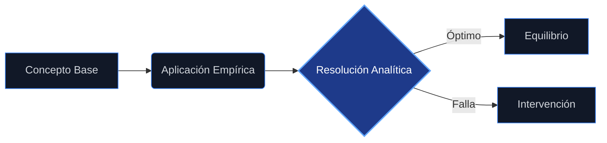

# Guía de Estudio: Matemáticas para Economistas

Esta guía desarrolla el contenido del **Temario Oficial de Matemáticas para economistas** [1], integrando los conceptos, teoremas y aplicaciones económicas encontrados en las fuentes proporcionadas.

## 9.1. Funciones de varias variables

### 9.1.1. Conceptos básicos matemáticos y terminología
El estudio de la economía requiere herramientas para analizar relaciones donde una variable depende de múltiples factores. En el análisis matemático, esto implica el paso de funciones de una variable a funciones en espacios $n$-dimensionales. Conceptos fundamentales incluyen conjuntos abiertos, cerrados, compactos y convexos, esenciales para la teoría de la optimización [2], [3].

### 9.1.2. Definición de funciones de IRn en IRm
Una función de $\mathbb{R}^n$ en $\mathbb{R}^m$ asigna a cada vector de $n$ dimensiones un vector de $m$ dimensiones. En el contexto de la economía avanzada, se estudian funciones desde $\mathbb{R}^n$ hacia $\mathbb{R}$ (campos escalares) y hacia $\mathbb{R}^m$ (campos vectoriales), fundamentales para la estática comparativa [4], [5].

### 9.1.3. Representación gráfica
La representación gráfica permite visualizar el dominio y el comportamiento de funciones. Para funciones de dos variables, se utilizan superficies en el espacio tridimensional y curvas de nivel en el plano para representar combinaciones de variables que mantienen constante el valor de la función [6].

### 9.1.4. Tipos de funciones
Se distinguen diversas categorías de funciones según sus propiedades matemáticas y aplicaciones: lineales, no lineales, continuas, diferenciables, implícitas y homogéneas. Estas clasificaciones son vitales para modelar fenómenos económicos como la producción y la utilidad [7], [8].

### 9.1.5. Funciones escalares
Son aquellas funciones que toman vectores de $\mathbb{R}^n$ y devuelven un número real ($\mathbb{R}$). Son la base de las funciones de utilidad y de producción en la teoría microeconómica, donde se busca maximizar un valor escalar (utilidad o beneficio) sujeto a restricciones vectoriales [1], [5].

### 9.1.6. Función cóncava y su aplicación al estudio económico
Una función es cóncava si el segmento de recta que une dos puntos cualesquiera de su gráfica está por debajo o sobre el arco de la curva. En economía, la concavidad está íntimamente ligada a la noción de tasas marginales decrecientes (utilidad marginal decreciente, productividad marginal decreciente) [9], [10]. Una función cóncava estricta tiene un máximo global único en un conjunto convexo [11].

### 9.1.7. Función convexa y su aplicación al estudio económico
Una función es convexa si el segmento de recta que une dos puntos está por encima de la curva. En la teoría del consumo, las preferencias convexas implican que los consumidores prefieren los promedios a los extremos. La convexidad es crucial para la minimización de costos y para asegurar la existencia de equilibrios [9], [12].

### 9.1.8. Curvas de nivel
Las curvas de nivel representan el conjunto de puntos en el dominio donde la función toma un valor constante. En economía, se interpretan como curvas de indiferencia (teoría del consumidor) o isocuantas (teoría de la producción). Son esenciales para visualizar problemas de optimización en dos variables [6], [13].

### 9.1.9. Funciones vectoriales
Son funciones donde tanto el dominio como el codominio son vectores (de $\mathbb{R}^n$ a $\mathbb{R}^m$). Se utilizan para modelar sistemas de ecuaciones simultáneas, como en el equilibrio general donde múltiples mercados interactúan, o en transformaciones lineales descritas por matrices [14], [1].

### 9.1.10. Operaciones con funciones
Incluye la suma, producto y composición de funciones. La composición es fundamental para la regla de la cadena en el cálculo multivariable, permitiendo analizar cómo cambios en variables exógenas se transmiten a través de funciones intermedias hasta afectar la variable de interés [15], [5].

## 9.2. Funciones reales de varias variables

### 9.2.1. Límites de funciones
El concepto de límite en varias variables es una generalización del caso unidimensional, analizando el comportamiento de la función cuando las variables independientes se aproximan a un punto específico. Es la base para definir la continuidad [6].

### 9.2.2. Límite puntual de una función IRn en IRm
Se refiere al análisis de la convergencia de una función vectorial en un punto específico del dominio $n$-dimensional hacia un valor en el espacio $m$-dimensional [16].

### 9.2.3. Limites direccionales
En funciones de varias variables, el acercamiento a un punto puede realizarse desde infinitas direcciones. Los límites direccionales analizan la tendencia de la función a lo largo de una recta específica que pasa por el punto de acumulación [16].

### 9.2.4. Limites dobles y sus propiedades
El límite doble (o simultáneo) requiere que la función se aproxime al mismo valor independientemente de la trayectoria de acercamiento. Sus propiedades incluyen la unicidad y las reglas algebraicas estándar (suma, producto) [6].

### 9.2.5. Límite de una función de IRn en IRm
Formaliza la convergencia en espacios euclidianos generales. Es esencial para definir derivadas y continuidad en sistemas de ecuaciones que modelan economías complejas [16], [5].

### 9.2.6. Estudio de la continuidad de las funciones de varias variables
Una función es continua si su límite en un punto coincide con el valor de la función en dicho punto. En economía, se asume generalmente la continuidad de las funciones de utilidad y producción para garantizar la existencia de soluciones en problemas de optimización (Teorema de Weierstrass) [6], [17].

### 9.2.7. Derivadas de funciones. Derivadas sucesivas y parciales. Concepto de diferencial de una función
Las derivadas parciales miden el cambio en la función ante cambios en una sola variable, manteniendo las demás constantes (ceteris paribus). El diferencial total aproxima el cambio total de la función ante variaciones simultáneas de todas las variables. Las derivadas de orden superior (como el Hessiano) se usan para verificar condiciones de segundo orden en optimización [18], [19].

### 9.2.8. Diferenciación de funciones compuestas. La regla de la cadena
Permite calcular la derivada de funciones anidadas. En modelos económicos, es vital para la estática comparativa, analizando cómo cambios en parámetros profundos afectan los resultados finales del modelo [5], [15].

### 9.2.9. Funciones homogéneas
Una función $f(x)$ es homogénea de grado $k$ si $f(tx) = t^k f(x)$. En economía, las funciones de producción con rendimientos constantes a escala son homogéneas de grado 1, y las funciones de demanda suelen ser homogéneas de grado 0 en precios e ingreso [15], [13].

### 9.2.10. Propiedades
Las funciones homogéneas tienen propiedades geométricas y analíticas específicas, como la radialidad de las pendientes en sus curvas de nivel. Las funciones de demanda walrasianas, por ejemplo, no cambian si todos los precios y el ingreso se multiplican por el mismo factor [20].

### 9.2.11. Teorema de Euler y su interpretación económica
El Teorema de Euler establece que si una función es homogénea de grado $k$, la suma de sus variables multiplicadas por sus respectivas derivadas parciales iguala a $k$ veces la función. En economía, si la producción tiene rendimientos constantes a escala ($k=1$), el pago a los factores según sus productividades marginales agota exactamente el producto total [21], [15].

## 9.3. Optimización

### 9.3.1. Definición
La optimización busca los mejores valores (máximos o mínimos) de una función objetivo dentro de un conjunto de elecciones posibles. Es el núcleo de la teoría económica neoclásica: maximización de utilidad o beneficios y minimización de costos [22], [23].

### 9.3.2. La búsqueda e interpretación de óptimos
Implica identificar puntos críticos donde el gradiente es nulo y evaluar condiciones de segundo orden. Económicamente, se interpreta como igualar beneficios marginales a costos marginales [22], [24].

### 9.3.3. Teorema de Weierstrass
Establece que una función continua definida sobre un conjunto compacto (cerrado y acotado) alcanza un máximo y un mínimo globales. Garantiza la existencia de solución en problemas económicos estándar [5], [25].

### 9.3.4. Teorema local-global
Para funciones cóncavas (o convexas) definidas en conjuntos convexos, cualquier óptimo local es también un óptimo global. Esto simplifica enormemente la búsqueda de soluciones en economía [26], [27].

### 9.3.5. Optimización sin restricciones y con restricciones de igualdad
Aborda problemas donde las variables pueden tomar cualquier valor (sin restricciones) o deben satisfacer ecuaciones específicas (restricciones de igualdad), como la restricción presupuestaria en su forma de igualdad [28], [29].

### 9.3.6. Teorema de Taylor aplicado a funciones de varias variables
Provee una aproximación polinómica de una función alrededor de un punto. Es fundamental para analizar las condiciones de segundo orden (concavidad/convexidad) y para linealizar sistemas dinámicos no lineales alrededor de un estado estacionario [15], [30].

### 9.3.7. Optimización sin restricciones
Se buscan puntos donde el gradiente de la función objetivo es cero. Las condiciones de segundo orden involucran la matriz Hessiana (definida negativa para máximos, positiva para mínimos) [28], [19].

### 9.3.8. Optimización con restricciones
Implica optimizar una función objetivo sujeta a limitaciones (presupuesto, tecnología). El método principal transforma el problema restringido en uno sin restricciones mediante la función Lagrangiana [31], [24].

### 9.3.9. Método directo
Consiste en sustituir las restricciones en la función objetivo para reducir el número de variables y resolverlo como un problema sin restricciones. Es viable cuando las restricciones son sencillas de despejar [23].

### 9.3.10. Interpretación de los multiplicadores de Lagrange
El multiplicador de Lagrange ($\lambda$) representa la tasa de cambio del valor óptimo de la función objetivo ante una relajación marginal de la restricción. Económicamente, es un "precio sombra", midiendo la utilidad marginal del ingreso o el costo marginal de una restricción tecnológica [32], [24].

### 9.3.11. El hessiano orlado
Es una matriz utilizada para verificar las condiciones suficientes de segundo orden en problemas de optimización con restricciones de igualdad. Determina si un punto crítico es un máximo o un mínimo local basándose en el signo de sus determinantes menores principales [23].

## 9.4. Optimización con restricciones de desigualdad

### 9.4.1. Introducción
Muchos problemas económicos imponen restricciones de no negatividad ($x \ge 0$) o límites de recursos ($g(x) \le c$). Estos problemas requieren técnicas más avanzadas que el método de Lagrange tradicional [33], [34].

### 9.4.2. Condiciones necesarias de primer orden para la existencia de óptimos locales. Teorema de Kuhn-Tucker y su interpretación económica
El teorema de Kuhn-Tucker generaliza el método de Lagrange para incluir restricciones de desigualdad. Las condiciones incluyen la factibilidad, las condiciones de holgura complementaria y el signo de los multiplicadores. Económicamente, si una restricción no es activa (no "muerde"), su precio sombra es cero; si es activa, su precio sombra es positivo (en maximización) [35], [36], [33].

### 9.4.3. Teorema de la globalidad: programación convexa
En problemas de programación convexa (maximizar función cóncava con restricciones convexas), las condiciones de Kuhn-Tucker son necesarias y suficientes para un óptimo global. Esto asegura que la solución hallada es única y la mejor posible [34], [11].

## 9.5. Programación lineal

### 9.5.1. Introducción
La programación lineal aborda la optimización de una función objetivo lineal sujeta a restricciones lineales de igualdad o desigualdad. Es una herramienta clave en el análisis de actividades y asignación de recursos [37], [38].

### 9.5.2. Propiedades
Los conjuntos factibles en programación lineal son politopos convexos (intersección de semiespacios). Las soluciones óptimas, si existen, se encuentran en los vértices o fronteras del conjunto factible [39].

### 9.5.3. Resolución gráfica
Para problemas con dos variables, se puede graficar la región factible y encontrar el óptimo desplazando las curvas de nivel de la función objetivo hasta tocar el punto extremo del polígono factible [40], [34].

### 9.5.4. Aplicación de las condiciones de Kuhn-Tucker
La programación lineal es un caso particular de la programación no lineal. Las condiciones de Kuhn-Tucker se aplican, y debido a la linealidad y convexidad, son condiciones necesarias y suficientes para el óptimo global [34], [40].

### 9.5.5. Método simplex
Es un algoritmo iterativo que se mueve a lo largo de los vértices del conjunto factible para encontrar la solución óptima de manera eficiente. Utiliza operaciones matriciales y de pivoteo (eliminación gaussiana) [41], [34].

### 9.5.6. Aplicaciones económicas
Incluye el problema de la dieta, la asignación de transporte, el análisis de insumo-producto y la teoría de juegos (juegos de suma cero). También se aplica en modelos de equilibrio general como el de Koopmans [42], [43], [40].

## 9.6. Cálculo integral. Integral de Riemann

### 9.6.1. Definición y aplicación en la economía
La integral de Riemann se define como el límite de sumas de áreas bajo una curva. En economía, se utiliza para calcular el excedente del consumidor, el valor presente de flujos de ingresos continuos y para resolver ecuaciones diferenciales que modelan dinámicas de capital y crecimiento [34], [44].

### 9.6.2. Propiedades
La integral es un operador lineal. Posee propiedades de aditividad respecto al intervalo de integración y cumple con el Teorema Fundamental del Cálculo, que conecta la derivación con la integración [45].

### 9.6.3. Condiciones de integrabilidad
Para que una función sea integrable según Riemann, debe ser acotada y continua (o tener un número finito de discontinuidades) en el intervalo de integración. Esto es relevante en economía para funciones de flujo de caja o utilidad continuas a trozos [45].

### 9.6.4. Relación de la integral con la derivada
El Teorema Fundamental del Cálculo establece que la integración y la derivación son procesos inversos. Esto permite recuperar funciones totales (como el costo total) a partir de funciones marginales (costo marginal) [45].

### 9.6.5. Integración por partes
Técnica derivada de la regla del producto para derivadas. Es útil en economía dinámica, por ejemplo, para integrar funciones que involucran un factor de descuento exponencial multiplicado por otra función del tiempo [46], [47].

### 9.6.6. Método de integración por cambio de variables
Conocido como el método de sustitución, permite simplificar integrales complejas transformando la variable de integración. Es esencial para resolver ecuaciones diferenciales separables en modelos de crecimiento [45], [48].

## 9.7. Aplicaciones de la integral de Rienmann en economía y empresa

### 9.7.1. Función de distribución
En estadística y econometría, la integral de la función de densidad de probabilidad determina la función de distribución acumulada, esencial para calcular probabilidades, como en la aproximación de una función gaussiana [49].

### 9.7.2. Valor actual de un flujo de dinero
La integral permite calcular el valor presente descontado de un flujo de ingresos continuo en el tiempo, usando un factor de descuento exponencial ($e^{-rt}$), fundamental en la evaluación de proyectos y bonos [50], [51].

### 9.7.3. Valor medio de una función en un recinto
El valor medio de una función continua en un intervalo se calcula mediante la integral definida dividida por la longitud del intervalo. Tiene aplicaciones en el cálculo de promedios de variables económicas continuas [51].

### 9.7.4. Pierre-Simon Laplace y su aportación
Laplace contribuyó significativamente a la teoría de la probabilidad y las transformadas integrales. Su aportación es relevante en la resolución de ecuaciones diferenciales y en la aproximación de funciones de probabilidad (como la distribución normal o gaussiana) utilizadas en economía financiera y econometría [51], [49].

## 9.8. Ecuaciones diferenciales ordinarias

### 9.8.1. Introducción
Las ecuaciones diferenciales (EDO) modelan sistemas dinámicos donde el cambio de una variable depende de su estado actual y otras variables. Son la base de la macroeconomía dinámica y los modelos de crecimiento [52], [45].

### 9.8.2. Definición
Una EDO es una relación que involucra una variable independiente (usualmente el tiempo $t$), una función incógnita $y(t)$ y sus derivadas. Si la función depende de una sola variable independiente, es "ordinaria" [53], [54].

### 9.8.3. Clasificación
Las EDO se clasifican por su **orden** (la derivada más alta presente) y su **grado** (la potencia de la derivada de mayor orden). También se distinguen entre lineales y no lineales, y autónomas (el tiempo no aparece explícitamente) o no autónomas [55], [56].

### 9.8.4. Ecuaciones diferenciales de primer orden
Son ecuaciones que involucran solo la primera derivada ($y'$). Incluyen modelos de crecimiento poblacional malthusiano o desintegración radiactiva. Su forma general es $y' = f(t, y)$ [57], [51].

### 9.8.5. Resolución
Existen diversos métodos analíticos para resolver EDOs de primer orden, dependiendo de su estructura. La solución general contiene una constante arbitraria, que se determina con una condición inicial (problema de valor inicial) [57], [58].

### 9.8.6. Ecuaciones diferenciales de Bernoulli
Son ecuaciones no lineales de la forma $y' + P(x)y = Q(x)y^n$. Se resuelven mediante una sustitución $z = y^{1-n}$ que las transforma en ecuaciones lineales [51], [59].

### 9.8.7. Ecuaciones diferenciales exactas
Una EDO es exacta si proviene del diferencial total de una función $F(x, y) = C$. Se resuelven integrando las partes correspondientes para recuperar la función potencial $F$ [60], [59].

### 9.8.8. Resolución
Involucra verificar la condición de exactitud ($\frac{\partial M}{\partial y} = \frac{\partial N}{\partial x}$) y luego integrar. Si no es exacta, a veces se puede encontrar un factor integrante para convertirla en exacta [59].

### 9.8.9. Ecuaciones diferenciales ordinarias de orden superior a uno (con coeficientes constantes)
Son ecuaciones que incluyen derivadas de segundo orden o mayor (ej. $y'' + ay' + by = 0$). Se resuelven utilizando la ecuación característica (polinomio auxiliar). Son fundamentales para modelar oscilaciones y ciclos económicos, así como la dinámica del capital en modelos de segundo orden [61], [38].

## 9.9. Ecuaciones en diferencias finitas

### 9.9.1. Introducción
Las ecuaciones en diferencias son el análogo discreto de las ecuaciones diferenciales. Modelan variables que cambian en intervalos de tiempo discretos ($t, t+1, \dots$), lo cual es común en datos económicos (PIB anual, inflación mensual) [62], [63].

### 9.9.2. Funciones de variable discreta o funciones discretas
Son funciones definidas solo para valores enteros de la variable independiente (generalmente el tiempo). Describen la evolución de una variable $y_t$ en función de sus valores pasados $y_{t-1}, y_{t-2}$, etc. [51], [64].

### 9.9.3. Ecuaciones en diferencias finitas lineales de primer orden con coeficientes constantes
Tienen la forma $y_{t+1} + ay_t = c$. Su solución general consta de una solución homogénea (relacionada con $a$) y una particular (relacionada con $c$). Se utilizan para modelos como la telaraña (ajuste de precios) y modelos de crecimiento simples [65], [63].

---

### Resumen de 3 Puntos Clave

1.  **Fundamentos Multivariables y Estáticos:** El temario comienza estableciendo la base matemática necesaria para la economía moderna mediante el cálculo en $\mathbb{R}^n$ (funciones vectoriales, cóncavas, homogéneas) y la teoría de optimización estática (multiplicadores de Lagrange y condiciones de Kuhn-Tucker), herramientas indispensables para modelar el comportamiento racional de agentes que maximizan utilidad o beneficios bajo restricciones.
2.  **Integración y Dinámica Continua:** Se incorpora el cálculo integral (Riemann) no solo para mediciones de áreas (excedentes, probabilidad), sino como paso previo a la dinámica continua modelada por Ecuaciones Diferenciales Ordinarias (EDO), las cuales describen trayectorias de crecimiento, acumulación de capital y estabilidad de precios en tiempo continuo.
3.  **Dinámica Discreta:** El estudio culmina con las Ecuaciones en Diferencias, la contraparte discreta de las EDO, cruciales para el análisis de datos económicos periódicos y modelos de ciclos económicos o expectativas adaptativas, permitiendo a los economistas trabajar con series de tiempo reales.
<!-- VISUAL_ENRICHMENT -->

    

        [DIAGRAMA]
        <h3 class="text-white font-bold text-xl">Esquema Conceptual Módulo A9</h3>
    

    

        

    

